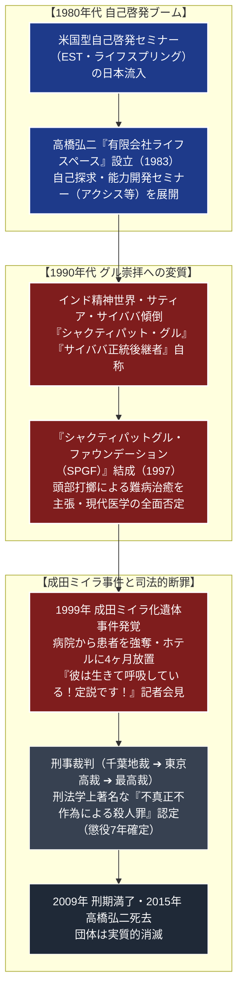

# ライフスペース 専門構造分析ノート

> [!summary] 要旨
> ライフスペース（英語：Life Space、後にSPGF＝シャクティパットグル・ファウンデーション）は、代表の高橋弘二（1938-2015）が1983年に設立した自己啓発セミナー会社を母体とする疑似宗教的カルト集団である。1990年代にインドのサティア・サイババに傾倒し、自らを「サイババの後継者」「シャクティパット・グル」と称して、頭部を叩く行為（シャクティパット）であらゆる難病を治癒できると豪語した。
> 1999年11月、千葉県成田市のホテル客室から、4ヶ月にわたり放置されてミイラ化した高齢男性の遺体が発見され、高橋がテレビカメラの前で遺体を「生きている！呼吸している！定説です！」と叫ぶ異常な記者会見を行って日本社会を震撼させた（**成田ミイラ化遺体事件**）。高橋は殺人罪で起訴され、最高裁判所において「保護すべき立場にありながら医療を施さず放置した」として**刑法学上著名な「不真正不作為犯による殺人罪」**が認定され懲役7年の実刑が確定した。

---

## 1. 概要と基本情報 (司法確定記録・公的報道資料)

| 項目 | 内容 |
| :--- | :--- |
| **団体正式名称** | 有限会社ライフスペース（改組後：シャクティパットグル・ファウンデーション / SPGF） |
| **主宰・代表者** | 高橋弘二（1938年7月23日 - 2015年12月没、77歳） |
| **設立年月日** | 1983年（会社設立） / 1997年（SPGF発足） |
| **活動拠点** | 東京都豊島区（セミナーオフィス）、千葉県成田市（ホテル滞在拠点）等 |
| **法的地位** | 有限会社（宗教法人格は一度も取得せず、民事・刑事事件後に事実上解散） |
| **核心的主張** | 高橋弘二を「最高位のグル」とする個人崇拝、頭部打擲による治病奇跡 |
| **象徴的フレーズ** | 「シャクティパット」「定説です」「最高裁の裁判官を教育してやる」 |
| **重大事件・司法** | 成田ミイラ化遺体事件（最高裁判決：不真正不作為による殺人罪で懲役7年） |
| **現状** | 2009年高橋刑期満了、2015年高橋死去、団体としては実質的消滅状態 |

---

## 2. 自己啓発セミナーから疑似宗教・カルト化への構造変容系統樹

1980年代の米国型能力開発セミナーから、密室洗脳と霊能治病カルトへ変貌し、刑事事件を経て崩壊した。



---

## 3. 指導者：高橋弘二と「グル」崇拝構造

### 1. 高橋弘二の経歴と人物像
- **前半生**:
  大阪府出身。公認会計士を目指して受験勉強を続けるも挫折。1970年代から80年代にかけて日本で急成長した米国型自己啓発セミナーのトレーナー・講師として頭角を現した。
- **神格化への傾倒**:
  1990年代に入ると、セミナーの枠組みを超えてオカルト・ニューエイジ思想に傾倒。インドの霊能力者サティア・サイババに心酔し、帰国後は「自分はサイババから直接マントラを授かった世界で唯一の後継者である」と自称。長い白髪・髭を蓄え、白いローブを身にまとって「シャクティパット・グル」と称した。

### 2. 側近幹部と信徒の従属関係
高橋の周囲には、セミナー時代から高額な受講料を払い続けてマインドコントロール下に置かれた忠実な信徒（スタッフ）が取り巻きを形成した。ナンバー2と目された幹部（釣部人裕ら）や高橋の妻らが外部との交渉や資金管理を担当し、高橋の妄想的言動を絶対正義として無批判に信奉した。

---

## 4. 歴史変遷クロノロジー

```
・1983年: 高橋弘二、東京都豊島区に「有限会社ライフスペース」を設立
・1980年代後半〜90年代前半: 「アクシス」等の高額自己啓発セミナーを開催し、受講生に長時間の自己否定・感情解放を強いる
・1995年: 高橋がインドへ渡航。サティア・サイババから霊力を授かったと主張し始める
・1997年: 団体名を「シャクティパットグル・ファウンデーション（SPGF）」に改組。治病カルトへ舵を切る
・1999年7月: 兵庫県内の病院で脳内出血により重体となっていた男性患者（66歳）を、信徒である長男が医師の制止を無視して連れ出し、成田市のホテルへ搬送
・1999年7月〜11月: 高橋が男性の頭部を叩くシャクティパットを連日実施。一切の点滴・投薬を行わず放置。男性は数日後に死亡
・1999年11月11日: ホテル側の通報により警察が突入、ミイラ化した男性遺体を発見
・1999年11月12日: 高橋がテレビ各局の前で記者会見。「彼はいま生きている！」「定説です！」と連呼し日本中に衝撃を与える
・2000年1月: 千葉県警、高橋弘二ら幹部11名を殺人容疑等で逮捕
・2002年1月: 千葉地裁、高橋に対し殺人罪を適用し懲役15年の実刑判決
・2003年10月: 東京高裁、不作為の殺意を認めつつ懲役7年に減刑
・2005年7月4日: 最高裁判所第二小法廷、上告を棄却。懲役7年が確定
・2009年: 高橋弘二、刑務所を満期出所
・2015年12月: 高橋弘二、77歳で死去
```

---

## 5. 教理・思想・マインドコントロール手法の特色

### 1. 自己啓発セミナーからカルトへの変容メカニズム
ライフスペースは、一般的な自己啓発セミナーの手法（密室合宿、長時間の叱責と自己批判、睡眠遮断、集団での感情的カタルシス）を悪用し、参加者の自律的判断力を奪った上で高橋への絶対服従を刷り込んだ。

### 2. 「シャクティパット」と医学の完全否定
- **シャクティパット（Shaktipat）**:
  本来はヒンドゥー教タントラにおける「師が弟子に霊的エネルギーを転送する儀式」を意味するが、高橋は**「自分の掌で患者の頭部を激しく叩くことで、患者の体内に滞る悪いエネルギーを破壊し、あらゆる難病を奇跡的に根治できる」**と俗流解釈した。
- **現代医学への敵視**:
  医師や病院を「患者を薬漬けにして殺す悪魔の手先」と激しく罵倒し、信徒やセミナー受講生に対し、病院での治療、投薬、点滴、人工呼吸器の使用を厳格に拒否させた。

### 3. 「定説です！」の言語統制と現実逃避
高橋は自らの発言に客観的根拠がないことを指摘されると、語気を強めて**「これは定説です！」**と言い放ち、一切の反論を封殺した。この思考停止の言語パターンは信徒全体に共有され、目の前にある腐敗・乾燥した死体を見ても「生きている、肌がピンク色になって回復している」と妄信する極端な認知の歪み（集団的現実逃避）を生み出した。

---

## 5-1. 成田ミイラ化遺体事件と刑法上の判例意義（徹底客観記録）

> [!danger] 刑法学上の金字塔「不真正不作為犯による殺人罪」最高裁判決
> - **事件の真相と経過**:
>   1999年7月、兵庫県内の病院で脳出血を起こし意識不明となっていた高齢男性患者に対し、高橋に洗脳された長男が「グルに治療してもらう」として病院から強引に退院させ、千葉県成田市のホテル客室に搬送した。高橋は男性の頭部を激しく叩くシャクティパットを施し、必要な医療措置を一切拒絶した。男性は搬送後数日で死亡したが、高橋らは「死んでいない」として死体を放置。4ヶ月にわたるエアコン暖房の送風により遺体は完全にミイラ化した。
> - **刑法上の重要判例（最高裁第二小法廷決定 平成17年7月4日）**:
>   本事件の裁判は、**「自ら直接手を下して殺害していない場合（不作為）、いかなる要件を満たせば殺人罪が成立するか」**という**「不真正不作為犯（ふしんせいふさごはん）」**の限界を巡って争われた。
>   最高裁判所は以下の規範を示し、高橋の殺人罪の成立を認定した：
>   1. **作為義務（保障者的地位）の発生**: 被害者の生命が自己の治療行為に全面的に依存しており、自己の意思で容易に適切な救命医療を受けさせることが可能な状態にあったこと。
>   2. **作為との同視可能性**: 瀕死の被害者を放置した行為は、包丁で刺すなどの「作為による殺人行為」と法的に同等と評価できること。
>   3. **不作為の殺意の認定**: 被害者が死亡する危険性を認識しながら、自らの誤った治療法（シャクティパット）を正当化するためにあえて放置したこと。
>   本決定は、現在でも全国の法科大学院・司法試験において刑法総論の最重要リーディングケースとして必修判例となっている。

---

## 6. 拠点・活動の実態

- **セミナー拠点（旧有限会社ライフスペース）**:
  東京都豊島区池袋等のオフィスビルに拠点を設置し、受講生の集客と高額セミナーの販売を行っていた。
- **事件現場（成田空港至近のホテル）**:
  千葉県成田市取香に所在する大手シティホテル。高橋らは複数の客室を数ヶ月にわたり長期貸し切り、外部の目を遮断した密室空間として使用していた。

---

## 7. 関連組織・破産と残党動向

- **シャクティパットグル・ファウンデーション（SPGF）**:
  事件発覚後に設立された任意団体。幹部らが「高橋は無実であり警察とメディアの捏造である」と主張して冤罪キャンペーンを展開。
- **SPGF RESEARCH出版**:
  高橋の正当性を主張する書籍や『定説裁判』と題する記録集を自費出版。
- **批判者への訴訟乱発と敗訴**:
  カルト被害を告発した弁護士（紀藤正樹ら）を相手取って名誉毀損訴訟を起こしたが、2015年にSPGF側の敗訴が確定した。

---

## 8. 史料・参考文献

1. 最高裁判所第二小法廷決定 平成17年7月4日（刑集59巻6号403頁・成田ミイラ化遺体事件決定）
2. 東京高等裁判所判決 平成15年10月10日
3. 千葉地方裁判所判決 平成14年1月31日
4. 前田雅英『刑法総論講義』（不真正不作為犯論・成田ミイラ事件の判例解説）
5. 紀藤正樹『マインド・コントロール』（アスペクト）

---

## 9. 関連ノート (Vault内)

- [[_分派・異端研究ポータル]]
- [[神世界]]（霊感商法・ヒーリングサロン詐欺事件カルト）
- [[オウム真理教]]（疑似科学・オカルト治病からの凶悪化の比較対照）
- [[法の華三法行]]（足裏診断による巨額詐欺事件カルト）

---

## 10. 検証・品質ゲートと留保事項

> [!warning] 留保事項
> - **刑事確定記録に基づく記述**: 本稿に記された事件の事実関係、医学的所見、および高橋弘二の責任は、最高裁判所の確定判決および裁判記録に基づき客観的に記録している。
> - **宗教法人格の不存在**: ライフスペースは宗教法人法に基づく宗教法人ではなく、商法上の有限会社および任意団体である。
> - 本ノートの evidence_type は `"judicial_records"`、confidence は `5`。

---

*※本稿は[[_分派・異端研究ポータル]]の個別教団分析ノートである。*
