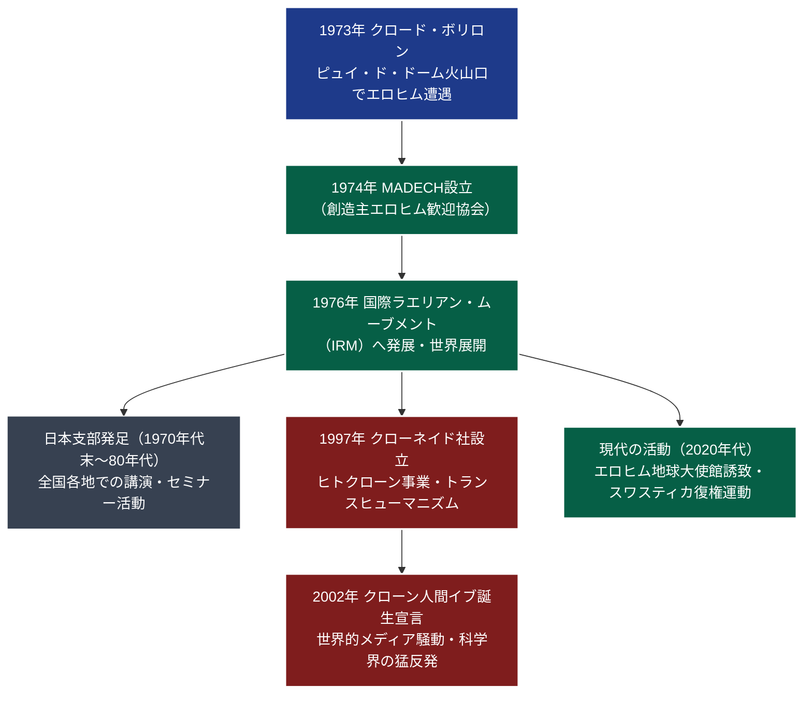

# 国際ラエリアン・ムーブメント 専門構造分析ノート

> [!summary] 要旨
> 国際ラエリアン・ムーブメント（International Raelian Movement: IRM）は、フランス出身の元自動車ジャーナリスト、クロード・ボリロン（指導者名：ラエル、1946-）が1973年に創設したUFO信仰系・無神論の新新宗教運動である。旧約聖書の「エロヒム（Elohim）」を超高度な科学技術を持つ地球外知的生命体と解釈し、人類はエロヒムによる遺伝子合成実験によって科学的に創造されたと主張する。クローン技術による個体の不死再生、感覚瞑想（性道徳の解放）、および「エロヒムを迎える地球大使館」の建設を推進し、2002年のヒトクローン誕生宣言（クローネイド事件）等で国際的な議論を巻き起こした。

---

## 1. 概要と基本情報

| 項目 | 内容 |
| :--- | :--- |
| **団体正式名称** | 国際ラエリアン・ムーブメント（日本組織：日本ラエリアン・ムーブメント） |
| **通称・略称** | ラエリアン、IRM、ラエル教 |
| **創始者・最高指導者** | クロード・ボリロン（Claude Vorilhon / ラエル、1946-） |
| **設立年・地域** | 1973年12月 フランスにて創設（1974年組織化） |
| **国際本部所在地** | スイス・ジュネーブ（歴史的拠点：カナダ・ケベック州UFOLand等） |
| **法人格** | 日本国内では非宗教法人（任意団体・一般社団法人等の形態） |
| **公称信徒数** | 全世界約90,000人 / 日本国内約1,000人〜数千人（公称） |
| **基本思想・教義** | 科学的創造論（インテリジェント・デザインの極限）、無神論、感覚瞑想 |
| **象徴シンボル** | ダビデの星（六芒星）の中心に卍（スワスティカ）を配した図案 |

---

## 2. 教団系統樹（Mermaid 11）

---

## 3. 指導層と後継構造

### 創始者：クロード・ボリロン（ラエル、1946-）
* フランス・オーヴェルニュ地方アンベール出身。元レーシングカー専門誌の編集長兼レーサー。
* 1973年12月13日、フランス中部のピュイ・ド・ドーム火山口で未確認飛行物体（UFO）から現れた異星人（エロヒムの代表者ヤハウェ）と遭遇し、「人類創造の真実を全世界に伝える預言者」として任命されたと主張。
* 「ラエル（Rael）」という霊名を授かり、モーセ、イエス、釈迦、マホメットに続く「最後の預言者」「マイトレーヤ（弥勒菩薩）」を自称する。

### 組織ヒエラルキー（ガイド制度）
国際ラエリアン・ムーブメントは、厳格な6段階のヒエラルキー（階梯）によって運営される：
* **レベル6（ガイド・オブ・ガイド）**: ラエル（最高意思決定者）。
* **レベル5（ビショップ・ガイド / 司教）**: 各大陸・主要国の最高統括者。
* **レベル4（プリースト・ガイド / 司祭）**: 儀礼・洗礼（細胞トランスミッション）を司る上級指導者。
* **レベル3（アニメーター）**: 地域支部の主導・教育担当者。
* **レベル2（アシスタント）**: 実務補佐員。
* **レベル1（研修員）**: 正式メンバー。

---

## 4. 歴史変遷クロノロジー

| 年代 | 事項 | 詳細・背景 |
| :---: | :--- | :--- |
| **1973年** | エロヒムとの遭遇 | 12月、ピュイ・ド・ドームにてラエルがエロヒムと遭遇。6日間にわたり啓示を受ける。 |
| **1974年** | 『真実を告げる書』出版 | 啓示内容をまとめた処女作を刊行。受容組織「MADECH」をフランスで設立。 |
| **1975年** | 第2の遭遇 | 10月、ロコマンディエールにて再びUFOに搭乗し、エロヒムの母星へ案内されたと主張。 |
| **1976年** | IRM設立 | 組織を「国際ラエリアン・ムーブメント」へ改組。ヨーロッパから北米・アジアへ伝道を拡大。 |
| **1980年** | 日本初来日 | ラエルが来日し、日本支部（日本ラエリアン・ムーブメント）が本格始動。 |
| **1995年** | 仏議会報告書（セクト指定） | フランス国民議会委員会による報告書で「セクト（カルト）」として分類される。 |
| **1997年** | クローネイド（Clonaid）設立 | ドリー羊の誕生を受け、ヒトクローン技術による個体再生を目指す民間企業を設立。 |
| **2002年** | **クローン人間「イブ」騒動** | クローネイドCEOブリジット・ボワセリエが「世界初のクローン人間女児が誕生した」と発表。国際的激震。 |
| **2000年代〜** | 大使館プロジェクト | 国連や各国政府に対し、エロヒムを迎える治外法権の大使館建設用地提供を要請。 |
| **現在** | 自由主義的抗議運動 | スワスティカ復権、トップレス権利擁護（ゴー・トプレスの日）など街頭啓発を継続。 |

---

## 5. 教理・信仰・実践の特色

### 核心教理：科学的創造論（無神論的インテリジェント・デザイン）
* **神の否定とエロヒム**: 霊的な超越神や創造主を完全に否定する無神論である。旧約聖書の創世記に登場する「エロヒム（Elohim）」はヘブライ語の複数形であり、「天空から降りてきた人々」を意味する高度な異星人科学者集団であると再解釈する。
* **生命の科学的創造**: 約25,000年前、エロヒムが地球上の研究所でDNA合成技術によって植物・動物、そして自らの姿に似せて人類を科学的に創造したと主張する。
* **クローン再生による永遠の生命**: 霊魂や死後の世界は存在せず、生命は情報（遺伝子コード）にすぎないとする。生前に「細胞トランスミッション（個人のDNAコードをエロヒムのスーパーコンピュータに登録する儀式）」を受けることで、死後エロヒムによって新たな肉体としてクローン再生され、不死の生を得られると説く。

### 儀礼と実践
1. **細胞トランスミッション**: 年4回（4月の第1日曜日、8月6日、10月7日、12月13日）の祝日に、ガイドの手を通して個人の生体情報をエロヒムに伝送するとされる洗礼儀式。
2. **感覚瞑想（Sensual Meditation）**: 五感（触覚・味覚・視覚・聴覚・性感覚）を研ぎ澄まし、脳の潜在能力を開花させる瞑想法。自己愛、快楽、オーガズムを宇宙意識との同調として肯定する。
3. **ジーニアソクラシー（天才政治）**: 民主主義に代わる理想政治として、知能指数（IQ）が平均より高い者のみに投票権と被選挙権を与える選良政治を提唱。

---

## 5-1. 事件・裁判・社会的議論

### クローネイド社によるクローン人間「イブ」捏造騒動（2002年）
* **発表と国際的衝撃**: 2002年12月27日、ラエリアン傘下の生命工学企業「クローネイド」のCEOブリジット・ボワセリエ（生化学者・ラエリアン指導者）が記者会見を開き、「31歳のアメリカ人女性から世界初のクローン人間女児『イブ』が誕生した」と発表した。
* **科学的証拠の欠如と告発**:
  - 各国首脳やローマ教皇庁、WHO、科学界が一斉に生命倫理違反として非難。
  - しかし、独立したDNA鑑定人による親子鑑定の機会を「親のプライバシー保護」を理由に拒否。
  - フロリダ州の裁判所における審理やメディアの追跡調査により、科学的証拠が一切提示されない単なる**宣伝目的の虚偽・メディアジャック**であったと結論づけられた。

### 児童保護・性道徳を巡るセクト批判
* **フランス国民議会報告（1995年）**: ギヤール委員会報告書において、ラエリアン運動は家族解体の促進、未成年者に対する早期性教育、経済的収奪の懸念から「危険なセクト」としてリストアップされた。
* **退会者による告発**: カナダやフランスにおいて、元信徒から「共同体内での性的乱交の強要」や「教祖への過度な盲従」を理由とする告発や訴訟が提起された歴史がある。

### スワスティカ（卍）復権運動と反発
* 教団は古代の平和の象徴として六芒星と卍を組み合わせたシンボルを用いていたが、ナチス・ドイツのホロコーストを想起させるとしてユダヤ人団体等から激しい抗議を受けた。
* 一時期、中央の卍を銀河の渦巻き模様に変更したが、現在は原初のシンボルの名誉回復運動を展開している。

---

## 6. 拠点施設・アクセス

### 日本ラエリアン・ムーブメント
* **連絡拠点**: 東京都内、沖縄県等に事務局を設置。固定的な大規模神殿は持たず、公共施設やオンラインを活用したセミナー形式で運営。
* **国際聖地構想（エロヒム大使館）**: エロヒムが公式に地球に帰還するための治外法権を備えた大使館建設を目指し、日本を含む世界各国政府に用地提供と治外法権の認可を働きかけている。

---

## 7. 組織形態・関連企業

* **国際組織**: 非営利国際団体（IRM）。
* **関連組織**:
  - **クローネイド（Clonaid）**: ヒトクローン開発を標榜した企業（バハマ等で登記）。
  - **クリトリエド（Clitoraid）**: 女性器切除（FGM）被害者の修復手術を支援する人道支援団体。
  - **ゴー・トプレス（Go Topless）**: 女性が公共の場で上半身裸になる権利を主張する市民運動団体。

---

## 8. 史料・参考文献

1. **教団一次資料・ラエル著作**:
   - クロード・ボリロン（ラエル）『宇宙人からのメッセージ』（太陽出版、1986年）
   - ラエル『真実を告げる書』（ラエリアン・ムーブメント）
   - ラエル『感覚瞑想—愛と至福の調和』（太陽出版）
2. **公的調査資料**:
   - フランス国民議会『セクト調査委員会報告書』（1995年）
3. **宗教学・社会学的研究**:
   - スーザン・J・パーマー『エイリアン・セクト—ラエリアン・ムーブメントの社会学』（Susan J. Palmer, *Aliens Adored: Rael's UFO Religion*, Rutgers University Press, 2004）
   - 櫻井義秀『カルトとスピリチュアリティ—現代日本における「救い」の変容』（ミネルヴァ書房、2009年）

---

## 9. 関連ノート（内部リンク）

- [[01_宗派・異端研究/_分派・異端研究ポータル|_分派・異端研究ポータル]]
- [[01_宗派・異端研究/系統別分類カタログ|系統別分類カタログ]]
- [[01_宗派・異端研究/14_神道系/皇祖皇太神宮天津教|皇祖皇太神宮天津教]]（超古代宇宙人・神話の科学的再解釈の比較）
- [[01_宗派・異端研究/12_その他/ライフスペース|ライフスペース]]（現代における科学とカルト的言説の交錯）

---

## 10. 検証・品質ゲートと留保事項

> [!note] 検証ステータスと留保事項
> - **主張の科学的検証**: エロヒムによる人類創造説およびクローネイド社によるヒトクローン誕生主張は、現代の生化学・進化生物学・医学界において科学的事実として認められておらず、虚偽・宗教的信仰言説と判断されている。
> - **客観的記録**: 本稿は、現代社会におけるUFO信仰・トランスヒューマニズム系新宗教の世界的展開と、メディア利用・生命倫理を巡る議論の客観的構造を整理したものである。
> - 本ノートの `confidence` は **5**、`evidence_type` は **official_database / academic_history** である。

---

*※本稿は[[_分派・異端研究ポータル]]の個別教団分析ノートである。*
