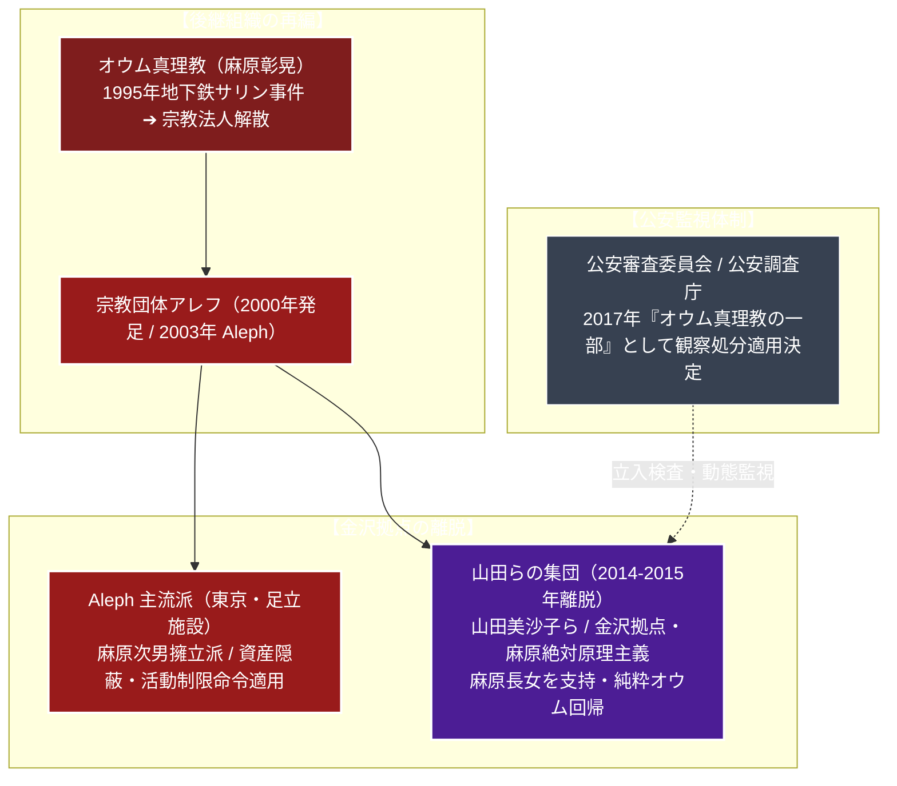

# 山田らの集団 専門構造分析ノート

> [!summary] 要旨
> 山田らの集団（やまだらのしゅうだん、公安調査庁指定呼称、通称：オウム金沢分派）は、2014年末から2015年頃にかけて、旧オウム真理教の主流後継組織[[Aleph]]から分裂した分派組織である。元オウム真理教の最高幹部（正悟師）である山田美沙子が主導し、石川県金沢市および野々市市などの民間アパート・住宅を拠点として活動している。
> 公安当局の監視や世論の批判を逃れるために対外的な麻原隠しを行おうとしたAleph指導部（足立施設・次男派幹部）に対し、「教祖・麻原彰晃（松本智津夫）の教えと儀礼を一切改変せず純粋に継承・実践する」ことを主張して分派した極めて先鋭的な麻原絶対原理主義グループである。公安審査委員会により「無差別大量殺人行為を行った団体の規制に関する法律（団体規制法）」に基づく観察処分の対象団体として認定されており、公安調査庁による厳格な監視・立入検査が継続されている。

---

## 1. 概要と基本情報 (公安調査庁・警察当局データ)

| 項目 | 内容 |
| :--- | :--- |
| **団体呼称** | 山田らの集団（公安調査庁による公式指定呼称 / 通称：金沢グループ） |
| **中心指導者** | 山田美沙子（元オウム真理教幹部・正悟師） |
| **精神的教祖** | 麻原彰晃（松本智津夫、2018年死刑執行） / 麻原の長女（松本美香）を支持 |
| **分派時期** | 2014年末〜2015年頃（Alephより集団離脱） |
| **主要拠点** | 石川県金沢市、石川県野々市市などの一般住宅・マンション |
| **法的地位** | 任意団体（無差別大量殺人行為を行った団体の規制に関する法律に基づく観察処分適用団体） |
| **教理・信条** | 麻原彰晃への絶対的帰依、初期オウム教理・マントラ・瞑想行法の完全遵守 |
| **活動形態** | 閉鎖的な共同生活、祭壇における麻原礼拝、生誕祭等の儀式厳修 |
| **構成員規模** | 出家信者約30人、在家信者十数人、計約30〜50人（公安調査庁推計） |

---

## 2. Aleph内部抗争と金沢分派の独立系統樹

オウム真理教解散後、上祐派の離脱に続き、Aleph内部での指導部（次男派）と金沢拠点（長女派・原理主義）の対立から分裂した。



---

## 3. 指導層：山田美沙子と集団構造

### 1. 中心人物：山田美沙子
元オウム真理教の古参出家信徒。オウムのステージ制度において最高位クラスである「正悟師」に昇格していた重要幹部である。
地下鉄サリン事件以前から教団中枢・法務部等で活動し、教団崩壊後も一貫して麻原への盲従を堅持。Aleph結成後、北陸地域（金沢支部）の責任者として信徒を統率していたが、指導部との方針対立を経て自らのグループを率いて独立した。

### 2. 麻原親族（長女）との関係性
Aleph主流派が麻原の次男（および三女松本麗華らとの綱引き）を精神的指導者として擁立しようと画策したのに対し、山田らの集団は麻原の長女（松本美香）を正統な後継血統として支持・連携しているとされる。この麻原遺族内の主導権争いが分派の大きな要因となった。

### 3. 構成員の閉鎖的共同生活
構成員は、1990年代のオウム真理教時代に出家した古参信徒が中心であり、石川県金沢市や野々市市にある複数の賃貸アパートや一軒家において、外部との接触を極度に遮断した共同生活を営んでいる。

---

## 4. 歴史変遷クロノロジー

```
・1990年代: オウム真理教金沢支部として活動
・2000年: 団体規制法適用に伴い「宗教団体アレフ金沢道場」として再編
・2013年: Aleph足立指導部と金沢拠点との間で、教団運営方針や資金拠出を巡る不和が表面化
・2014年末: 山田美沙子を中心とする金沢の信徒集団が、Aleph指導部からの自立・離脱を通告
・2015年: Alephから正式に分裂。「山田らの集団」として独自に集金・修行活動を開始
・2017年8月: 公安審査委員会、山田らの集団を団体規制法に基づく「観察処分対象団体」と公式決定
・2017年11月: 公安調査庁、金沢市内の集団施設に対し観察処分に基づく初の立入検査を実施
・2018年7月: 教祖・麻原彰晃らの死刑執行。金沢拠点で麻原の遺影を前に追悼儀礼を厳修
・2021年1月: 公安審査委員会、観察処分（第7回）更新決定において山田らの集団への適用を継続
・2024年1月: 観察処分（第8回）更新決定。依然として麻原原理主義を堅持していると認定
```

---

## 5. 教理・信仰・儀礼の特色

### 1. 極限の「麻原彰晃絶対原理主義」
山田らの集団の最大の特徴は、**麻原彰晃の教理・行法に対する一切の妥協なき純化**である。
- **Alephとの差異**: Aleph指導部が観察処分の解除や社会的制約を回避するため、表向き麻原の写真や説法教材を隠匿する（偽装脱麻原）傾向を示したのに対し、山田らは「尊師の教えを隠すことは信仰に対する背教である」と猛反発した。
- **純粋継承**: 麻原が説いた初期オウム真理教の教本、説法テープ、ビデオ、マントラを聖典として一言一句そのまま学び実践する。

### 2. 祭壇礼拝と生誕祭の厳修
- **祭壇**: 共同生活拠点内の密室に祭壇を設置し、中央に麻原彰晃の特大写真を掲揚。シヴァ神の絵画や麻原の遺品を安置して香を焚き、朝夕に信徒全員でひざまずいて五体投地の礼拝を行う。
- **麻原生誕祭（3月2日）**: 麻原彰晃の誕生日である3月2日には、信徒が集結して麻原の説法テープを連続再生し、マントラを終日詠唱する大規模な記念儀式を毎年厳修している。

### 3. ヴァジラヤーナ救済論（ポア思想）の温存
麻原が凶悪テロを正当化するために説いた「ヴァジラヤーナ（金剛乗）」の思想、すなわち「魂の救済のためには肉体を奪うことすら慈悲である」とするポアの論理を根本的に否定・反省しておらず、公安調査庁は「無差別大量殺人に及んだ極めて危険な教義を純粋に保持している」と警告している。

---

## 5-1. 公安調査庁の監視と地域社会の警戒（徹底客観記録）

> [!danger] 団体規制法観察処分の適用と地域社会による抗議運動
> - **公安審査委員会による公式認定（2017年8月）**:
>   公安審査委員会は、山田らの集団について以下の事実を認定し、オウム真理教後継団体として観察処分の適用を決定した：
>   1. 意思決定において麻原彰晃の教えを絶対的なものとして従属していること。
>   2. 構成員のほぼ全員がオウム真理教時代の出家信徒であり、オウムの組織構造を温存していること。
>   3. 団体規制法の適用を回避するためにAlephと分裂した形を取っているが、実質的に同一の危険性を有していること。
> - **石川県金沢市・野々市市における地域住民の強い警戒**:
>   集団が一般の住宅街にある戸建て住宅やアパートの一室を「個人名義」で極秘に賃借・購入して道場化しているため、近隣住民の間で強い不安と反発が発生。
>   地元自治会、金沢市議会、石川県警、防犯協議会が連携し、「オウム真理教（山田らの集団）対策協議会」を結成。施設周辺での街頭抗議パトロール、横断幕の設置、早期退去を求める署名活動が現在も継続している。
> - **公安調査庁による立入検査**:
>   公安調査官による立入検査が年数回実施され、室内の祭壇、麻原の肖像写真、説法音源教材の保管状況、信徒の生活実態が厳しく確認されている。

---

## 6. 拠点施設・地域分布

外部に対する看板、表札、教団旗などは一切掲げておらず、外見上は一般の民家や賃貸アパートと完全に同化している。

- **石川県金沢市内の拠点群**:
  金沢市内の住宅街に複数の一軒家・アパート室を確保。礼拝施設（道場）および共同居住スペースとして運用。
- **石川県野々市市内の拠点**:
  金沢市に隣接する野々市市内の集合住宅に拠点を配置。
- **閉鎖性**:
  外部からの一般勧誘活動（街頭布教等）は行わず、かつてオウム真理教に帰依したことのある元信徒や、Alephを脱退した麻原原理主義者を水面下で集約・組織化している。

---

## 7. 組織形態・資金獲得活動

- **名称なき組織**:
  法人格はおろか、公式な団体名称すら自ら公表しておらず、治安当局や報道機関によって「山田らの集団」「オウム金沢分派」と便宜的に呼ばれている。
- **資金源**:
  出家信徒による外部でのアルバイト・一般就労の給与、在家信徒からの献金、教団資産の分配金などによって細々と運営されている。

---

## 8. 史料・参考文献

1. 公安調査庁『内外情勢の回顧と展望』（各年版・オウム真理教後継団体動向）
2. 公安審査委員会「無差別大量殺人行為を行った団体の規制に関する法律に基づく観察処分の決定書」（平成29年8月21日決定）
3. 警察庁『警察白書』
4. 石川県・金沢市「オウム真理教対策地域協議会」活動記録

---

## 9. 関連ノート (Vault内)

- [[_分派・異端研究ポータル]]
- [[オウム真理教]]（母体・テロの全貌と宗教法人解散史）
- [[Aleph]]（分裂元の主流派後継組織）
- [[ひかりの輪]]（対極に位置する脱麻原派オウム分派）
- [[世界平和統一家庭連合]]（カルト問題・解散議論の比較対照）

---

## 10. 検証・品質ゲートと留保事項

> [!warning] 留保事項
> - **呼称の客観性**: 「山田らの集団」という名称は、公安審査委員会および公安調査庁が調査・監視実務において用いている公的指定呼称であり、教団側の自己申告名称ではない。
> - **公的諜報・治安記録基準**: 本稿の記述はすべて法務省公安調査庁の公表資料および公安審査委員会の決定書に基づき、公安上の事実関係を記録している。
> - 本ノートの evidence_type は `"official_intelligence_report"`、confidence は `5`。

---

*※本稿は[[_分派・異端研究ポータル]]の個別教団分析ノートである。*
