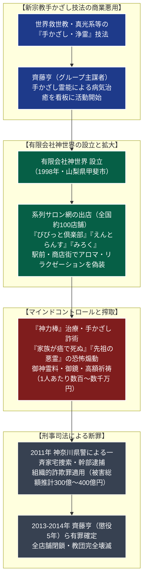

# 神世界 専門構造分析ノート

> [!summary] 要旨
> 神世界グループ（有限会社神世界、有限会社えんとらんす、株式会社びびっと等）は、最高指導者の齊藤亨（1948-）らが1990年代から2010年代初頭にかけて全国展開した、ヒーリングサロンを偽装した組織的霊感商法・詐欺カルトグループである。山梨県甲斐市に巨大な本部拠点を構え、首都圏を中心に約100店舗のサロンを展開した。
> 宗教色を隠して駅前や商店街に「アロマテラピー」「リラクゼーションサロン」として出店し、健康不安や家庭の悩みを抱える主婦層を誘引。布で巻いた棒（神力棒）で体を擦る手かざし治療で難病が治ると欺き、「悪霊の因縁を祓わなければ家族が死ぬ」などと恐怖を煽って数千万円単位の「御神霊料」や高額な「御鏡」を購入させた。2011年、神奈川県警による大規模強制捜査を受け幹部が一斉逮捕され、**推計300億〜400億円に上る巨額詐欺事件**として齊藤ら首謀者に実刑判決が確定、組織は完全に壊滅した。

---

## 1. 概要と基本情報 (司法確定記録・警察当局発表)

| 項目 | 内容 |
| :--- | :--- |
| **団体正式名称** | 神世界グループ（有限会社神世界、有限会社えんとらんす、株式会社びびっと等） |
| **最高指導者（教祖格）** | 齊藤亨（元手かざし系信徒、懲役5年実刑確定） |
| **主たる幹部** | 杉本明弘（えんとらんす代表）、浅野和代（霊能者役「神の手」）ら |
| **設立年・壊滅** | 1990年代初頭（創始） / 1998年（会社設立） / 2011年（警察強制捜査・壊滅） |
| **旧本部拠点** | 山梨県甲斐市（旧中巨摩郡敷島町）の山林施設（現在は閉鎖） |
| **法的地位** | 有限会社・株式会社等（宗教法人格は取得せず、サロン企業として活動） |
| **偽装の手法** | ヒーリングサロン（アロマ、整体、足裏マッサージ）を看板とした無警戒な誘引 |
| **象徴的詐欺手具** | 「神力棒（しんりきぼう）」「御神霊（おみたま）」「御鏡」「千手観音絵画」 |
| **被害規模** | 被害総額推計300億〜400億円（被害者対策弁護団公表資料） |

---

## 2. ヒーリングサロンを偽装した組織的霊感商法の詐欺系統樹

手かざし系新宗教の技法を悪用し、リラクゼーションサロンを装って一般人をマインドコントロール下に置き、巨額資金を収奪した。



---

## 3. 指導層：齊藤亨と偽装企業のピラミッド構造

神世界グループは、宗教法人ではなく複数の一般法人（有限会社・株式会社）をピラミッド型に配置し、税務追及や警察の監視を逃れながら組織的詐欺を行っていた。

### 1. 最高首謀者：齊藤亨（1948-）
山梨県出身。手かざし系新宗教の信徒を経て、自ら「神の声を聞き、人々の因縁を透視できる絶対的霊能者」として君臨。表向きはサロン企業の経営には直接関与しない形を取りながら、山梨県甲斐市の豪華な本部施設からすべてのサロン運営・金銭ノルマ・祈祷価格を一元的に指示・統制していた。

### 2. 統括幹部とフロント企業網
- **有限会社えんとらんす**: 代表・杉本明弘。首都圏の主要サロンを統括。
- **株式会社びびっと**: 会報誌の発行、新規顧客の集客イベントを担当。
- **有限会社みろく**: 関西・東海地方のサロン網を管理。
- **霊能者役（神の手）**: 浅野和代などの女性幹部が各サロンを巡回し、相談者に対して「神があなたの体に入って治そうとしている」「この因縁を祓わなければ息子が早死にする」などと告げて高額契約を迫る「クローザー」の役割を果たした。

---

## 4. 歴史変遷クロノロジー

```
・1990年代初頭: 齊藤亨、山梨県や神奈川県で手かざしによる民間霊能治療活動を開始
・1998年: 山梨県甲斐市に「有限会社神世界」を法人登記
・2000年代初頭: 「癒やしブーム」に乗り、「びびっと倶楽部」等のサロンを首都圏の主要駅前に次々と出店
・2005年: 全国約100店舗に達し、年間数十億円の売上を記録する一大霊感商法ネットワークへ成長
・2007年: 被害者が弁護士会に駆け込み、「神世界被害対策弁護団」が全国で結成される
・2007年12月: 神奈川県警、特定商取引法違反（不実の告知）容疑で神世界本社および系列サロンを一斉捜索
・2011年8月: 神奈川県警特別捜査本部、組織的詐欺容疑で齊藤亨、杉本明弘、浅野和代ら中核幹部を一斉逮捕
・2011年12月: 警察庁・検察、詐欺罪で齊藤らを起訴。山梨の本部施設や全国サロンが全面閉鎖
・2013年3月: 横浜地方裁判所、主謀者・齊藤亨に対し懲役5年（求刑懲役8年）の実刑判決
・2014年: 最高裁判所、上告を棄却。齊藤らの実刑判決が確定し、グループは完全壊滅
```

---

## 5. 手口・教理的詐術・マインドコントロールの特色

### 1. 「癒やしのサロン」による巧妙なファーストコンタクト
従来の霊感商法（統一教会等の街頭アンケートや戸別訪問）と異なり、神世界は**「お洒落で清潔なヒーリングサロン」**の形態をとった。
- 「初回お試し千円」「アロマテラピー」「足つぼマッサージ」などと謳い、身体の不調や育児の悩みを抱える主婦を無警戒に店内へ招き入れた。

### 2. 「神力棒」と手かざしによる治病詐術
- **神力棒（しんりきぼう）**: 白い布を巻き付けた長さ約30cmの木棒。サロン店員が「この棒には神の力が宿っている」と称して顧客の患部（肩、腰、腹など）を擦り、「邪気が出ている」「ほら軽くなったでしょう」と暗示をかけた。
- **現代医学の否定**: 病院の薬を「毒薬」と呼び、医師の治療を中断させてサロンの施術に依存させた。

### 3. 恐怖煽動による金銭収受の吊り上げ階段
顧客がスタッフを信頼し始めると、巡回してきた「特別霊能者」との面談（特別ヒーリング）をセッティングした。
- **因縁の告知**: 「あなたの背後に水子の怨霊が見える」「このままでは夫が倒れ、家庭が崩壊する」と極度の恐怖心を植え付けた。
- **法外な価格設定**:
  - 初級祈祷（御神霊料）：数十万〜100万円
  - 中級・上級祈祷（先祖解脱）：数百万円
  - 御鏡（神が宿るとされる鏡）：1,000万〜3,000万円
  - 千手観音等の絵画：数千万円
- 被害者は預貯金を使い果たした後、自宅を担保に銀行やノンバンクから借金を重ねさせられ、破産に追い込まれる者が続出した。

---

## 5-1. 神奈川県警による摘発と刑事確定判決（徹底客観記録）

> [!danger] 霊感商法に対する「組織的詐欺罪」適用の歴史的メルクマール
> - **神奈川県警による執念の強制捜査**:
>   宗教行為を隠れ蓑にした金銭トラブルは、従来「民事不介入」「信教の自由」の壁に阻まれ刑事事件化が極めて困難とされてきた。しかし、神奈川県警は神世界が宗教法人ではなく一般企業である点に着目し、科学的根拠のない治病効果を謳って多額の現金を詐取した**「純粋な組織的詐欺犯罪」**として立件に踏み切った。
> - **被害総額推計と実態**:
>   神世界被害対策弁護団の調査によると、グループが約10年間に詐取した総額は**推計300億〜400億円**に上り、単一の被害者が1億円以上を騙し取られたケースも多数確認された。
> - **裁判所の司法判断（横浜地裁・東京高裁・最高裁）**:
>   2013年3月、横浜地方裁判所は首謀者・齊藤亨に対し、**「病気治癒や災厄回避の効果がないことを知りながら、神仏の祟りや病気の悪化を予告して被害者の恐怖心や不安感に付け込み、多額の金員を騙し取った悪質な犯行である」**として懲役5年の実刑判決を下した。
>   東京高裁および最高裁もこの判断を全面的に支持し、齊藤の実刑が確定した。

---

## 6. 拠点・サロン網の実態

- **山梨本部（神世界総本部）**:
  - 所在地：山梨県甲斐市（旧敷島町）の山林地帯
  - 広大な敷地に豪華な木造大殿堂、研修棟、齊藤の個人邸宅を配備。全国のサロンから集められた莫大な現金がここに集約されていた（現在は閉鎖・売却）。
- **全国サロン網**:
  - 神奈川県（横浜・川崎・藤沢・横須賀）、東京都（八王子・町田・蒲田）、静岡県、愛知県、福岡県等、全国主要都市に約100店舗展開していたが、2011年の捜査により全店舗が閉鎖された。

---

## 7. 関連フロント企業網

- **有限会社神世界**: グループの頂点企業。
- **有限会社えんとらんす**: サロン店舗の経営・スタッフ指導。
- **株式会社びびっと**: 広報・会員管理。
- **有限会社みろく**: 西日本地区サロン統括。
※これらの企業はいずれも刑事事件摘発後に営業を停止し、法人登記も閉鎖された。

---

## 8. 史料・参考文献

1. 横浜地方裁判所判決 平成25年3月18日（神世界グループ詐欺被告事件判決録）
2. 東京高等裁判所判決 平成25年12月10日
3. 神奈川県警察本部 捜査第四課・広報資料（平成23年検挙記録）
4. 神世界被害対策弁護団 公開資料および被害実態報告書
5. 紀藤正樹・山口広『霊感商法の実態―カルトの心理と詐術』（岩波ブックレット）

---

## 9. 関連ノート (Vault内)

- [[_分派・異端研究ポータル]]
- [[ライフスペース]]（自己啓発・治病カルトの比較対照）
- [[世界平和統一家庭連合]]（霊感商法・恐怖煽動マインドコントロールの先駆）
- [[法の華三法行]]（足裏診断による巨額詐欺事件カルト）
- 明覚寺（霊視商法・解散命令が出された本覚寺グループ）

---

## 10. 検証・品質ゲートと留保事項

> [!warning] 留保事項
> - **司法確定判決基準**: 本稿の記述は、横浜地裁・東京高裁・最高裁における刑事確定判決記録、および神奈川県警の公表資料に基づき、法的・客観的事実のみを記録している。
> - **宗教法人との峻別**: 神世界グループは宗教法人ではなく、一般法人（有限会社・株式会社等）を偽装隠れ蓑として用いた詐欺グループである。
> - 本ノートの evidence_type は `"official_court_and_academic_database"`、confidence は `5`。

---

*※本稿は[[_分派・異端研究ポータル]]の個別教団分析ノートである。*
