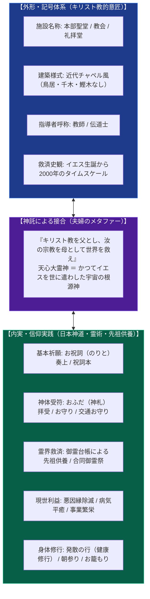
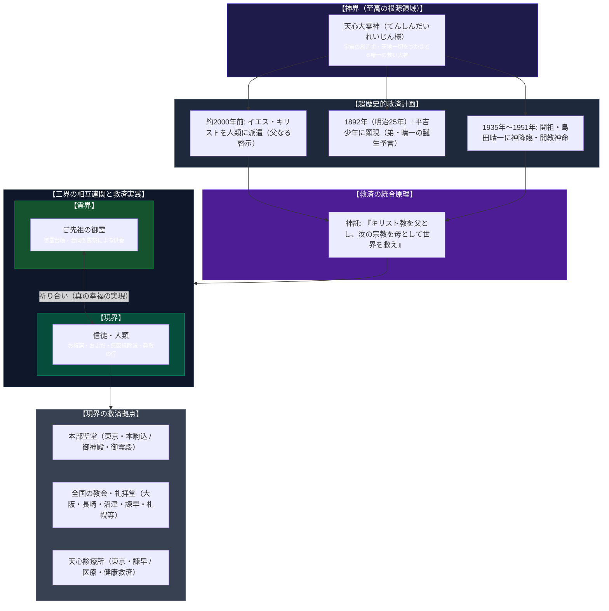

# 天心聖教 専門構造分析ノート

> [!summary] 要旨
> **天心聖教**（てんしんせいきょう / 旧称: 天心教、天心大霊教）は、開祖・[[島田晴一]]（1896〜1985、文献により「精一」）が主祭神「天心大霊神（てんしんだいれいじん）」の神託・神命を受けて創始した文部科学大臣所轄の単立宗教法人（法人番号: 4010005000437、本部: 東京都文京区本駒込6丁目）。
> 全国主要都市の拠点を神社ではなく「教会」「礼拝堂」「本部聖堂」と呼称し、モダンな近代教会堂建築を採用しているため外形上はキリスト教系と混同されやすいが、その教義の本質は**「神道・民間霊術的実践を母体としながら、キリスト教の神観（イエスを遣わした宇宙神）を包括的・発展的に取り込んだ独自の習合宗教」**である。
> 主祭神「天心大霊神」は**「かつてイエスを人類に遣わされた神様御自身」**であると公式教理（入門冊子『安心して暮らせる幸せを』等）で明記されており、戦時中には開祖に対して**「キリスト教を父とし、汝の宗教を母として世界を救え」**という神託（神勅）が下された。西洋の一神教的超越性（父）と、日本の神道・母性的抱擁・現世救済（母）を統合する救済史観を掲げつつ、信徒の実践面では「お祝詞」「おふだ」「御霊台帳による先祖供養」「悪因縁除滅」「発散の行」といった伝統的日本宗教の霊動的・現世利益的儀礼を中核に据えている。

---

## 1. 命題の構造（通説・キリスト教との混同 vs 天心聖教の神学構造）

天心聖教は、施設名称に「教会」「礼拝堂」「聖堂」を用い、竹中工務店設計の本部聖堂をはじめとする近代的な会堂建築を持つことから、初見の外部者からは「プロテスタント系またはキリスト教系新宗教の一派」と認識されることが多い。しかし、内部教理および儀礼の深層を解剖すると、キリスト教を否定するのではなく、むしろ自教の主神の配下にキリスト教の神格と歴史的使命を包摂・位置づける「スーパーセッショニズム（超克・完成的習合）」の構造を持つ。

### 比較考察軸マトリクス表

| 比較考察軸 | 伝統的正統キリスト教（カトリック / プロテスタント） | 伝統的教派神道・神社神道 | 天心聖教 (Tenshin-Seikyo) |
| :--- | :--- | :--- | :--- |
| **最高神・信仰対象** | 三位一体の神（父・子・聖霊） | 天照大御神・造化三神・八百万の神 | **天心大霊神**（宇宙の創造主、天地一切をつかさどる唯一の救い神。「かつてイエスを世に遣わした神」御自身） |
| **イエス・キリストの位置づけ** | 神の独り子、人類の贖罪主、救世主 | 基本的に教理外（他宗教の預言者） | **天心大霊神が約2000年前に人類へ遣わした使者**（天心大霊神はその根源神であり、モーセやイエスの時代を超越した存在） |
| **キリスト教の役割（神託）** | 唯一絶対の救済の道 | 他宗教（外来宗教） | **「キリスト教を父とし、汝の宗教（自教）を母として世界を救え」**（父性的一神教と母性的現世救済の婚姻的統合） |
| **拠点・建築形態** | 教会堂・大聖堂（十字架を掲揚） | 神社社殿（鳥居・千木・鰹木・神鏡） | **本部聖堂・教会・礼拝堂**（近代建築・チャペル風様式、十字架や鳥居は排し「御聖殿（御神殿・御霊殿）」を安置） |
| **中心儀礼・実践** | 礼拝、ミサ、聖餐式、洗礼、聖書朗読 | 祭祀、大祓詞奏上、玉串奉奠、神札 | **お祝詞奏上**、**おふだ拝受**、**御霊台帳による先祖供養**、**悪因縁除滅**、**発散の行**、個人指導（悩み相談） |
| **世界観・領域統治** | 天国と地獄、終末論（最後の審判） | 幽顕一如、高天原・中津国・黄泉国 | **三界統治**（現界・霊界・神界を一貫して統べる。現界の信徒と霊界のご先祖が共に天心大霊神を祈ることで真の幸福を実現） |
| **他宗教観** | 排他的または対話的包摂 | 寛容・神仏習合 | **包括的帰一論**（「信じる対象は違っても、その信じる心がやがて天心大霊神様に結ばれ、今までの信仰も生きる」） |

---

## 2. 概要と基本公的諸元

### 2-1. 法人格および組織諸元
- **法人名称**: 宗教法人 天心聖教（てんしんせいきょう）
- **法人番号**: 4010005000437（国税庁法人番号公表サイト確認済み）
- **所轄庁**: 文部科学大臣所轄（単立単位宗教法人、包括関係なし）
- **文化庁『宗教年鑑』分類**: 諸教（単立）
- **國學院大學『神道事典』分類**: 第8部 流派・教団と人物 / 近代の教団（神道系新宗教）
- **代表役員**: 島田 幸一郎（初代開祖: 島田晴一、二代教主: 島田晴行）
- **公称信者数**: 約21万人
- **本部所在地**: 〒113-0021 東京都文京区本駒込6丁目10-21（天心聖教本部聖堂）
  - 本部施設構成: 御聖殿（向かって右: 御神殿、左: 御霊殿）

### 2-2. 全国の主要礼拝施設（聖堂・教会・礼拝堂一覧）
教団は全国各地に拠点を展開しており、その名称は「聖堂」「教会」「礼拝堂」に統一されている（公式入門冊子『安心して暮らせる幸せを』末尾一覧より）。

| 施設種別 | 施設名 | 所在地 | 特色・備考 |
| :--- | :--- | :--- | :--- |
| **本部** | **本部聖堂** | 東京都文京区本駒込6-10-21 | 教団中枢。竹中工務店設計による近代建築。御神殿・御霊殿を併設。 |
| **聖堂** | **長崎聖堂** | 長崎県長崎市女の都3-5-16 | 九州中核拠点（旧・長崎仮教会から昇格）。 |
| **教会** | **大阪教会** | 大阪府大阪市阿倍野区長池町10-6 | 関西中核拠点。 |
| **教会** | **沼津教会** | 静岡県沼津市下香貫林ノ下2068 | 東海地区中核拠点。 |
| **教会** | **諫早教会** | 長崎県諫早市福田町46-32 | 諫早天心診療所を併設。近代建築の会堂。 |
| **発祥聖地** | **聖地大越礼拝堂** | 埼玉県加須市大越2439 | 平吉少年が神様と出会った「納屋」が保存される教団発祥聖地。 |
| **礼拝堂** | **札幌礼拝堂** | 北海道北広島市虹ヶ丘8-2-1 | 北海道中核拠点。モダンな礼拝堂建築。 |
| **礼拝堂** | **函館礼拝堂** | 北海道函館市東山1-15-1 | 道南拠点。 |
| **礼拝堂** | **仙台礼拝堂** | 宮城県仙台市青葉区栗生6-2-1 | 東北中核拠点。 |
| **礼拝堂** | **山形礼拝堂** | 山形県天童市東久野本3-3-38 | 山形拠点。 |
| **礼拝堂** | **伊勢礼拝堂** | 三重県いなべ市大安町石榑東1860-5 | 近畿・東海境界拠点。 |
| **礼拝堂** | **四国礼拝堂** | 香川県東かがわ市水主2067-31 | 四国北部拠点。 |
| **礼拝堂** | **今治礼拝堂** | 愛媛県今治市桜井2-6-4 | 四国西部拠点。 |
| **礼拝堂** | **大分礼拝堂** | 大分県大分市中鶴崎2-6-19 | 東九州拠点。 |
| **医療機関** | **天心診療所（東京）** | 東京都文京区本駒込6-11-9 | 本部聖堂至近に設置された医療施設。 |
| **医療機関** | **諫早天心診療所** | 長崎県諫早市福田町46-32 | 諫早教会に併設された医療施設。 |

---

## 3. 開教起源と沿革史

### 3-1. 1892年（平吉少年への神顕現）と開祖誕生予言
天心聖教の起源は、教団公式教本『由来』および入門冊子において以下のように語られる。
- **神の顕現**: 1892年（明治25年）、埼玉県加須市大越の農家において、当時10歳であった長男・**島田平吉（へいきち）**の前に突如として神様（天心大霊神）が姿を現した。神様は大男の姿で山小屋や納屋に現れ、平吉に文字を教え、空中飛行によって深山へ連れ出すなど数々の神秘的奇蹟を現したとされる。
- **救済史的意味**: 教団は、この1892年の平吉への顕現を**「イエス誕生から約2千年後」**という超歴史的タイムスケールの中で位置づけている。
- **開祖誕生予言**: 1895年（明治28年）正月、平吉は「来年弟が生まれる」と予言。13ヶ月後の1896年（明治29年）2月11日、予言通り男の子が誕生した。神様はその子に自ら**「晴一（せいいち）」**と名付け、平吉に対して「汝と別れねばならないが、年月が経つうちに我が使命を降す者を現す故、時節を待っておられよ」と言い残して神界へ戻ったとされる。

### 3-2. 40年後の神降臨と先物相場神示
- 成長した晴一は外米や建具（障子戸）のブローカーとなり、23歳で東京・深川に店舗を開店した。しかしその後事業は暗転し、深刻な経営不振に陥る。
- 誕生から約40年後の1935年（昭和10年）、どん底にあった晴一の前に天心大霊神が再降臨した。「汝らに財宝を授けつかわすが故、晴一の生まれた二月十一日には必ず祭り事をせよ」と命じ、商品先物市場の相場変動を正確に予言（神示）したことで、晴一とその商売仲間は莫大な富を得て窮地を脱した。
- これを契機に晴一は自宅で例祭を始め、神懸かり（憑依）によって神託を伝える宗教的集会が形成されていった。

### 3-3. 1951年の開教神命と教団の発展
- **開教の神命**: 1951年（昭和26年）、天心大霊神より**「晴一、汝身命を賭して宗教を改革し、宗教と人生に新生命を与えて世界人類を救済せよ。我が守護してつかわす」**との神命を受ける。
- **教団設立**: 晴一は経営していた3つの会社を部下に譲渡し、1952年（昭和27年）に**「天心教」**を創立。
- **教名改称**: 1953年（昭和28年）に**「天心大霊教」**へ改称。1955年に青年部発足、1960年に新殿堂が竣工。
- **医療と病気治し**: 診療所・調剤所を開設するとともに、1961年頃には神から示された「御神水」注射による病気平癒祈願を行い、多くの信徒を獲得した。
- **二代教主への継承と「天心聖教」**: 1976年（昭和51年）、晴一の高齢に伴い、長男の**島田晴行（しまだ はるゆき）**が二代教主に就任。1985年（昭和60年）に開祖・晴一が89歳で帰幽。1988年（昭和63年）に教団名を**「天心聖教」**へと改称し、現代表役員・島田幸一郎体制へと受け継がれている。

---

## 4. キリスト教との関係性の深層分析

### 4-1. 神託「キリスト教を父とし、汝の宗教を母として世界を救え」の解読
國學院大學『神道事典』（磯岡哲也執筆）に記録された教団史料によれば、戦時中に島田晴一に対して下された主祭神の神託は以下のように明記されている。
> **「キリスト教を父とし、汝の宗教を母として世界を救え」**

宗教学的・構造主義的にこの神託を分析すると、以下の3重のコードが読み取れる：
1. **父性原理と母性原理の婚姻的統合**:
   - **キリスト教（父）**: 西洋近代文明を駆動した超越的一神教。絶対者への信仰、倫理的戒律、ロゴス（言葉・神学体系）、普遍的救済の意志を象徴する。
   - **自教・天心聖教（母）**: 日本列島固有の神道・アニミズム・現世肯定信仰。病気平癒、先祖供養、家庭の平安、具体的苦難の包摂・治癒を象徴する。
   - 父のみ（キリスト教のみ）では形式的教条主義や文明の闘争に陥り、母のみ（日本の土着信仰のみ）では普遍的文明性や世界的救済力を欠く。両者が「夫婦」として統合されることで、世界人類の真の救済が成し遂げられるという神学である。
2. **終末論的・世界救済的使命**:
   - 太平洋戦争という未曾有の世界危機・東西文明の衝突期において、「西洋（キリスト教）対 日本（神道）」の二項対立を乗り越え、キリスト教を父として受け入れつつ、日本発の宗教を母として世界を導くという強烈な世界変革ヴィジョンが示されている。

### 4-2. 神観におけるキリスト論の包摂と超克（スーパーセッショニズム）
教団の公式入門冊子『安心して暮らせる幸せを』第6頁には、以下の決定的な公式教理が明記されている：
> *「この宇宙をお創りになられた神様で、天地一切をつかさどられるという意味の『天心大霊神様』とお呼びしています……神様はイエス誕生から約２千年後の1892年（明治25年）に本教の開祖の兄・平吉に姿を現わされました。のちに、**イエスを人類に遣わされた神様であることを、神様がみずから明らかにされています。**」*

この公式教理が意味する神学的構造は以下の通りである：
- **イエス・キリストの相対化と根源神の同定**: キリスト教において「父なる神」と呼ばれ、イエスを世に遣わした宇宙の絶対主そのものが「天心大霊神」であると定義される。したがって、キリスト教徒が祈っている対象と天心聖教の信仰対象は根源において同一であるとされる。
- **啓示の段階的発展（時代超克論）**: 國學院大學の事典記述にもある通り、教団では天心大霊神を**「モーセ、イエスの時代を遥かに超えた至高の存在」**と説明する。すなわち、
  - 第1段階: モーセによる律法の時代（旧約）
  - 第2段階: イエス・キリストによる福音の時代（新約）
  - 第3段階: 島田平吉・晴一を通じた天心大霊神の直接顕現と三界救済の時代（完約・新生命）
  という、救済史の発展的超克（スーパーセッショニズム）の構造が採用されている。

### 4-3. 外形（教会・礼拝堂・聖堂）と内実（祝詞・神札・御霊供養）の二重構造
天心聖教の最大の特徴は、**「器（外形）としてのキリスト教的記号」**と**「中身（内実）としての神道的・霊術的儀礼」**の鮮やかなコントラストにある。

### 4-4. 他宗教包摂論（普遍的帰一観）
公式冊子『安心して暮らせる幸せを』第27頁のQ&Aにおいて、他宗教との関係が以下のように明確に語られている：
> **Q. 他の宗教をしていても入会できますか？**  
> **A. できます。信じる対象は違っても、その信じる心が、やがて天心大霊神様に結ばれ、今までの信仰も生きるでしょう。**

この教理は、キリスト教をはじめ仏教や諸教を信仰してきた信徒に対しても改宗や前信仰の破棄を強要せず、「その信仰心そのものが天心大霊神という根源神へと帰一する」という包括主義をとっている。

### 4-5. 日本近代宗教史におけるキリスト教習合系譜との比較
日本の近代新宗教において、キリスト教を取り込んだ教団との比較においても天心聖教の位置は極めて際立っている：
- **道会（松村介石）**: キリスト教から発し、儒教・神道を統合して日本的キリスト教（道）を確立。
- **日本聖道教団（岩﨑照皇）**: 宮崎・高千穂の八大龍王水神信仰を基盤としながら、「伊邪那美大神＝マリア様」と同一視し、12月24日にマリア祭を執行。
- **生長の家（谷口雅春）**: ニューソート（クリスチャン・サイエンス）の神学を取り込み、「万教帰一」としてキリスト教の愛と神道の生命を融合。
- **世界救世教（岡田茂吉）**: 「主（ス）の神（エホバ・エロヒム）」を主神とし、キリストの再臨・東方の光を唱える。
- **天心聖教（島田晴一）**: キリスト教の父性（ヤハウェ＝天心大霊神）と日本固有の母性（現世救済・先祖供養）を「父と母の婚姻」としてメタファー化し、外形を完全な近代教会堂としつつ、内実を祝詞・おふだ・御霊供養の日本的祭祀で満たすという独自のデザインを完成させた。

---

## 5. 構造連関図（Mermaidダイアグラム）

天心聖教における神界・霊界・現界の三界統治と、キリスト教救済史を包含する教理構造は以下のように体系化される。

---

## 6. 史料・参考文献・一次情報アーカイブ

1. **教団公式文献・一次史料**:
   * 天心聖教本部聖堂公式入門冊子『安心して暮らせる幸せを』（`saiwai_new.pdf`、URL: http://www.tenshin-seikyo.or.jp/pdf/saiwai/saiwai_new.pdf ）
   * 天心聖教教本『由来』（一巻、310頁、開教起源・平吉少年記録）
   * 教団公式教書『御神示』『御諭し』『神の聖旨（みこころ）』
   * 天心聖教公式サイト（ http://www.tenshin-seikyo.or.jp ）
2. **公的統計・法人登記データ**:
   * 文化庁『宗教年鑑 令和3年版』（第3部 2 文部科学大臣所轄単位宗教法人一覧 諸教・単立「天心聖教」p.161）
   * 国税庁法人番号公表サイト「宗教法人天心聖教」（法人番号: 4010005000437）
3. **学術事典・研究文献**:
   * 國學院大學デジタルミュージアム『神道事典』（韓国語版・日本語原文データベース、項目「天心聖教」、執筆者: 磯岡哲也、URL: https://d-museum.kokugakuin.ac.jp/eosk/detail/?id=17829 ）
   * 井上順孝編『新宗教事典』弘文堂
   * 井上順孝編『新宗教教団・人物事典』弘文堂

---

## 7. 関連ノート (Vault内)

- [[日本聖道教団]]（同じく神道系新宗教でありながらマリア信仰・キリスト教的エネルギー論を習合した教団）
- [[世界救世教]]（エホバ・エロヒム神観とキリスト再臨論を取り込んだ新宗教）
- [[大山ねずの命神示教会]]（文化庁『宗教年鑑』において同じく単立新宗教として併記される教団）
- [[_分派・異端研究ポータル]]

---

## 8. 品質ゲート（検証チェックリスト）

- [x] 主祭神「天心大霊神」の定義および「イエスを世に遣わされた神様」の公式教理が明記されているか
- [x] 戦時中の神託「キリスト教を父とし、汝の宗教を母として世界を救え」の出所（國學院事典）と解釈が記録されているか
- [x] 1892年の起源が「イエス生誕から約2000年後」として意識されている事実が反映されているか
- [x] 施設名称（教会・礼拝堂・聖堂）と実践儀礼（祝詞・おふだ・御霊供養）の二重構造が解剖されているか
- [x] 全国主要拠点（本部、長崎、大阪、沼津、諫早、札幌、診療所等）の所在地が網羅されているか
- [x] 法人番号（4010005000437）および文部科学大臣所轄単立宗教法人としての公的諸元が一致しているか
- [x] Mermaidダイアグラムに構文エラーがなく、コントラスト・アクセシビリティが担保されているか
