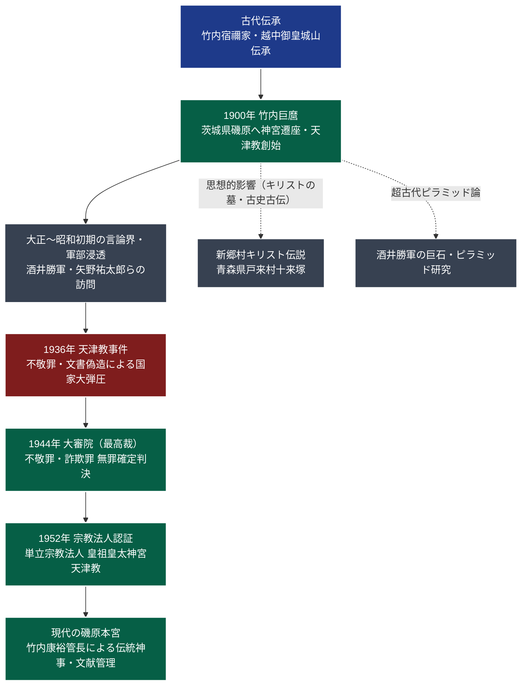

# 皇祖皇太神宮天津教 専門構造分析ノート

> [!summary] 要旨
> 皇祖皇太神宮天津教（こうそこうたいじんぐう あまつきょう）は、超古代史文書「竹内文書（竹内文献）」の継承・公開を契機として神道家・竹内巨麿（1874-1965）が創始した単立神道教団である。茨城県北茨城市磯原町に本宮を構え、天神七代・上古二十五代・鵜葺草葺不合朝（うがやふきあえずちょう）七十三代に及ぶ天皇の世界統治、モーセ・イエス・キリスト・釈迦らの来日修業伝説を伝承する。戦前には不敬罪弾圧（天津教事件）を受けながらも大審院で無罪が確定した歴史を持ち、近代日本の古史古伝・オカルティズム・精神史研究における極めて重要な結節点である。

---

## 1. 概要と基本情報

| 項目 | 内容 |
| :--- | :--- |
| **教団正式名称** | 宗教法人 皇祖皇太神宮天津教（こうそこうたいじんぐうあまつきょう） |
| **通称・別名** | 皇祖皇太神宮、天津教、磯原神宮、竹内神道 |
| **創始者（初代管長）** | 竹内巨麿（たけうち きよまろ、1874-1965、幼名・稲造） |
| **現代表者（第3代管長）** | 竹内康裕（宮司・管長） |
| **立教年・法人設立** | 1900年（明治33年）神宮遷座・立教 / 1952年（昭和27年）宗教法人認可 |
| **本部所在地** | 〒319-1537 茨城県北茨城市磯原町磯原1602 |
| **法人格・所轄** | 単立宗教法人（文部科学大臣所轄 / 法人番号: 4050005003310） |
| **公称信者数** | 約5,000人（公称・崇敬者含む） |
| **信仰対象・主祭神** | 元無極神（もとふつのおおかみ）、天地身一大神、歴代皇祖・皇妹神 |
| **最重要聖典・神宝** | 『竹内文書（竹内文献）』、神代文字碑、神宝（剣・鑑・ヒヒイロカネ伝承） |

---

## 2. 教団系統樹（Mermaid 11）

---

## 3. 指導層と後継構造

### 創始者：竹内巨麿（たけうち きよまろ、1874-1965）
* 富山県婦負郡呉羽村（現・富山市）出身。幼名は稲造。
* 鞍馬山、御岳山、伊勢神宮等で修行を重ね、自らを「武内宿禰（たけしうちのすくね）の正統後裔」と名乗った。
* 1900年（明治33年）、先祖代々越中（富山）の御皇城山（おみしろやま）に鎮座していた皇祖皇太神宮を、神託に基づいて茨城県多賀郡磯原町（現・北茨城市）へ遷座し、社殿を造営して教団活動を開始した。

### 後継体制と世襲構造
* **初代管長**: 竹内巨麿（1874-1965） — 竹内文書を公開し、戦前の大弾圧を耐え抜いて教団基盤を確立。
* **第2代管長**: 竹内義宮（よしのり、1921-1999） — 巨麿の養嗣子。戦後の宗教法人認可、社殿再建、竹内文書の資料散逸防止に努める。
* **第3代管長（現職）**: 竹内康裕（やすひろ） — 義宮の長男。茨城県磯原町の本宮宮司・管長を兼務し、祭祀と文献の保管を統括。代々竹内家による完全世襲制が採られている。

---

## 4. 歴史変遷クロノロジー

| 年代 | 事項 | 詳細・背景 |
| :---: | :--- | :--- |
| **1874年** | 竹内巨麿誕生 | 富山県呉羽村に生まれる。若年期より修験道・神道修行に没頭。 |
| **1900年** | 皇祖皇太神宮磯原遷座 | 神託により富山から茨城県磯原へ神宮を遷座。「皇祖皇太神宮天津教」を開教。 |
| **1910年代** | 竹内文書の開示 | 秘匿されてきた古代文献・神宝・神代文字を研究者や神道関係者に開示開始。 |
| **1925年** | 酒井勝軍の来訪 | キリスト教伝道者・オカルト研究家の酒井勝軍が磯原を訪れ、ピラミッド説・モーセ日本来日説に共鳴。 |
| **1928年** | 狩野亨吉による告発 | 元第一高等学校校長・文学博士の狩野亨吉が雑誌『思想』に「天津教古文書の偽作」を発表。痛烈な偽書批判を展開。 |
| **1935年** | キリスト墓発見騒動 | 竹内巨麿らが青森県戸来村（現・新郷村）を訪れ、古文書に基づき「キリストの墓（十来塚）」を発見したと発表。 |
| **1936年** | **天津教事件（検挙）** | 内務省特高警察および水戸地検が、皇室冒涜・不敬罪・詐欺・文書偽造容疑で巨麿らを逮捕。古文書・神宝が大量押収される。 |
| **1942年** | 水戸地裁有罪判決 | 水戸地方裁判所にて竹内巨麿に懲役刑が言い渡される。弁護側は即日控訴。 |
| **1944年** | **大審院で無罪確定** | 12月、大審院（現・最高裁判所）において、不敬罪・文書偽造ともに**無罪が確定**（近代治安史上の異例判決）。 |
| **1945年** | 資料の戦災焼失 | 裁判証拠として東京控訴院に保管されていた押収文献・神宝の多くが東京大空襲で焼失（教団側原本は一部現存）。 |
| **1952年** | 単立宗教法人認証 | 新生日本の「宗教法人法」に基づき、文部省（現・文科省）から単立宗教法人として正式認可を受ける。 |
| **2000年代〜** | 現代の境内・祭祀 | 磯原本宮の整備が進み、古代文字碑・神宝殿などを擁する歴史探訪・巡礼地として存続。 |

---

## 5. 教理・信仰・実践の特色

### 核心教理：竹内文書（竹内文献）の世界観
教団の信仰の基盤は、神代文字（アヒル草文字、トヨクニ文字等）で書かれたとされる膨大な古代記録群『竹内文書』にある。記紀（古事記・日本書紀）以前の歴史を記すとされる。

1. **歴代朝の編年**:
   - **天神七代（てんじんしちだい）**: 宇宙開闢から地球形成、人類創成に至る神話的時代。
   - **上古二十五代（じょうこにじゅうごだい）**: 天皇（スメラミコト）が地球全体を統治していた黄金時代。
   - **鵜葺草葺不合朝（うがやふきあえずちょう）七十三代**: 記紀神話の神武天皇以前に73代続いた王朝。神武天皇は不合朝73代の皇子とされる。
2. **スメラミコトの世界巡幸と五色人（ごしきじん）**:
   - 上古の天皇は「天の浮舟（あめのうきふね）」と呼ばれる飛行船に乗って世界各地を巡幸し、万国の民を統治したとされる。
   - 世界の人類は「黄人（きひと）」「白人（しろひと）」「黒人（くろひと）」「赤人（あかひと）」「青人（あおひと）」の五色人に大別され、日本がその親国・根源の地であると説く。
3. **世界聖人の来日・修行伝説**:
   - モーセ、イエス・キリスト、釈迦、孔子、老子、マホメットら世界の宗教創始者が来日し、皇祖皇太神宮で神道を修業したと主張。
   - モーセは十戒を授かる前に来日して神道秘法を修め、キリストはゴルゴダの丘で十字架にかけられたのは弟イスキリであり、本人は日本（青森県戸来村）に逃れて106歳の天寿を全うしたとする伝承を掲げる。

### 儀礼・禁忌・実践規範
* **古代神道祭祀**: 祝詞奏上、神籬（ひもろぎ）祭祀、神代文字を刻んだ石碑・神宝への礼拝を行う。
* **生活規律**: 一般社会生活を肯定し、過度な断食や世俗隔離は行わない。皇室尊崇と平和共存（万国和親）を重んじる。

---

## 5-1. 事件・裁判・社会的議論

### 天津教事件（不敬罪・国家弾圧事件）
* **事件の背景**: 昭和10年代、国体明徴運動や大本教への壊滅的弾圧（第2次大本事件）が吹き荒れる中、記紀神話の皇室系譜を否定し、伊勢神宮よりも皇祖皇太神宮が上位であると唱える天津教は、内務省治安当局から「国家神道の根底を揺るがす不敬の巨魁」とみなされた。
* **検挙と裁判経過**:
  - 1936年（昭和11年）2月、水戸地検と警察は竹内巨麿および教団幹部を一斉検挙。神宝や文書数千点が証拠物件として押収された。
  - 起訴容疑は「皇室に対する不敬罪」「詐欺罪」「有印公文書偽造罪」。
  - 1942年の第1審（水戸地裁）では有罪判決（懲役刑）が下されたが、教団側は徹底抗戦。
* **1944年大審院判決（無罪確定）**:
  - 1944年（昭和19年）12月、大審院判事・小林俊三らは「被告人らの主張は祖先伝来の神道信仰・確信に基づく宗教的行為であり、天皇制や皇室を冒涜・否定する故意（不敬の犯意）は認められない」として、**無罪を言い渡し確定**した。
  - 戦時統制下の極限状態において、司法の独立と良識が発揮された近代法制史上の重要判例として記録されている。

### 歴史学・考古学における「偽書」論争
* 歴史学界における一致した見解として、竹内文書は**近代（明治〜大正期）に成立した偽書（偽作）**と断定されている。
* 文学博士・狩野亨吉は1928年の論文において、以下の決定的な証拠を指摘した：
  1. 文書中に使用されている用紙が近代の洋紙や江戸後期の和紙であること。
  2. 神代文字と称する文字の文法・音韻体系が、明治期の現代日本語の音韻（五十音図）をそのままトレースしていること（古代の上代特殊仮名遣いと完全に矛盾）。
  3. 古代に存在し得ない近代地理・科学概念が混入していること。
* 一方で、民俗学・宗教社会学においては、近代日本人が西欧列強の植民地支配に対抗する中で生み出した「日本中心主義的ナショナリズムの文化的所産」として、オカルティズム史・近代精神史の極めて貴重な一次史料として分析されている。

---

## 6. 拠点施設・アクセス

### 本宮（皇祖皇太神宮）
* **所在地**: 〒319-1537 茨城県北茨城市磯原町磯原1602
* **境内環境**: 阿武隈山系の静閑な山林に位置し、本殿、神宝殿、神代文字碑、天の浮舟の記念碑等が点在する。
* **交通アクセス**:
  - **電車**: JR常磐線「磯原駅」西口よりタクシーで約10分（徒歩約40分）。
  - **自動車**: 常磐自動車道「北茨城IC」より国道6号線・県道経由で約10分。

---

## 7. 組織形態・関連出版・神宝

### 組織構造
* 文部科学大臣所轄の単立宗教法人。包括宗教団体には属さない。
* 神職（宮司・禰宜）による祭祀奉仕が行われ、全国に崇敬者会（友の会）組織が存在する。

### 主な出版物・関連資料
* 『竹内文献資料集』（八幡書店等から公刊された復刻資料群）
* 『神代の万国史』（酒井勝軍編、大正〜昭和初期の竹内文書解説書）
* 教団機関紙・崇敬会だより（不定期刊行）

---

## 8. 史料・参考文献

1. **教団一次資料**:
   - 皇祖皇太神宮天津教 公式サイト（`http://www.kousokoutaijingu.or.jp/`）
   - 竹内巨麿 伝記資料・御神託録（教団社務所蔵）
2. **司法確定記録**:
   - 大審院刑事判例集（昭和19年12月 皇室不敬被告事件判決録）
3. **学術・歴史学的検証文献**:
   - 狩野亨吉「天津教古文書の偽作」（『思想』1928年6月号 / 岩波書店）
   - 原田実『偽書が揺るがした日本史』（山川出版社、2020年）
   - 長尾光之『竹内文書の謎』（大陸書房、1986年）
   - 藤原明『幻影の超古代史—竹内文書と近代日本』（柏書房、2019年）

---

## 9. 関連ノート（内部リンク）

- [[01_宗派・異端研究/_分派・異端研究ポータル|_分派・異端研究ポータル]]
- 系統別分類カタログ
- [[01_宗派・異端研究/02_大本系/神道天行居|神道天行居]]（友清歓真・古神道研究との交錯）
- [[01_宗派・異端研究/02_大本系/大本|大本]]（昭和10年代の国家弾圧・不敬罪事件の比較対象）
- [[01_宗派・異端研究/12_その他/国際ラエリアン・ムーブメント|国際ラエリアン・ムーブメント]]（古代宇宙人・超古代文明論の近現代的変奏）

---

## 10. 検証・品質ゲートと留保事項

> [!note] 検証ステータスと留保事項
> - **史料批判の明確化**: 教団が伝承する『竹内文書』の記述は、学術的（歴史学・考古学・国語学）には偽書と断定されている。本ノートの記述は、信仰内容そのものの客観的記録と、教団史・法廷闘争史を厳密に区別して整理したものである。
> - **大審院判決のファクトチェック**: 昭和19年12月の大審院判決録により、不敬罪・文書偽造罪の無罪確定は司法確定事実として検証済み。
> - 本ノートの `confidence` は **5**（最高裁・大審院確定判決および学術研究に基づく確定検証）、`evidence_type` は **official_database / academic_history** である。

---

*※本稿は[[_分派・異端研究ポータル]]の個別教団分析ノートである。*
