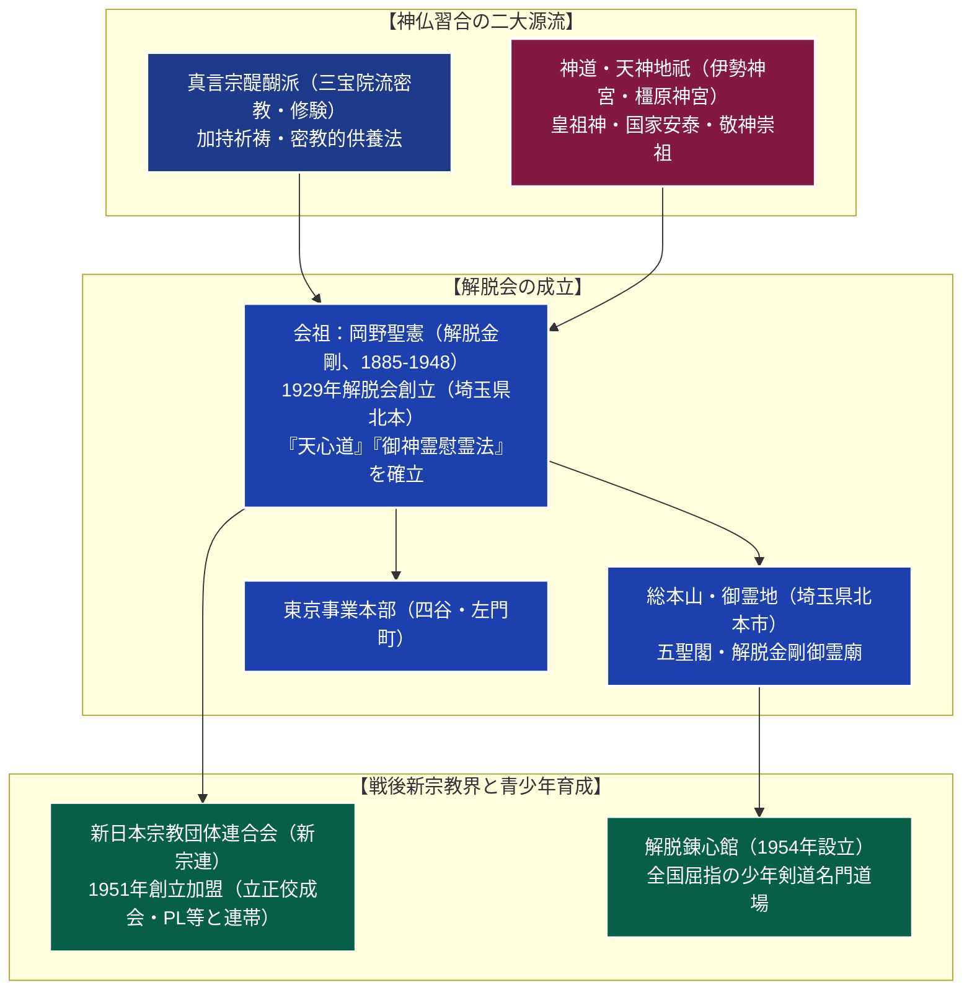

# 解脱会 専門構造分析ノート

> [!summary] 要旨
> 解脱会（げだつかい）は、会祖・岡野聖憲（解脱金剛、1885-1948）が1929年（昭和4年）に創立した新宗教教団である。真言密教（醍醐派三宝院流の修法）を仏教的基盤としながら、伊勢神宮（天照大御神）や橿原神宮（神武天皇）をはじめとする天神地祇・皇祖神への崇敬を不可分とする徹底した「神仏習合」を教義の中核に据える。
> 「天心道（てんしんどう）」と呼ばれる敬神崇祖・報恩感謝の実践道徳を説き、釈迦・孔子・老子・キリスト・天神地祇を合祀する「五聖閣」を仰ぐ包摂的宗教観を持つ。戦後の1951年には立正佼成会やPL教団らと共に「新日本宗教団体連合会（新宗連）」を結成した中核母体の1つ。総本山である埼玉県北本市の「御霊地（ごれいち）」に日本屈指の少年剣道道場「解脱錬心館」を構え、武道を通じた青少年健全育成活動でも社会的に著名である。

---

## 1. 概要と基本情報 (公的データベース・教団資料)

| 項目 | 内容 |
| :--- | :--- |
| **教団正式名称** | 宗教法人 解脱会（単立宗教法人） |
| **会祖（尊称）** | 岡野聖憲（解脱金剛、1885-1948） |
| **創立年・認証** | 1929年（昭和4年創立） / 1952年（宗教法人認証） |
| **本部所在地** | 東京事業本部：東京都新宿区左門町13-1 / 総本山御霊地：埼玉県北本市荒井5丁目144 |
| **法人番号** | 3011105005087（国税庁法人番号公表サイト確認済み） |
| **主神・信仰対象** | 三宝（仏法僧・真言密教本尊）、天神地祇（伊勢神宮・橿原神宮等）、五聖 |
| **核心教義・修法** | 天心道（敬神崇祖・反省感謝）、御神霊慰霊法、五聖閣拝礼 |
| **加盟連合組織** | 新日本宗教団体連合会（新宗連・結成原加盟団体） |
| **主要社会事業** | 解脱錬心館（少年剣道・武道道場）、解脱選奨（地域社会貢献表彰） |

---

## 2. 伝統密教から神仏習合・新宗連への連関系統樹

解脱会は、真言宗醍醐派の密教・修験を母体としながら、神道皇祖神への崇敬を融合させ、戦後新宗教界の平和運動・信教の自由擁護の中心軸を担った。



---

## 3. 歴代指導者と法統

- **会祖：岡野聖憲（解脱金剛、1885-1948）**:
  本名・岡野英蔵。現在の埼玉県北本市に生まれる。若年期より病弱に苦しみ、霊的体験を経て真言宗醍醐派で厳格な密教修行・加持祈祷法を修める。1929年に「解脱会」を創設。第二次世界大戦の戦禍の中で多くの戦没者慰霊と民衆救済に奔走し、1948年に遷化。死後、醍醐派総本山より「解脱金剛」の大号を追贈された。
- **第2代法主：岡野英憲（1906-1981）**:
  会祖の養子。会祖没後の教団近代化と組織整備を主導。1951年の新宗連創設に尽力し、新宗連理事長や全日本仏教会理事などを歴任。宗教界の連帯と社会福祉に大きな足跡を残した。
- **第3代法主：岡野聖法（1937-2009）**:
  教団の教学・儀礼体系を深化させ、解脱選奨や海外青年交流など社会・文化活動を拡張。
- **現代の指導体制**:
  世襲法統を基盤としながら、総務庁・事業本部による合議制と全国の支部（道場）ネットワークによって運営されている。

---

## 4. 歴史変遷クロノロジー

```
・1885年: 岡野英蔵（会祖・岡野聖憲）、埼玉県北足立郡中丸村（現・北本市）に誕生
・1929年: 真言密教の修行を経て「解脱会」を創設。病気平癒や霊的救済の指導を開始
・1933年: 埼玉県北本に聖地「御霊地」の神殿・道場を開設
・1940年代: 戦時下、戦没将兵の供養および国土安泰を祈念する「御神霊慰霊法」を徹底修法
・1948年: 会祖・岡野聖憲、63歳で遷化。真言宗醍醐派より「解脱金剛」大号を追贈
・1951年: 立正佼成会、PL教団らと共に「新日本宗教団体連合会（新宗連）」を創設
・1952年: 宗教法人法に基づく単立宗教法人「解脱会」の認証を受ける
・1954年: 聖地・御霊地に剣道道場「解脱錬心館」を道場開き、青少年武道教育を開始
・1968年: 東京事業本部ビル（東京都新宿区左門町）を竣工
・1986年: 地域社会で地道に善行・奉仕を続ける市民を顕彰する「解脱選奨」制度を創設
・2000年代: 御霊地の環境整備と少年剣道における全国大会制覇等、社会貢献活動を継続
```

---

## 5. 教理・儀礼の特色

### 1. 徹底した神仏習合（仏教と神道の両敬）
明治の神仏分離令以降、日本の宗教界では仏教と神道が制度的に切り離されたが、解脱会は前近代の日本古来の豊かな「神仏習合（神仏両敬）」を現代に再構築した。
- **仏教（真言密教）**: 衆生済度、祖霊供養、心の浄化、加持祈祷の根本原理。
- **神道（天神地祇）**: 伊勢神宮（天照大御神・宇宙の生命根源）、橿原神宮（神武天皇・建国の理念）、および郷土の鎮守・産土神に対する日々の敬神崇祖。信徒は神棚と仏壇の双方を等しく清浄に保ち参拝する。

### 2. 「天心道（てんしんどう）」の実践道徳
解脱会の信徒教育における倫理綱領。難解な観念論を避け、日常生活における平易な徳目の実践を説く：
- **敬神崇祖**: 神仏と先祖を敬い、自らの生命が悠久の過去から受け継がれていることに感謝する。
- **報恩感謝**: すべての環境・他者からの恩恵に感謝し、不平不満を慎む。
- **反省と奉仕**: 日々の行動を省み、自己の過ちを改め、社会・他者のために惜しみなく労力を捧げる。

### 3. 「五聖閣（ごせいかく）」の包摂的世界観
総本山・御霊地に建立されている「五聖閣」は、解脱会の宗教的寛容・包摂性を象徴する礼拝施設である。
- **釈迦牟尼如来（仏教）**
- **孔子（儒教）**
- **老子（道教）**
- **イエス・キリスト（キリスト教）**
- **天神地祇（神道・天照大御神等）**
人類の偉大な五大聖者を等しく仰ぎ、すべての高貴な教えは究極において一源に帰するという普遍的平和観を示す。

### 4. 御神霊慰霊法（ごしんれいいれいほう）
会祖が体系化した解脱会独自の供養儀礼。真言密教の修法に基づき、縁のある祖霊のみならず、無縁仏、戦争殉難者、災害犠牲者、さらには鳥獣・動植物・万物の霊に至るまで、大慈悲の心をもって供養し、怨親平等に成仏・解脱を祈る。

---

## 5-1. 社会事業と戦後宗教界における役割

> [!important] 武道による青少年育成と新宗連平和運動の中核
> - **解脱錬心館（全国少年剣道の最高峰）**:
>   1954年、会祖の「青少年を心身ともに健全に育成し、国家社会に有為な人材を育てる」という遺志を受け、埼玉県北本の御霊地内に創設された剣道道場。
>   元警視庁主席師範らの一流指導者を招聘し、全日本少年剣道武道錬成大会での優勝をはじめ、数々の全国大会を制覇。警察官、教育者、全日本選手権出場者など多数の名剣士を輩出し、「少年剣道の虎の穴」として武道界・スポーツ界で極めて高く評価されている。
> - **新日本宗教団体連合会（新宗連）の創設と信教の自由擁護**:
>   戦前の国家神道体制下で多くの新宗教が弾圧された教訓から、1951年に解脱会（岡野英憲）は立正佼成会（庭野日敬）、PL教団（御木徳近）、世界救世教らと共に「新宗連」を結成。戦後日本の「信教の自由の擁護」「政教分離の遵守」「国民道徳の向上」を掲げ、平和憲法の擁護運動を推進した。
> - **穏健な社会融和路線**:
>   攻撃的な折伏・強引な勧誘を行わず、地域の神社祭礼や寺院の行事、日本遺族会の慰霊活動とも協調する「穏健保守・伝統調和型」の姿勢を貫いており、新宗教の中でも特異な地域定着を果たしている。

---

## 6. 本部境内・拠点アクセス

- **総本山・御霊地（ごれいち）**:
  - 所在地：〒364-0026 埼玉県北本市荒井5丁目144
  - アクセス：JR高崎線「北本駅」西口より川越観光バス「北里大学メディカルセンター」行き等約10分、「解脱前」下車すぐ / 首都圏中央連絡自動車道（圏央道）「桶川北本IC」より車で約10分
  - 境内施設：五聖閣、会祖御霊廟、神殿、大講堂、解脱錬心館（剣道場）、広大な鎮守の森（自然庭園）が整備されている。
- **東京事業本部**:
  - 所在地：〒160-0017 東京都新宿区左門町13-1
  - アクセス：東京メトロ丸ノ内線「四谷三丁目駅」1番出口より徒歩約5分、JR総武線「信濃町駅」より徒歩約8分
  - 首都圏における宗務・布教・社会事業の統括窓口。

---

## 7. 関連組織・社会活動

- **解脱錬心館**: 青少年剣道道場（全日本剣道道場連盟加盟）。
- **解脱選奨**: 1986年創設。地域社会で地道な社会奉仕・文化活動・善行を継続している個人・団体を表彰する公益顕彰制度。
- **解脱報恩感謝会**: 信徒による福祉施設慰問、清掃奉仕、災害被災地支援を行うボランティア組織。

---

## 8. 史料・参考文献

1. 解脱会編『天心道要旨・解脱教典』（解脱会出版部）
2. 岡野聖憲『解脱金剛御説法集』（解脱会）
3. 新日本宗教団体連合会編『新宗連五十年史』（新宗連）
4. 井上順孝ほか編『新宗教事典』（弘文堂）
5. 文化庁『宗教年鑑』

---

## 9. 関連ノート (Vault内)

- [[_分派・異端研究ポータル]]
- [[立正佼成会]]（新宗連創設の盟友・法華系新宗教）
- パーフェクト リバティ教団（PL）（新宗連創設の盟友・大正新宗教）
- [[真如苑]]（同じく真言宗醍醐派を母体として発展した仏教系新宗教）
- [[阿含宗]]（真言密教・加持祈祷を基盤とする新仏教教団）

---

## 10. 検証・品質ゲートと留保事項

> [!warning] 留保事項
> - **神仏習合の性格**: 特定の既成仏教宗派や神社庁の傘下ではなく、単立の宗教法人として独自の神仏両敬・五聖合祀体系を確立している。
> - 本ノートの evidence_type は `"official_database"`、confidence は `5`。

---

*※本稿は[[_分派・異端研究ポータル]]の個別教団分析ノートである。*
