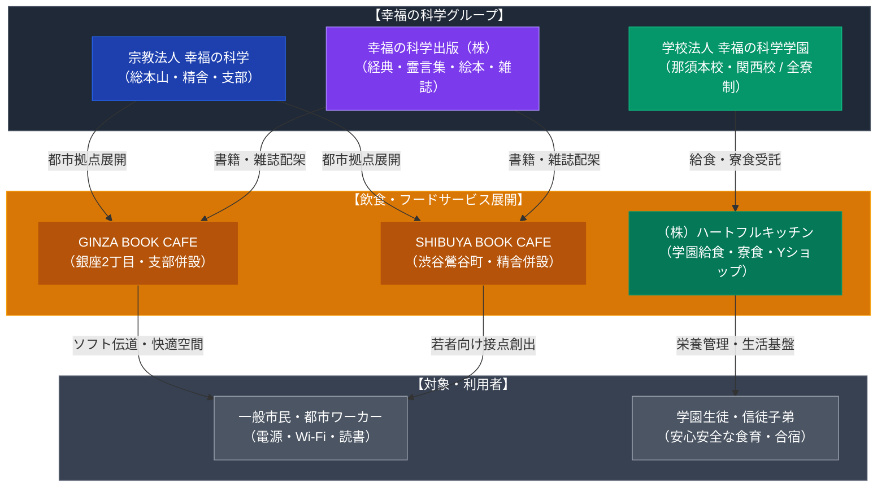

# GINZA BOOK CAFE・SHIBUYA BOOK CAFE（幸福の科学） 専門構造分析ノート

> [!warning] 執筆前の確認事項
> - **GINZA BOOK CAFE** および **SHIBUYA BOOK CAFE** は、新宗教「幸福の科学（HAPPY SCIENCE）」が直営・運営に関与する都心のブックカフェである。
> - 銀座店は東京中央支部に併設、渋谷店は渋谷精舎の2階入口横に併設されている。いずれも一般的なカフェとして外部に開放されており、電源やWi-Fi、こだわりのコーヒーや軽食（無水ハヤシライス等）を提供している。
> - 店内には幸福の科学出版が刊行する大川隆法の著作群（法シリーズ・霊言集）や絵本、雑誌『ザ・リバティ』『アー・ユー・ハッピー？』が整然と配架されており、宗教色を前面に押し出さずに自然な接触（タッチポイント）を生み出す都市型ソフトプロパガンダ／文化発信拠点として機能している。
> - グループのフードサービス企業として**「株式会社ハートフルキッチン」**が存在し、全寮制私立中高である幸福の科学学園（那須本校・関西校）の給食・寮食調理および校内売店（ヤマザキYショップ）運営を一手に担っている。

> [!summary] 要旨
> **幸福の科学の飲食・カフェ戦略**は、都心一等地におけるスタイリッシュなブックカフェ（銀座・渋谷）と、信徒子弟向け教育機関の食を支える直営給食会社（ハートフルキッチン）の二層構造を持つ。特にブックカフェは、従来の露骨な街頭勧誘や戸別訪問とは一線を画し、サードプレイス（第3の居場所）としての快適性を提供しながら教義書籍への自然な接触を促す、現代新宗教の高度な都市空間戦略の典型例である。

---

## 1. 諸見解・機能の対比（一般客 vs 教団戦略）

| 比較軸 | 一般利用者・周辺ワーカー（外部視点 / etic） | 幸福の科学・教団グループ（内部視点 / emic） |
| :--- | :--- | :--- |
| **存在意義** | 銀座・渋谷で電源・Wi-Fiが使える静かで落ち着いた穴場カフェ | 「幸福の科学の書籍・世界観」に自然に触れてもらう伝道・接点拠点 |
| **空間体験** | 洗練された内装、良質なコーヒー、軽食（ハヤシライス等） | 仏法真理の磁場に身を置き、心身の癒しと知的啓発を得る空間 |
| **書架の受容** | 「自己啓発やスピリチュアル本が妙に多いカフェ」という認識 | 大川隆法総裁の膨大な経典・霊言・絵本を通じた「地上天国」理念の浸透 |
| **布教アプローチ** | 積極的な勧誘や声かけはなく、居心地重視で利用可能 | 押し付けを排し、空間の快適性と書籍の魅力で自発的関心を促すソフト伝道 |

---

## 2. 概要と基本情報

| 項目 | GINZA BOOK CAFE | SHIBUYA BOOK CAFE | 株式会社ハートフルキッチン |
| :--- | :--- | :--- | :--- |
| **所在地** | 東京都中央区銀座2-2-19 | 東京都渋谷区鶯谷町3-12（渋谷精舎2F） | 栃木県那須郡那須町 / 滋賀県大津市 |
| **併設施設** | 幸福の科学 東京中央支部 | 幸福の科学 渋谷精舎 | 幸福の科学学園（那須本校・関西校） |
| **主要提供内容** | コーヒー、紅茶、スイーツ、無水ハヤシライス等 | コーヒー、カフェドリンク、軽食 | 学園中高の生徒・寮生向け朝昼晩給食、校内Yショップ |
| **設備・特徴** | 電源席、無料Wi-Fi、教団出版物展示・販売 | 渋谷精舎入口横、Instagram発信（別組織運営表記） | アレルギー対応食、安心安全食材の徹底 |
| **利用対象** | 一般市民、ビジネスパーソン、信徒 | 一般市民、若者層、精舎参拝者 | 学園生（全寮制）、教職員、来訪者 |

---

## 3. 史的経緯と都市型カフェ戦略の背景

### (1) 出版・メディア重視から「空間・カフェ体験」への拡張
幸福の科学は1986年の立教以来、大川隆法の著作を一般商業書店に大量流通させる「出版プロパガンダ」と、大規模ホールでの講演会、劇場用アニメ・実写映画の製作・全国配給を核として成長してきた。2010年代以降、若年層の活字離れや都市住民の孤立化が進む中で、銀座や渋谷といった情報発信力の高いメガロポリスの一等地に、誰もが立ち寄れる「ブックカフェ」を配置する空間戦略へと展開した。

### (2) 「敷居を下げる」ソフト伝道の実態
GINZA BOOK CAFEおよびSHIBUYA BOOK CAFEでは、一般的な新宗教の道場・布教所に見られる威圧感や教団看板は抑制されている。来訪者は1階のカウンターでドリンクやハヤシライスを注文し、2階の明るい客席でパソコン作業や読書を行うことができる。その周囲に配置された書棚には、経営論、政治評論、霊界論、児童向け絵本に至る多種多様な大川隆法著作が平積みされており、利用者は警戒心を抱くことなく自然に教団の活字文化に包まれる設計となっている。

### (3) 給食・食育インフラとしての「ハートフルキッチン」
都心のカフェが「対外的な接点」であるのに対し、全寮制中高一貫校である幸福の科学学園（那須・関西）の食事を一手に担う「株式会社ハートフルキッチン」は、「信徒子弟の体内育成・食育インフラ」として機能している。添加物を排除し、無農薬・安心食材に配慮した給食・寮食を提供することで、心身ともに健全な教団エリート層を育成する生活基盤を形成している。

---

## 4. 施設・機能の構造連関図

---

## 5. 現地利用・観察ポイント

1. **銀座店（GINZA BOOK CAFE）の立地と動線**:
   有楽町線「銀座一丁目駅」至近。銀座2丁目の路地に面し、ガラス張りの明るいエントランス。1階でレジ精算、2階がテーブル席・カウンター席。教団関係者とおぼしき利用者のほか、近隣のビジネスパーソンが作業カフェとして日常利用している。
2. **渋谷店（SHIBUYA BOOK CAFE）の独自性**:
   渋谷駅新南改札から鶯谷町方面へ徒歩約7分。渋谷精舎のエントランス脇に位置し、「精舎とは別組織の運営」と明記されているが、精舎参拝前後の信徒や地域の若者層が利用。
3. **書籍の選書傾向**:
   一般的なベストセラー小説等は置かれず、幸福の科学出版の最新刊、大川隆法の初期著作、経営成功学、霊言本、ならびに美麗な児童向けスピリチュアル絵本が棚全体を占める。教団の教義体系を網羅的に閲覧できる一種の「教団図書館カフェ」の様相を呈している。

---

## 6. 関連ノート

- [[幸福の科学]]
- [[PL病院 カフェレストラン（パーフェクト リバティー教団）]]
- [[SUZU COFFEE（東京黎明アートルーム・自然農法カフェ）]]
- [[生長の家オープン食堂]]
- [[_分派・異端研究ポータル]]
