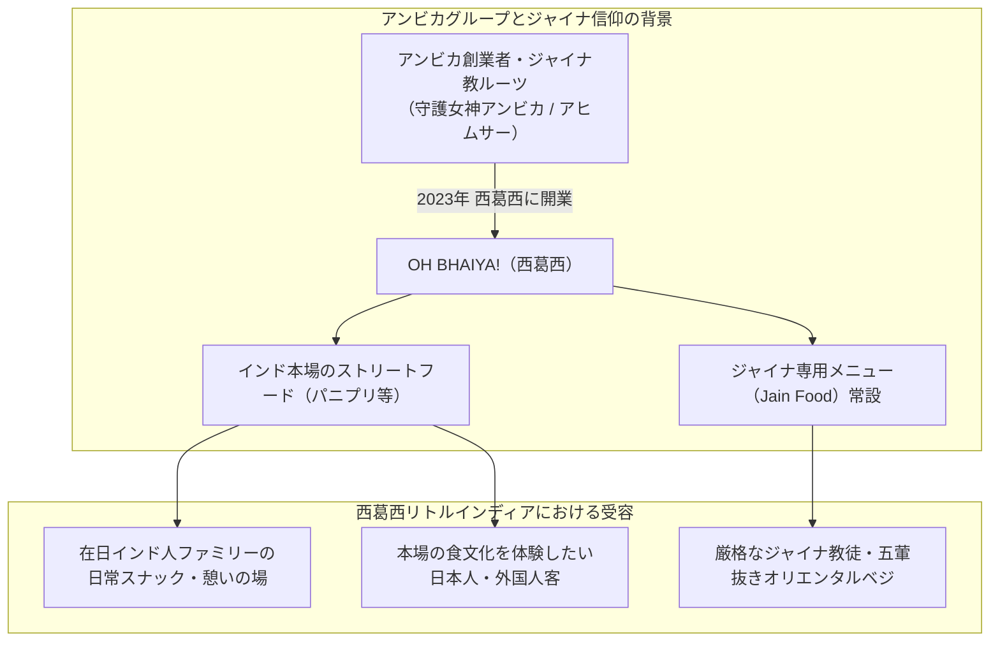

# OH BHAIYA!（西葛西・ジャイナ対応ストリートフード） 専門構造分析ノート

> [!warning] 執筆前の確認事項
> - **OH BHAIYA!（オー・バイヤ！）**は、日本最大級のインド人集積地である東京都江戸川区西葛西（リトルインディア）に所在する、**本格インド・ストリートフード（チャート / Chaat）およびジャイナ教対応（Jain Food）専門店**である。
> - 日本最大のインド食材・スパイス専門商社**「アンビカ（AMBIKA）」グループ**を背景に持ち、店名の「バイヤ（Bhaiya）」はヒンディー語で「お兄さん・アニキ」という親愛の呼称を意味する。
> - メニューには「Jain Hakka Noodles（ジャイナ焼きそば）」「Jain Fried Rice（ジャイナ炒飯）」「Jain Chili Paneer（ジャイナチリチーズ）」など、**「Jain（ジャイナ）」と明記された専用カテゴリーが常設**されており、ジャイナ教徒の厳格な食戒律（五葷・根菜完全不使用）に対応している。

> [!summary] 要旨
> **OH BHAIYA!**は、従来の「日本のインド料理＝北インドのチキンカレーとナン」という固定観念を覆し、インド庶民が熱狂する「ストリートフード（パニプリ、チャート、サモサ）」と「厳格なジャイナ食戒律」の双方を高度に両立させた最先端の宗教食実践拠点である。アンビカ創業者一族のジャイナ教的ルーツ（社名アンビカはジャイナ教第22代ティールタンカラの守護女神ヤクシニーに由来）と連動し、西葛西の多文化共生・食のバリアフリーを牽引している。

---

## 1. 諸見解・機能の対比（一般客 vs ジャイナ教理）

### 比較考察マトリクス表

| 比較軸 | 一般日本人客・エスニック愛好家（etic） | ジャイナ教徒・宗教的菜食主義者（emic） |
| :--- | :--- | :--- |
| **料理の魅力** | パニプリやチャートなど、スパイスと酸味・甘みが弾ける新感覚スナック | **不殺生（アヒムサー）と五葷禁忌を厳格にクリアした「清浄食」** |
| **ジャイナ（Jain）表記** | メニューにある「Jain」というヘルシーな野菜オプション | **タマネギ・ニンニク・ジャガイモを一切含まず、霊性を汚さない保証** |
| **店舗の雰囲気** | 西葛西の団地内にあるリアルなインド大衆食堂 | 母国の街角と同じ味を**安心して口にできるコミュニティの居場所** |
| **母体（アンビカ）の信頼** | スパイス卸として有名な大手企業直営 | **ジャイナの価値観（生命尊重・誠実）を理解する同胞の企業** |

---

## 2. 概要と基本情報

| 項目 | 内容 |
| :--- | :--- |
| **店舗名** | OH BHAIYA!（オー・バイヤ！） |
| **業態** | インド・ストリートフード（Chaat）、インド中華、南インド料理、ジャイナ対応専門店 |
| **所在地** | 東京都江戸川区西葛西3-22-6-110 1F（小島町二丁目団地内） |
| **運営主体** | 株式会社SK / アンビカ（AMBIKA）グループ関連 |
| **アクセス** | 東京メトロ東西線「西葛西駅」北口より徒歩約5分 |
| **代表メニュー** | パニプリ（ゴールガッパ）、セブプリ、サモサチャート、**Jain Fried Rice（ジャイナ炒飯）**、**Jain Hakka Noodles（ジャイナ麺）**、**Jain Chili Paneer** |
| **食事規定** | ベジタリアン、**ジャイナ教対応（五葷・根菜抜きメニュー常設）**、ハラール対応 |
| **公式サイト** | `https://ohbhaiya.jp/` |

---

## 3. ジャイナ教的背景とアンビカ（AMBIKA）の深層解剖

### 3-1. 社名「アンビカ（Ambika）」の宗教的起源
- **ジャイナ教の守護女神（ヤクシニー）**:
  ジャイナ教において、第22代ティールタンカラ（救済者）である「ネーミナータ尊者（Lord Neminatha）」に仕える専属の守護女神が**「アンビカ女神（Ambika Devi / 別名クシュマンディニー）」**である。
- **神聖な母性の象徴**:
  アンビカ女神は子供を抱き、マンゴーの枝を手にした慈愛と豊穣の神としてジャイナ寺院に必ず祀られる。アンビカグループの名はこの聖なる護法神に由来し、創業家（ラジャスタン出身のニッティン・ヒンガル氏ら）のジャイナ信仰が根底にある。

### 3-2. ストリートフードにおけるジャイナ調理技術
インドの屋台スナック（チャート）は通常、ジャガイモ（アルー）やタマネギ（ピャーズ）を大量に使用するが、OH BHAIYA! では以下の代替技術により完全なジャイナ仕様を実現している。
- **青バナナ（ローバナナ）やひよこ豆の活用**: ジャガイモの代わりに、加熱するとホクホクした食感になる青バナナ（調理用バナナ）や煮込み豆を使用。
- **ヒング（アサフェティダ）とフレッシュハーブ**: タマネギやニンニクを使わず、ヒングとミント・コリアンダー・タマリンドのチャトニで強烈な旨味とパンチを生み出す。

---

## 4. 宗教学的・食文化史的意義

- **西葛西リトルインディアにおける宗教食インフラの完成**:
  西葛西にはヒンドゥー教徒だけでなく多数のIT系ジャイナ教徒が暮らしており、OH BHAIYA! の登場によって、日常の軽食から外食会席に至るまで「ジャイナ食の完全自給」が達成された。
- **ストリートフードのグローバル展開**:
  伝統的なカレー専門店だけでなく、インドの大衆食文化（チャート）が宗教食対応（Jain Food）を伴って日本に根付いた画期的な事例である。

---

## 5. 関連教団・関連人物・関連概念

- **ジャイナ教（Jainism）**: 徹底した不殺生と五葷・根菜禁忌
- **アンビカ女神（Ambika Yakshini）**: ジャイナ教第22代ネーミナータの守護女神
- **[[バグワン・マハビールスワミ・ジェイン寺院（神戸ジャイナ寺院）]]**: 日本唯一のジャイナ教寺院
- **[[ヴェジハーブサーガ（VEGE HERB SAGA）]]**: 御徒町のジャイナ対応南インド料理店
- **[[Veg Kitchen（ベジキッチン・仲御徒町）]]**: 仲御徒町の100%ピュアベジ・ジャイナ対応店
- **[[ナタラジ（NATARAJ・自然派インド料理）]]**: 日本の菜食インド料理の草分け

---

## 6. 史料・参考文献

- OH BHAIYA! 公式サイト (`https://ohbhaiya.jp/`)
- Ambika Japan 公式アーカイブ (`https://www.ambikajapan.com/`)
- UR都市機構「西葛西団地と多文化共生・インド文化特集」
- Paul Dundas, *The Jains* (Routledge, 2002)

---

## 7. 関連ノート (Vault内)

- [[バグワン・マハビールスワミ・ジェイン寺院（神戸ジャイナ寺院）]]
- [[ヴェジハーブサーガ（VEGE HERB SAGA）]]
- [[Veg Kitchen（ベジキッチン・仲御徒町）]]
- [[ナタラジ（NATARAJ・自然派インド料理）]]
- [[ゴヴィンダス（Govinda's）船堀店]]
- [[各教団の食の教義・タブー比較]]

---

## 8. 検証・品質ゲートと留保事項

> [!warning] 留保事項
> - **メニューの注文**: 通常メニュー（ポテトや玉ねぎ入り）とジャイナ専用メニュー（Jain Hakka Noodles等）が明確に分かれているため、五葷抜きを求める際は「Jain（ジャイナ仕様）」と明記されたメニューを選択する必要がある。
> - **evidence_type**: `primary_and_secondary_sources`
> - **confidence**: `5`

---

*※本稿は[[_分派・異端研究ポータル]]の飲食・食品関連およびジャイナ教ストリートフード食文化実践に関する専門構造分析ノートである。*
