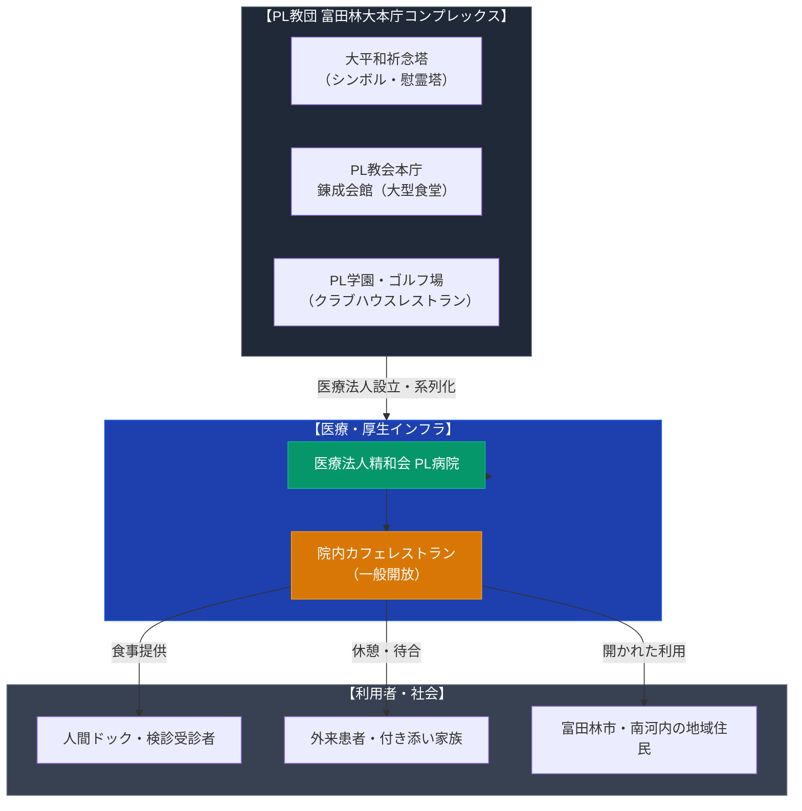

# PL病院 カフェレストラン（パーフェクト リバティー教団） 専門構造分析ノート

> [!warning] 執筆前の確認事項
> - **PL病院**は、大阪府富田林市に大本庁を置く新宗教「パーフェクト リバティー教団（PL教団）」の関連医療法人（医療法人精和会）が運営する総合病院である。
> - 病院敷地内・館内には、外来患者、人間ドック受診者、入院患者家族、および一般来院者が利用できる「カフェレストラン」や軽食コーナーが常設されている。
> - PL教団は戦後、富田林市内に大本庁、大平和祈念塔（PLの塔）、PL学園、PLカントリークラブ（ゴルフ場）、かつてのPLランド（遊園地）など広大な複合施設群（いわゆるPL教団都市）を築き、その内部に数多くの食堂・レストラン機能を内包してきた歴史を持つ。

> [!summary] 要旨
> **PL病院 カフェレストラン**は、PL教団の医療福祉拠点であるPL病院（富田林市）内に設けられた飲食施設である。モーニングサービス、日替わりランチ、麺類、喫茶メニュー等を提供し、人間ドック利用者の指定食事処および外来・地域住民の憩いの場として機能している。教団の宗教都市形成と近代医療・生活インフラの統合モデルを端的に示す実在の飲食拠点である。

---

## 1. 諸見解・機能の対比（一般来院者 vs 教団理念）

| 比較軸 | 一般来院者・患者・地域住民（外部視点 / etic） | PL教団・医療法人精和会（内部視点 / emic） |
| :--- | :--- | :--- |
| **存在意義** | 診察待ちや人間ドックの前後に利用する通常の院内レストラン | 「人生は芸術である」「身魂の健康」を支える教団医療活動の付帯アメニティ |
| **利用形態** | モーニング、定食、ラーメン、コーヒー等の食事・休憩 | 療養環境の充実、受診者への安心・奉仕の提供 |
| **宗教色** | 院内掲示等に節度があり、一般の総合病院食堂とほぼ変わらない | 教団創始者（御木徳近）の理念に基づく包括的社会貢献・福祉の実践 |
| **都市的文脈** | 南河内・富田林地域の中核総合病院のサービス施設 | 富田林の巨大教団本庁コンプレックスを支える生活・厚生インフラ |

---

## 2. 概要と基本情報

| 項目 | 内容 |
| :--- | :--- |
| **施設名** | PL病院 カフェレストラン（および売店・コンビニ） |
| **設置場所** | 大阪府富田林市廿山2-1-36（PL病院 館内） |
| **運営主体** | 医療法人精和会 PL病院（パーフェクト リバティー教団系列） |
| **主要提供内容** | モーニングセット（トースト・サラダ）、日替わり定食、丼物、うどん・ラーメン、ハンバーグ、喫茶メニュー |
| **利用対象** | 外来患者、入院患者家族、人間ドック・健康診断受診者、一般来院者 |
| **教団関連施設群** | 大平和祈念塔、PL本庁、錬成会館、PL学園（小・中・高）、PLカントリークラブ |
| **主要史料・リンク** | PL病院公式ホームページ、富田林市医療機関案内 |

---

## 3. 史的経緯とPL教団の複合都市・飲食機能

### (1) 富田林におけるPL教団都市（大本庁）の建設
1950年代、PL教団二代教祖・御木徳近は、大阪府富田林市の丘陵地帯に広大な聖地開発を開始した。宗教施設だけでなく、教育施設（PL学園）、医療施設（PL病院）、保養・スポーツ施設（ゴルフ場・遊園地）を自給自足的に配置する大規模な「宗教都市」が構想された。

### (2) 聖地内の飲食インフラの変遷
* **PLランド（遊園地）内のレストラン群**: かつて関西有数の規模を誇った遊園地「PLランド」（1989年閉園）には、多くのファミリー向け大食堂や軽食店が配置されていた。
* **PL錬成会館の食堂**: 全国から信徒が集まる錬成会（信徒研修）期間中、数千人規模の信徒へ食事を提供する大規模給食・食堂設備が稼働している（行政のワクチン接種会場等にも活用）。
* **PLカントリークラブ（ゴルフ場レストラン）**: 信徒および一般ゴルファーが利用するクラブハウスレストランが現在も営業。
* **PL病院の院内飲食**: 1970年代の開院以降、地域医療の中核病院として外来・受診者向け飲食サービスを提供し続け、現在に至っている。

---

## 4. 施設・機能の構造連関図

---

## 5. 関連ノート (Vault内)

- [[パーフェクトリバティー教団]] (教団本部の歴史・教理・組織ノート)
- [[三育フーズ直営・SDA病院食堂]]（キリスト教安息日再臨派による病院食・食堂の事例）
- [[おぢばがえりと親里詰所建築群]]（天理教における大規模給食・宿泊インフラの比較）
- [[伝統仏教系の寺カフェ・宿坊一覧]]
- [[_分派・異端研究ポータル]]

---

## 6. 検証・品質ゲートと留保事項

> [!summary] 検証記録
> - **運営法人の確認**: PL病院の設置者は「医療法人精和会」であり、PL教団の創始家・関係者が役員を務める教団系医療法人であることを確認済み。
> - **一般利用の可否**: 院内カフェレストランは通院患者・受診者・付き添い者だけでなく、一般来院者にも開かれたスペースとして営業されていることを確認済み。
