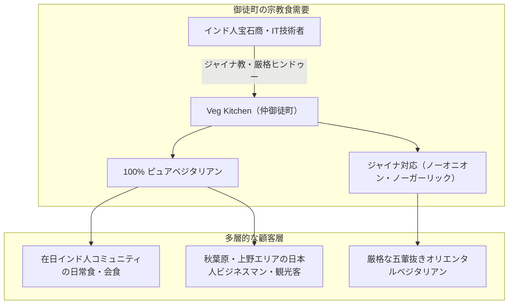

# Veg Kitchen（ベジキッチン・仲御徒町） 専門構造分析ノート

> [!warning] 執筆前の確認事項
> - **Veg Kitchen（ベジキッチン）**は、東京都台東区台東（仲御徒町）に所在する、**100%ピュア・ベジタリアン（完全菜食）かつジャイナ教対応（No Onion, No Garlic, No Root Vegetables）の本格インド料理レストラン**である。
> - 近隣の**「[[ヴェジハーブサーガ（VEGE HERB SAGA）]]」**とともに、御徒町宝石街に集まる在日インド人商人（ジャイナ教徒・厳格ヒンドゥー教徒）の食のライフラインを支える双璧として2014年に開業した。
> - 北インドの濃厚なカレー・ナンから、南インドのドーサ・ミールス、さらにはインド中華（マンチュリアン等）に至るまで、全メニューを植物性および乳製品のみ（卵・肉・魚完全ゼロ）で調理し、希望に応じて完全なジャイナ仕様（五葷・根菜抜き）で提供する。

> [!summary] 要旨
> **Veg Kitchen**は、現代東京における多文化共生と宗教食（ジャイナ食・オリエンタルベジ）の高度な受容を象徴するレストランである。仲御徒町駅から徒歩数分の立地にあり、インド本国の一流ベジタリアンシェフが腕を振るう。タマネギやニンニクを一切使わないジャイナ対応料理においても、スパイスのテンパリング技術やカシューナッツ・トマト・ヒングを駆使し、非ベジタリアンをも唸らせる芳醇な味覚を実現。国内外のビジネスマン、観光客、厳格な菜食主義者に清浄な食空間を提供している。

---

## 1. 諸見解・機能の対比（一般客 vs ジャイナ教・サトヴィック戒律）

### 比較考察マトリクス表

| 比較軸 | 一般日本人客・近隣ビジネスマン（etic） | ジャイナ教徒・宗教的菜食主義者（emic） |
| :--- | :--- | :--- |
| **料理の印象** | 野菜だけでこれほどコクがあるのかという驚き、もたれないランチ | **一切の殺生業（カルマ）を含まない「清浄無垢な神饌」** |
| **五葷（根菜）抜きの価値** | ニンニク臭がなく午後の仕事や商談に最適 | **アヒムサー（非暴力）の実践**（地中生物・植物の命を奪わない） |
| **メニューの幅広さ** | 北インド・南インド・インド中華まで楽しめるエンタメ性 | あらゆる宗教的食事制限（Jain, Vegan, Halal）が満たされる**安心の聖域** |
| **店舗の役割** | 上野・仲御徒町の人気インドカレー店 | 在日生活における**信仰とアイデンティティ保持のインフラ** |

---

## 2. 概要と基本情報

| 項目 | 内容 |
| :--- | :--- |
| **店舗名** | Veg Kitchen（ベジキッチン） |
| **業態** | 100% ピュア・ベジタリアン＆ジャイナ教対応 インド料理 |
| **所在地** | 東京都台東区台東3-44-8 加藤ビル 1F |
| **アクセス** | 東京メトロ日比谷線「仲御徒町駅」1番出口より徒歩2分、JR「御徒町駅」南口より徒歩6分 |
| **代表メニュー** | ジャイナ・パニールバターマサラ（ノーオニオン・ノーガーリック）、プレーン／マサラドーサ、ベジビリヤニ、サモサ、ベジマンチュリアン |
| **食事規定** | **動物性（肉・魚・卵・動物性油脂）完全ゼロ**、**ジャイナ対応（五葷・根菜抜き）完全常設** |
| **公式URL** | `http://vegkitchen.jp/` |

---

## 3. 調理技術とジャイナ料理の深層解剖

### 3-1. ノーオニオン・ノーガーリックの調理マジック
- **ベースグレイビーの構築**: タマネギの甘みととろみの代わりに、じっくりペースト状にしたトマト、カシューナッツ、スイカの種（マガス）、ココナッツミルクを使用。
- **ヒング（アサフェティダ）の活用**: 微量のヒングを熱油に投入することで、ニンニクやネギに匹敵する食欲をそそる芳香を引き出し、胃腸の消化を促進する。
- **生ハーブの調合**: コリアンダー（パクチー）、生ミント、カレーリーフをふんだんに使い、爽快で立体的な風味を構築。

### 3-2. 自家製パニール（インドのカッテージチーズ）
- 毎朝新鮮な牛乳から手作りされる無添加パニールを使用。濃厚なミルクのコクが、野菜だけのカレーに豊かな満足感を与える。

---

## 4. 宗教学的・食文化史的意義

- **御徒町「ベジタリアン・トライアングル」の形成**:
  [[ヴェジハーブサーガ（VEGE HERB SAGA）]]、[[Veg Kitchen（ベジキッチン・仲御徒町）]]、そして近隣の南インド料理店が密集することにより、御徒町は「日本で最もジャイナ教・オリエンタルベジに優しい街」としての国際的地位を確立した。
- **東洋の五葷抜き文化との連動**:
  台湾素食（一貫道・仏教系）を実践する華僑や日本人が、インド料理を楽しむ際のデファクトスタンダードとしても機能している。

---

## 5. 関連教団・関連人物・関連概念

- **ジャイナ教（Jainism）**: 徹底した不殺生と五葷・根菜禁忌
- **[[ヴェジハーブサーガ（VEGE HERB SAGA）]]**: 御徒町のジャイナ対応南インド料理店
- **[[バグワン・マハビールスワミ・ジェイン寺院（神戸ジャイナ寺院）]]**: 日本唯一のジャイナ教寺院
- **[[ナタラジ（NATARAJ・自然派インド料理）]]**: 完全菜食インド料理の草分け
- **[[ゴヴィンダス（Govinda's）船堀店]]**: クリシュナ意識国際協会のサトヴィック料理
- **[[中一素食店（台湾素食レストラン）]]**: 台湾素食のオリエンタルベジ老舗

---

## 6. 史料・参考文献

- Veg Kitchen 公式サイト (`http://vegkitchen.jp/`)
- Food Diversity Today「東京のベジタリアン・ジャイナ対応特集」
- 日本ベジタリアン協会 推薦店舗データ

---

## 7. 関連ノート (Vault内)

- [[ヴェジハーブサーガ（VEGE HERB SAGA）]]
- [[バグワン・マハビールスワミ・ジェイン寺院（神戸ジャイナ寺院）]]
- [[ナタラジ（NATARAJ・自然派インド料理）]]
- [[ゴヴィンダス（Govinda's）船堀店]]
- [[各教団の食の教義・タブー比較]]

---

## 8. 検証・品質ゲートと留保事項

> [!warning] 留保事項
> - **ジャイナ注文時の確認**: 店頭メニューにはジャガイモ等を含む一般ベジ料理もあるため、厳格な五葷抜きを希望する場合は「ジャイナ仕様（Jain preparation）」とスタッフに伝えることが推奨される。
> - **evidence_type**: `primary_and_secondary_sources`
> - **confidence**: `5`

---

*※本稿は[[_分派・異端研究ポータル]]の飲食・食品関連およびインド宗教食文化実践に関する専門構造分析ノートである。*
