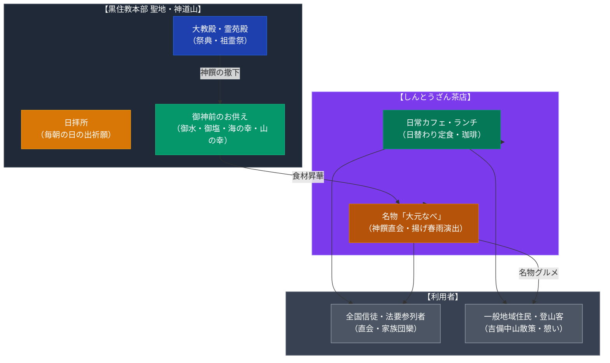

# しんとうざん茶店と大元なべ（黒住教・神道山） 専門構造分析ノート

> [!warning] 執筆前の確認事項
> - **しんとうざん茶店**は、幕末三大新宗教・教派神道十三派の一角である「黒住教」の本部境内地・神道山（岡山市北区尾上）に常設されている参拝者向け食事処・カフェである。
> - 瀬戸内海を一望する風光明媚な神道山の緑に囲まれ、日替わりランチ定食やコーヒー・スイーツを提供しており、参拝者だけでなく散策客やハイキング客にも広く利用されている。
> - 神道山の名物料理として受け継がれているのが**「大元（だいげん）なべ」**である。御神前に供えられた「海の幸」「山の幸」を神前のお塩とお水による出汁で煮込み、具材が煮えた後に**「油でカラッと揚げた春雨」を投入して海と山の恵みを繋ぐ**という、神道教団ならではの極めてユニークかつ象徴的な調理儀礼を持つ（事前予約制、4名〜）。

> [!summary] 要旨
> **しんとうざん茶店と大元なべ**は、黒住教の聖地・神道山における「直会（なおらい・神人共食）」の思想を現代的な飲食サービスおよび伝統料理として継承・具現化した拠点である。教団の開かれた姿勢を象徴する地域共生カフェであると同時に、神饌の生命力を分かち合う「大元なべ」の儀礼的食文化を今日に伝える貴重な信仰生活インフラである。

---

## 1. 諸見解・機能の対比（一般来訪者 vs 教団信仰観）

| 比較軸 | 地域住民・ハイカー（外部視点 / etic） | 黒住教・信徒共同体（内部視点 / emic） |
| :--- | :--- | :--- |
| **存在意義** | 神道山の自然に囲まれた静かな絶景カフェ・ランチスポット | 日拝・神殿参拝後の身心を調え、神人和楽を深める直会の場 |
| **料理の受け止め** | 野菜たっぷりの健康的な日替わり定食、独特の揚げ春雨鍋 | 天照大御神の恵み（天地の生命力）を丸ごと体内にいただく神饌の直会 |
| **「大元なべ」の象徴性** | パチパチと音を立てる揚げ春雨が楽しい名物郷土鍋 | 「海の幸（陰）」と「山の幸（陽）」を春雨で結び、大元（宇宙根源）の調和を体感する儀礼 |
| **空間体験** | ドライブや散策時の気軽な休憩・キッズフレンドリーな茶店 | 霊苑殿での祖霊供養や月次祭・大祭の後に親族・同信が集う団欒の聖域 |

---

## 2. 概要と基本情報

| 項目 | しんとうざん茶店 | 名物料理「大元（だいげん）なべ」 |
| :--- | :--- | :--- |
| **所在地** | 岡山県岡山市北区尾上 神道山敷地内 | 同左（しんとうざん茶店等にて提供） |
| **営業時間** | カフェ 10:00〜17:00 / ランチ 11:00〜14:00 | 事前予約制（原則4名様以上より受付） |
| **主要提供内容** | 日替わりランチ定食、うどん、和洋スイーツ、珈琲 | 海の幸（魚介）、山の幸（野菜・鶏肉）、揚げ春雨、特製出汁 |
| **特徴・演出** | 瀬戸内海や山並みを望む落ち着いた木造和風空間 | 煮立った鍋に高温で揚げた春雨を投入する劇的な演出 |
| **利用対象** | 全国の参拝信徒、法要参列者、一般登山客、観光客 | 講社・団参グループ、法要後の直会、一般予約客 |

---

## 3. 史的経緯と黒住教の食文化

### (1) 神道山遷座（1974年）と境内アメニティ
黒住教は1814年に黒住宗忠が立教。明治時代以降は岡山市大元（現・宗忠神社周辺）を本拠としていたが、立教160年を記念して1974年に現在の吉備中山の西麓・神道山へ本部を遷座した。毎朝日の出を拝む「日拝所」や大教殿が整備されるとともに、全国から登山参拝する教徒や地域住民の集う場として「しんとうざん茶店」が開設された。

### (2) 「大元なべ」の調理法と宗教的意味論
神道において、祭典後に神前にお供えした神饌（しんせん）を下げて参列者全員でいただく「直会（なおらい）」は、神仏の霊威（生命力）を分かち合う極めて神聖な行為である。「大元なべ」はこの直会を鍋料理として昇華させたものであり、以下のプロセスを経る：
1. **出汁と具材**: 神前にお供えされた神聖な御塩と御水をベースに、鯛や海老などの「海の物」と、地場の新鮮な野菜・きのこ・鶏肉などの「山の物」を出汁でじっくり煮込む。
2. **揚げ春雨の投入**: 具材に火が通った絶妙のタイミングで、直前に高温の油で真っ白く揚げた春雨を豪快に鍋の上に乗せる。
3. **結び（産霊・むすび）の象徴**: 揚げ春雨が出汁を勢いよく吸い込んでジュージューと音を立てることで、海のものと山のものが一体となり、宇宙の根本原理（大元）へと還帰・調和することを味覚と視覚・聴覚で体感させる。

---

## 4. 施設・機能の構造連関図

---

## 5. 現地利用・観察ポイント

1. **アクセス**:
   JR吉備線（桃太郎線）「備前一宮駅」よりタクシーで約5分、または徒歩約20〜25分。岡山ICから車で約15分。神道山の広大な駐車場が利用可能。
2. **茶店の雰囲気**:
   大きな窓から吉備路の山並みと緑が見渡せる明るく穏やかな空間。スタッフは温かい接客で、宗教的な勧誘などは行われない。キッズスペースや座敷席もあり、小さな子ども連れのファミリー層にも好評。
3. **大元なべの予約**:
   「大元なべ」は食材の準備・仕込みの関係上、数日前までの事前電話予約（原則4名以上）が必要。法要のお斎シーズン（春・秋の彼岸や大祭期）は混み合うため、早めの確認が推奨される。

---

## 6. 関連ノート

- [[黒住教]]
- [[金光教]]
- [[天理教のおたすけ・おさづけと近代病気救済史]]
- [[こどもおぢばがえりと天理カレー]]
- [[寺カフェ 茶庭（萬福寺）]]
- [[_分派・異端研究ポータル]]
