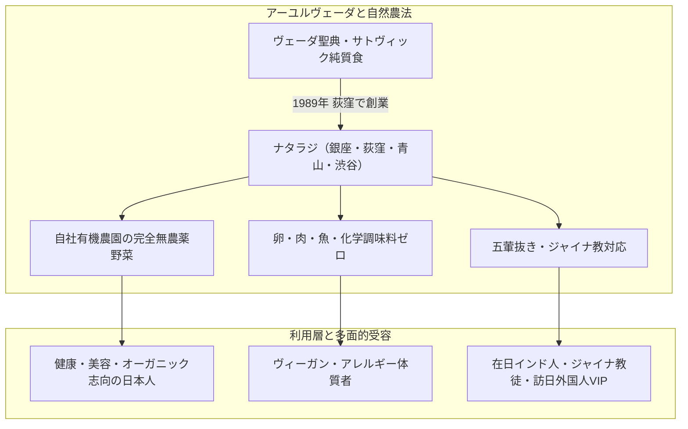

# ナタラジ（NATARAJ・自然派インド料理） 専門構造分析ノート

> [!warning] 執筆前の確認事項
> - **ナタラジ（NATARAJ）**は、1989年に東京都杉並区荻窪で創業した、**日本初の完全菜食（ベジタリアン・ヴィーガン）自然派インド料理レストラン**である。
> - 古代インドの伝統医学「アーユルヴェーダ」の根本理念に基づき、「からだに優しく、食べて健康になるインド料理」を提唱。肉・魚・卵・化学調味料を一切使用しない。
> - 自社農園（山梨県・長野県蓼科高原）で無農薬・有機栽培された安心・安全な野菜を使用し、**五葷抜き（ノーオニオン・ノーガーリック）やジャイナ教対応メニュー**にも柔軟に応じ、日本における宗教的菜食・オーガニック食のパイオニアとして35年以上の歴史を誇る。

> [!summary] 要旨
> **ナタラジ**は、インドのヴェーダ思想・アーユルヴェーダの「サトヴィック食（心を穏やかにする純質食）」を日本社会に定着させた記念碑的レストランチェーンである。店名は舞踏の神「シヴァ・ナタラージャ」に由来。自家製大豆ミート（大豆グルテン）を用いた「ナタラジカリー」や、国産小麦粉と天然酵母で焼き上げるナンなど、妥協のない健康・環境・スピリチュアルな食哲学を具現化し、国内外のVIPや厳格な宗教的菜食主義者から絶大な信頼を獲得している。

---

## 1. 諸見解・機能の対比（一般客 vs アーユルヴェーダ・サトヴィック思想）

### 比較考察マトリクス表

| 比較軸 | 一般グルメ客・オーガニック愛好家（etic） | アーユルヴェーダ・宗教的菜食実践者（emic） |
| :--- | :--- | :--- |
| **料理の印象** | 胃もたれせず、野菜本来の味が濃く身体が軽くなる極上カレー | **トリグナ（三特性）のうち「サットヴァ（純質）」を高める霊的食事** |
| **肉・卵不使用の理由** | 低コレステロール、ヘルシー、環境負荷軽減 | **アヒムサー（不殺生）の実践**とカルマ回避 |
| **五葷抜きの意義** | 食後に人と会う際のエチケット | **ラジャス（激性）・タマス（鈍性）を抑え、瞑想と心の静寂を保つ** |
| **自家農園（蓼科）の野菜** | 新鮮で安全なこだわりオーガニック食材 | **プラーナ（生命力・気）に満ち溢れた大自然の恵み** |

---

## 2. 概要と基本情報

| 項目 | 内容 |
| :--- | :--- |
| **店舗名** | 自然派インド料理 ナタラジ（NATARAJ） |
| **創業** | 1989年（平成元年） |
| **主要拠点** | 銀座店（中央区銀座6-9-4 5F）、荻窪店（杉並区荻窪5-30-6）、青山店（港区南青山2-22-19） |
| **自社農園** | ナタラジファーム（山梨県南アルプス・長野県蓼科高原など完全無農薬有機栽培） |
| **代表メニュー** | ナタラジカリー（特製大豆ミート）、パラクパニール（ほうれん草と自家製チーズ）、天然酵母ナン、ジャイナ対応ターリー |
| **食事規定** | **肉・魚・卵・化学調味料・遺伝子組換え食材完全不使用**、**五葷抜き（ノーオニオン・ノーガーリック）・ジャイナ教対応** |
| **公式URL** | `http://nataraj2.co.jp/` |

---

## 3. 調理技術とヴェーダ食哲学の深層解剖

### 3-1. 自家製大豆ミート（ナタラジミート）の開発
- 1989年の創業当時、日本でまだ「大豆ミート」が一般的でなかった時代から、大豆タンパクと小麦グルテンを独自配合して手作業で仕込み、肉のジューシーな旨味と弾力を再現。

### 3-2. 天然酵母と国産小麦のナン
- 一般的なインド料理店が使用する精製白小麦粉・ベーキングパウダー・卵・牛乳を使わず、国産小麦粉と自家製天然酵母で長時間熟成発酵させてタンドール窯で焼き上げる。

### 3-3. アーユルヴェーダに基づくスパイス調合
- 季節や体調（ドーシャ：ヴァータ・ピッタ・カパ）のバランスを整えるため、ターメリック、クミン、コリアンダー、フェンネル、生姜などを料理ごとに最適な比率で配合。

---

## 4. 宗教学的・食文化史的意義

- **日本のベジタリアン運動の金字塔**:
  35年以上にわたり日本のオーガニック・ベジタリアン市場を開拓し、日本ベジタリアン協会大賞を受賞するなど、日本の菜食文化の発展に決定的な影響を与えた。
- **ジャイナ・ヒンドゥー教徒の安心の受け皿**:
  銀座・青山などの都心部において、インド大使館やグローバル企業が招聘する厳格なジャイナ教徒・ベジタリアンVIPの公式接待拠点として不可欠な役割を果たしている。

---

## 5. 関連教団・関連人物・関連概念

- **アーユルヴェーダ**: 古代インドの生命科学・食養生体系
- **サトヴィック食（Sattvic Diet）**: 心を清浄に保つ純粋菜食
- **[[ヴェジハーブサーガ（VEGE HERB SAGA）]]**: 御徒町のジャイナ対応店
- **[[Veg Kitchen（ベジキッチン・仲御徒町）]]**: 仲御徒町の完全菜食インド料理店
- **[[バグワン・マハビールスワミ・ジェイン寺院（神戸ジャイナ寺院）]]**: 日本唯一のジャイナ教寺院
- **[[ゴヴィンダス（Govinda's）船堀店]]**: ISKCONのサトヴィック料理
- **[[中一素食店（台湾素食レストラン）]]**: 台湾素食のパイオニア（同時期の草分け）

---

## 6. 史料・参考文献

- 自然派インド料理ナタラジ 公式アーカイブ (`http://nataraj2.co.jp/`)
- 日本ベジタリアン協会『ベジタリアン・ジャーナル』
- クリシュナ・U『アーユルヴェーダ日常の食養生』（平河出版社）

---

## 7. 関連ノート (Vault内)

- [[ヴェジハーブサーガ（VEGE HERB SAGA）]]
- [[Veg Kitchen（ベジキッチン・仲御徒町）]]
- [[バグワン・マハビールスワミ・ジェイン寺院（神戸ジャイナ寺院）]]
- [[ゴヴィンダス（Govinda's）船堀店]]
- [[中一素食店（台湾素食レストラン）]]
- [[各教団の食の教義・タブー比較]]

---

## 8. 検証・品質ゲートと留保事項

> [!warning] 留保事項
> - **ジャイナ・五葷抜きの個別注文**: 全メニューがベジタリアン仕様であるが、一部メニューにはタマネギを使用するものもあるため、完全な五葷抜き・ジャイナ対応を希望する場合は注文時にスタッフへ指定する。
> - **evidence_type**: `primary_and_secondary_sources`
> - **confidence**: `5`

---

*※本稿は[[_分派・異端研究ポータル]]の飲食・食品関連およびインド宗教食文化実践に関する専門構造分析ノートである。*
