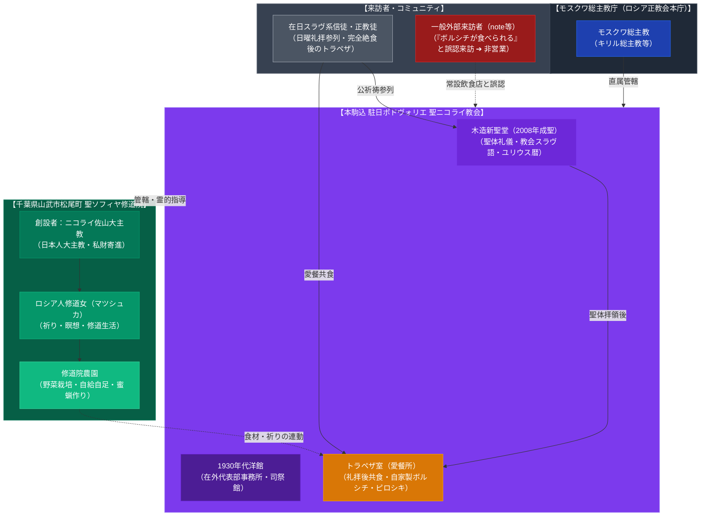

# ロシア正教会駐日ポドヴォリエ（本駒込・トラペザと聖ソフィヤ修道院） 専門構造分析ノート

> [!warning] 執筆前の確認事項
> - **ロシア正教会駐日ポドヴォリエ（ポドウォリエ）聖ニコライ教会**（東京都文京区本駒込2-12-17）は、モスクワ総主教庁（ロシア正教会本庁）が日本に置く公式な「在外代表部（使節機関）」である。
> - 神田駿河台の「ニコライ堂（東京復活大聖堂）」を首座主教座とする「日本ハリストス正教会（自治正教会）」とは教法上別組織であり、在日ロシア人・東欧系信徒の牧会と教会外交を担っている。
> - インターネット上や食文化探訪記（note等）において**「本駒込の教会で本格的なボルシチが食べられるという噂を聞いて訪ねたが、営業していなかった」**というレポートが散見されるが、これは**一般の常設飲食店（ロシア料理店）ではなく、正教会の礼拝後に行われる「トラペザ（愛餐会）」の文化が外部に誤解・伝播したもの**である。
> - また、当ポドヴォリエの管轄下には、日本人正教徒でモスクワ総主教庁の大主教となったニコライ佐山（佐山大助、1914〜2008）が開創した**日本国内唯一の正教会女子修道院「聖ソフィヤ修道院」**（千葉県山武市松尾町）が存在する。

> [!summary] 要旨
> **本駒込のロシア正教会駐日ポドヴォリエ**は、日本におけるロシア正教会の外交・司牧拠点であると同時に、在日スラヴ系正教徒コミュニティの生活・食文化の紐帯である。礼拝後に信徒間で分かち合われる「トラペザ（愛餐）」で振る舞われる手作りのボルシチやピロシキは、商業外食ではなく神聖な典礼共同体の共食儀礼であり、千葉・聖ソフィヤ修道院の祈りと労働（農園）の精神とも深く連動している。

---

## 1. 諸見解・機能の対比（外部グルメ探訪者 vs 正教会・信徒共同体）

| 比較軸 | 外部観察者・各国料理探訪者（外部視点 / etic） | 正教会・在日信徒コミュニティ（内部視点 / emic） |
| :--- | :--- | :--- |
| **存在意義** | 文京区本駒込の閑静な住宅街にある隠れ家的なロシア教会 | モスクワ総主教庁直属の在外代表部・聖ニコライ聖堂 |
| **「ボルシチ」の認識** | 「教会内でボルシチを食べさせてくれるらしい」という都市伝説的グルメ情報 | 聖体礼儀（リトゥルギヤ）後に信徒一同が主の恵みを共にする**「トラペザ（愛餐）」** |
| **利用形態** | 常設レストランとしての利用を期待（実際には平時は食事提供なし） | 日曜・祝日の公祈祷に参列した信徒・家族による祈りと親睦の団欒 |
| **提供の契機** | なし（商業飲食店ではない） | 日曜礼拝後、復活祭（パスハ）、降誕祭、不定期の慈善バザー |
| **千葉の修道院** | 「千葉にも何かあるらしい」という断片情報 | ニコライ佐山大主教が別荘地を寄進した日本唯一の正教会女子修道院（聖ソフィヤ修道院） |

---

## 2. 概要と基本情報

| 項目 | ロシア正教会駐日ポドヴォリエ（聖ニコライ教会） | 聖ソフィヤ修道院（女子修道院） |
| :--- | :--- | :--- |
| **所在地** | 〒113-0021 東京都文京区本駒込2-12-17 | 〒289-1500 千葉県山武市松尾町（旧武射郡松尾町） |
| **所属・教法上の地位** | ロシア正教会 モスクワ総主教庁直属 代表部 | 同 代表部管轄（日本唯一の正教会女子修道院） |
| **主要聖職者** | 長司祭 ニコライ・カツュバン（代表部責任者） | 修道女（マツシュカ・クセニヤ、マツシュカ・マグダリナ等） |
| **建築様式** | 1930年代の歴史的洋館 ＋ 2008年木造新聖堂 | ロシア伝統様式の聖堂・修道院宿舎・農園 |
| **食文化・提供形態** | **トラペザ（愛餐）**：ボルシチ、ピロシキ、カーシャ、紅茶 | 自給自足農園、修道院伝統の粗食・断食期精進料理 |
| **一般の食事利用** | **不可（常設飲食店ではない）**。バザー時等のみ一般開放 | **不可**（非公開の祈りと修道生活の聖域） |

---

## 3. 史的経緯と食文化（トラペザ）の真相

### (1) ニコライ堂（日本ハリストス正教会）とポドヴォリエの峻別
日本の正教会といえば神田駿河台の「ニコライ堂」が広く知られるが、ニコライ堂を中核とする「日本ハリストス正教会」は、1970年にロシア正教会から自治正教会（Autonomy）として承認された現地自治組織である。これに対し、本駒込のポドヴォリエ（代表部）は、冷戦期・ソ連崩壊後の日露関係やロシア本国総主教庁との直結窓口として設置された「総主教直属の在外教会」であり、ユリウス暦（旧暦）による厳格な教会スラヴ語の典礼を保持している。

### (2) 本駒込の建築遺産（1930年代の洋館と2008年新聖堂）
本駒込2丁目の敷地には、昭和初期（1930年代）に建設された重厚な木造洋館（元個人邸宅）が存在し、長年代表部事務所兼礼拝所として使用されてきた。2008年には、ロシア本国の支援により敷地内に玉葱型のクーポル（円蓋）を戴く木造の「聖ニコライ聖堂」が成聖され、荘厳なイコノスタス（聖障）を備えた本格的祈りの場となった。

### (3) 「ボルシチが食べられなかった」真相：正教会の「トラペザ（愛餐）」
note記事等で「ボルシチを食べさせてくれると聞いて行ったがやっていなかった」と報告される背景には、以下の正教会特有の文化的文脈がある：
1. **聖体礼儀と断食（ファスティング）**: 正教会の信徒は、日曜朝の聖体礼儀で聖体（パンと葡萄酒）を拝領するため、前夜深夜から一切の飲食を断つ（完全絶食）。
2. **トラペザ（Трапеза / 愛餐）の執行**: 2時間以上に及ぶ厳格な典礼を終えた正午頃、聖堂階下や隣接集会室にて、参列した信徒全員で卓を囲む「トラペザ」が始まる。
3. **家庭料理の味**: 在日ロシア人信徒の女性たち（マトゥーシュカ等）が当番制で大鍋に作った**本場のボルシチ（赤ビーツ、キャベツ、牛肉またはきのこ出汁、スメタナ添え）**や、焼きたてのピロシキ、黒パンが振る舞われる。
4. **外部への伝播と誤認**: このトラペザに参列した日本人信徒や招待客、あるいは年数回の教会バザーでボルシチが一般販売された際の体験談が、ネットや口コミで「本駒込にロシア料理を食べさせる教会がある」と誇張・変形して伝わり、一般レストランと誤認されて訪問されるケースが生じている。

### (4) 千葉県山武市松尾町「聖ソフィヤ女子修道院」
当ポドヴォリエを語る上で欠かせないのが、千葉県山武市松尾町にある「聖ソフィヤ修道院」である。
* **創設者・ニコライ佐山大主教**: 1914年生まれの日本人・佐山大助氏は、ロシア正教会モスクワ総主教庁で司教・大主教（ラーメスコエ大主教）に叙聖された稀有な人物である。
* **修道院の開創（1989年）**: 佐山大主教は晩年、私財を投じて千葉県松尾町の別荘地に女子修道院を建立。臨終にあたり全敷地をロシア正教会に遺贈した。
* **ロシア修道女の祈りと農園**: ウラジオストク等から派遣された修道女が住み込み、敷地内の農園で野菜を育て、蜜蝋蝋燭を作り、日夜祈りを捧げている。ここで収穫された農作物も、ポドヴォリエのトラペザを支える重要な糧となっている。

---

## 4. 組織・空間・食文化の構造連関図

---

## 5. 現地観察・訪問上の留意事項

1. **商業飲食店ではないことの徹底理解**:
   ポドヴォリエはあくまで祈りの場（聖堂・大使館級代表部）であり、レストランやカフェではない。食事目的の単独訪問は厳に慎むべきである。
2. **聖体礼儀への参祷**:
   正教会の奉神礼に関心がある一般人は聖体礼儀に参祷（見学・祈念）することは可能であるが、正教徒として洗礼・塗油を受けていない者は聖体（パンと葡萄酒）を拝領することはできない。礼拝後、信徒会の好意によってトラペザに招かれることはあり得るが、それは「歓待の受納」であって商業サービスではない。
3. **バザー等の公開機会**:
   年に数回、教会敷地内でロシア正教の慈善バザーが開催されることがあり、その際には一般来訪者向けにボルシチや焼き菓子、ピロシキ、マトリョーシカ等の民芸品が販売されることがある。食事体験を希望する場合は、教会の公式行事アナウンスを確認するのが適切である。

---

## 6. 関連ノート

- [[東京ジャーミイ トルコカフェ＆ハラールマーケット]]
- [[大阪ハラールレストラン（大阪マスジド）]]
- [[寺カフェ 茶庭（萬福寺）]]
- [[日本近代新宗教におけるキリスト教習合の系譜]]
- [[_分派・異端研究ポータル]]
