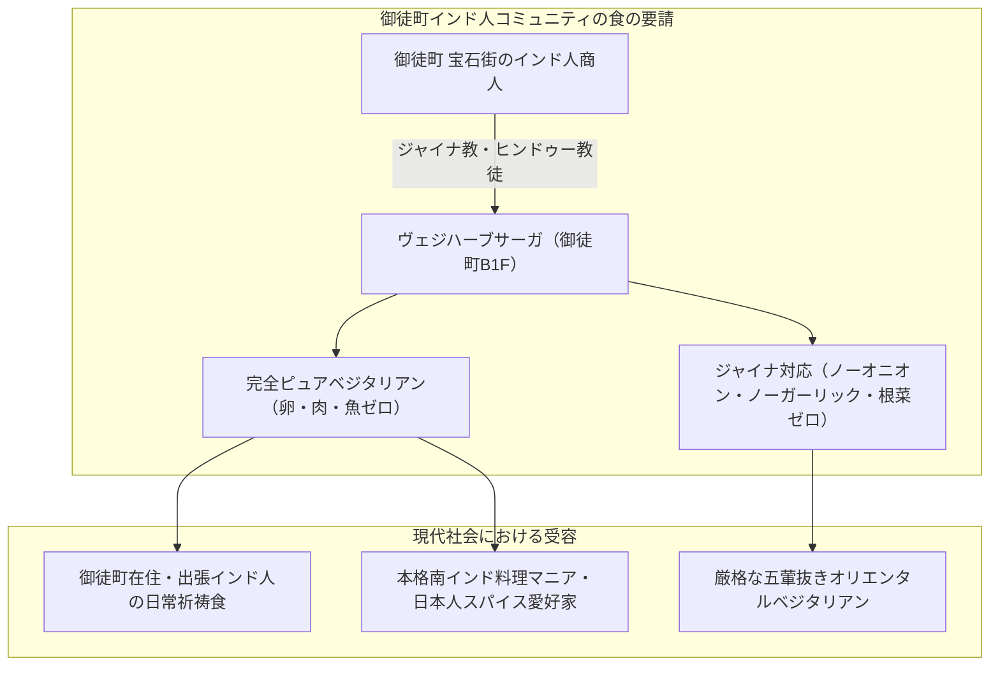

# ヴェジハーブサーガ（VEGE HERB SAGA） 専門構造分析ノート

> [!warning] 執筆前の確認事項
> - **ヴェジハーブサーガ（VEGE HERB SAGA）**は、東京都台東区上野（御徒町エリア）に所在する、日本屈指の**完全菜食（ピュア・ベジタリアン）およびジャイナ教対応（ノーオニオン・ノーガーリック）南・北インド料理レストラン**である。
> - 御徒町周辺は、世界的なダイヤモンド・貴金属取引に従事するインド人（特にジャイナ教徒および厳格なヒンドゥー教徒）が多数集まるコミュニティであり、彼らの厳格な食の戒律を支えるために誕生した。
> - 肉や魚、卵を使用しないだけでなく、**ジャイナ教の「アヒムサー（徹底的不殺生）」に基づき、地中の微生物を傷つけず植物の生命を根こそぎ奪わない「根菜類（タマネギ・ニンニク・ジャガイモ・生姜等）抜き＝五葷抜き」**の本格インド料理を提供する。

> [!summary] 要旨
> **ヴェジハーブサーガ**は、東洋のオリエンタルベジタリアン文化において、仏教・道教（中華素食）と双璧をなす「インド宗教（ジャイナ教・ヒンドゥー教）の食戒律」を日本で具現化した最重要レストランである。JR御徒町駅至近の地下空間に位置し、スパイス、ハーブ、豆類、自家製チーズ（パニール）を巧みに調合した南インド・ミールスやドーサを提供。在日インド人コミュニティの宗教的ライフラインであると同時に、日本における多文化共生・宗教食バリアフリーの先進的事例である。

---

## 1. 諸見解・機能の対比（一般客 vs ジャイナ教・ヒンドゥー教戒律）

### 比較考察マトリクス表

| 比較軸 | 一般カレー愛好家・日本人客（etic） | ジャイナ教・厳格ヒンドゥー教徒（emic） |
| :--- | :--- | :--- |
| **料理の印象** | 玉ねぎやニンニクを使わないのに信じられないほどスパイシーで美味 | **カルマ（業）を生まず、霊性を汚さない「純粋食（サトヴィック）」** |
| **五葷（根菜）抜きの理由** | 匂いが残らない、胃もたれしないスパイス料理 | **アヒムサー（非暴力）の実践**（地中の微生物や植物の命を奪わない） |
| **卵の扱い** | 卵くらいは入っていても良いのではという感覚 | 卵は将来の生命（受精卵・生命の芽）であり**殺生と同等（完全厳禁）** |
| **立地の意味** | 上野・御徒町のディープな本格インド料理店 | 日本で安心して信仰と日常を守れる**コミュニティの聖なる食卓** |

---

## 2. 概要と基本情報

| 項目 | 内容 |
| :--- | :--- |
| **店舗名** | ヴェジハーブサーガ（VEGE HERB SAGA） |
| **業態** | 完全菜食（ピュア・ベジタリアン）・ジャイナ教対応 南北インド料理 |
| **所在地** | 東京都台東区上野5-22-1 東鈴ビル B1F |
| **アクセス** | JR山手線・京浜東北線「御徒町駅」南口より徒歩2分、東京メトロ「仲御徒町駅」徒歩1分 |
| **代表メニュー** | 南インド・ベジミールス、マサラドーサ、ジャイナ・ターリー（五葷抜きセット）、パニールティッカ、サンバル、ラッサム |
| **食事規定** | **肉・魚・卵・動物性油脂完全不使用**、**ジャイナ教対応（五葷・根菜完全不使用メニュー常設）** |
| **厨房体制** | 本場インドより招聘されたベジタリアン専門の熟練シェフ |

---

## 3. ジャイナ教の食戒律と調理技術の深層解剖

### 3-1. ジャイナ教のアヒムサー（絶対不殺生）と食のタブー
ジャイナ教は世界で最も厳格な不殺生主義を貫く宗教である。
1. **動物性食材の完全拒絶**: 肉・魚・卵はもちろん、動物由来のゼラチンや添加物も一切排除。
2. **アナンタカーヤ（無数体）の禁忌**: 土の中に育つ根菜類（タマネギ、ニンニク、ジャガイモ、人参、大根等）は、1つの根の中に無数の生命（微生物）が宿っていると考えられ、さらに収穫時に土中の生物を傷つけ、植物全体を死に至らしめるため口にしない。
3. **夜間断食（ラートリ・ボーハナ・チャガ）**: 太陽が沈んだ後の飲食は、暗がりで小さな虫を誤って飲み込む恐れがあるため避ける伝統がある。

### 3-2. ノーオニオン・ノーガーリックでの味覚構築
一般のインド料理は「炒めたタマネギとニンニク・生姜」をベースにグレイビー（とろみとコク）を作るが、ヴェジハーブサーガでは以下の手法で極上のコクを生み出す。
- **ヒング（アサフェティダ）**: セリ科植物の樹脂。加熱するとニンニクやタマネギに酷似した芳醇な香味を放つ伝統スパイス。五葷抜きインド料理の要。
- **トマト・カシューナッツ・ココナッツ**: じっくりペースト状に煮込み、タマネギの代わりとなる濃厚な甘みととろみを形成。
- **生ハーブと各種スパイス**: クミン、マスタードシード、カレーリーフ、コリアンダー、ターメリックを巧みにテンパリング（油で香りを抽出）する。

---

## 4. 宗教学的・食文化史的意義

- **日本におけるジャイナ食文化の定着**:
  御徒町は宝石（ダイヤモンド）の卸問屋街として知られ、インド・グジャラート州出身のジャイナ教徒が多くビジネスを展開している。彼らにとって本店舗の存在は、日本国内で宗教的アイデンティティを保ちながら生活するための死活的インフラである。
- **オリエンタルベジの東西比較の架け橋**:
  東アジアの「仏教・道教・一貫道の素食（五葷抜き中華）」と、南アジアの「ジャイナ・ヒンドゥーのサトヴィック食（五葷抜きインド料理）」という、**アジア全域に共通する「五葷禁忌・不殺生」の普遍的宗教思想**を日本で体感できる極めて貴重な拠点である。

---

## 5. 関連教団・関連人物・関連概念

- **ジャイナ教（Jainism）**: マハーヴィーラを始祖とする徹底的不殺生宗教
- **アヒムサー（Ahimsa）**: 非暴力・不殺生の最高徳目
- **サトヴィック（Sattvic）**: 心を清らかに保つ純質食（ヒンドゥー教・アーユルヴェーダ）
- **[[ゴヴィンダス（Govinda's）船堀店]]**: クリシュナ意識国際協会（ISKCON）直営の五葷抜きインド料理
- **[[中一素食店（台湾素食レストラン）]]**: 台湾素食のオリエンタルベジ老舗
- **[[各教団の食の教義・タブー比較]]**: 宗教食・禁忌の総合比較

---

## 6. 史料・参考文献

- 食べログ店舗情報アーカイブ (`https://tabelog.com/tokyo/A1311/A131101/13119853/`)
- 河野亮仙『インドの宗教と食文化』（東方出版）
- 上田紀行『スリランカ・インドの仏教と社会』（岩波書店）

---

## 7. 関連ノート (Vault内)

- [[ゴヴィンダス（Govinda's）船堀店]]
- [[中一素食店（台湾素食レストラン）]]
- [[健福（台湾素食レストラン）]]
- [[菜食健美（大晶企画・道徳会館）]]
- [[香林坊（中野・台湾素食）]]
- [[一貫道と台湾素食レストラン]]
- [[各教団の食の教義・タブー比較]]

---

## 8. 検証・品質ゲートと留保事項

> [!warning] 留保事項
> - **ジャイナ対応の注文**: 一部メニューにはジャガイモやタマネギを使用する一般ベジタリアン向け料理も含まれるため、完全な五葷抜き・ジャイナ仕様を希望する場合は「ジャイナスタイル（Jain style / No onion no garlic）」と指定して注文する必要がある。
> - **乳製品の使用**: 卵は一切使用しないが、ヒンドゥー教の伝統に則り「パニール（自家製チーズ）」や「ギー（精製バター）」などの乳製品は一部メニューで使用される（ヴィーガン希望者には乳製品抜きも対応可能）。
> - **evidence_type**: `primary_and_secondary_sources`
> - **confidence**: `5`

---

*※本稿は[[_分派・異端研究ポータル]]の飲食・食品関連およびインド宗教（ジャイナ教・ヒンドゥー教）食文化実践に関する専門構造分析ノートである。*
