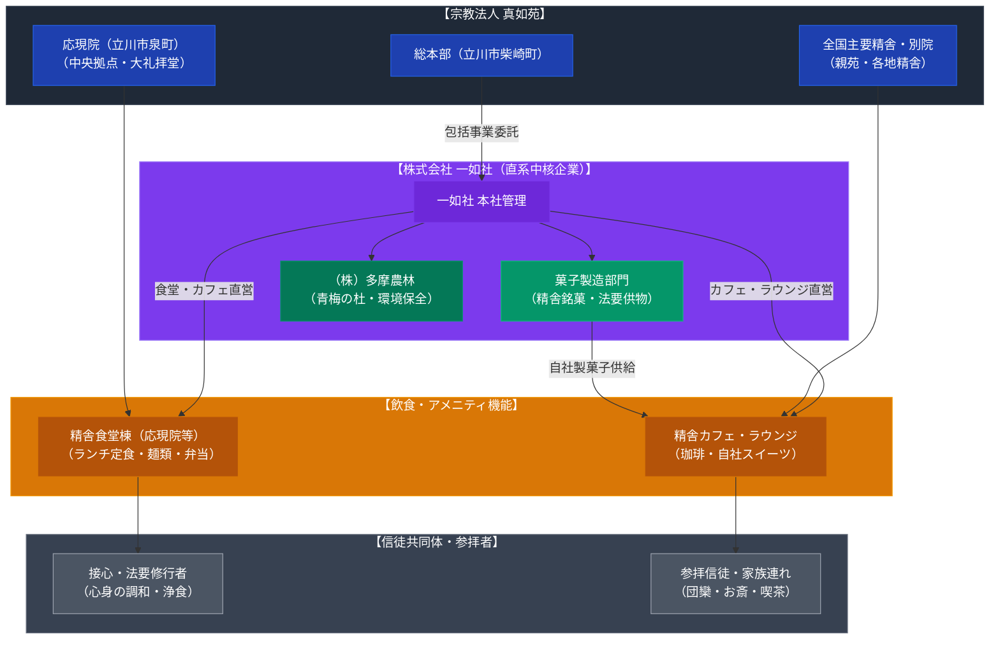

# 一如社・精舎食堂カフェ（真如苑） 専門構造分析ノート

> [!warning] 執筆前の確認事項
> - **株式会社一如社（いちにょしゃ）**は、1962年に真如苑の開祖・伊藤真乗夫妻によって設立された、教団活動および信徒生活を多角的に支える直系中核企業である（本社：東京都立川市柴崎町）。
> - 同社は**1971年に食堂業務を開始**し、現在に至るまで半世紀以上にわたり、立川の超巨大施設「応現院（おうげんいん）」をはじめとする全国各地の主要精舎において、参拝信徒向けの食堂およびカフェを直営している。
> - さらに自社で**菓子製造部門**を保有しており、法要や年中行事の供物・記念菓子、精舎限定のオリジナルスイーツの企画・製造を一貫して行っている。
> - グループ会社として、青梅市の広大な森林「青梅の杜」を管理し循環型林業を実践する「株式会社多摩農林」（日本初の宗教団体FSC森林認証取得）などを擁し、食と環境の両面から教団の生活文化基盤を形成している。

> [!summary] 要旨
> **一如社の精舎食堂・カフェおよび製菓事業**は、真如苑の信徒共同体を支える高度に体系化された直系フードビジネスモデルである。外部の給食業者に丸投げせず、1962年設立の自直系企業「一如社」が食堂・カフェ・菓子製造を一元管理することで、信徒への安心安全な食事提供、教団行事の厳格なロジスティクス、および自立的な経済循環を高い水準で達成している。

---

## 1. 諸見解・機能の対比（外部視点 vs 信徒・教団視点）

| 比較軸 | 一般社会・外部観察者（外部視点 / etic） | 真如苑・一如社（内部視点 / emic） |
| :--- | :--- | :--- |
| **存在意義** | 立川・応現院などの巨大宗教施設内に備えられた大規模社食・カフェ | 接心（せっしん）修行や法要に臨む信徒が心身を清め、和合する「浄食」の場 |
| **運営形態** | 宗教法人の直系株式会社（一如社）による手堅いインハウス事業 | 開祖・真乗と友司の「信徒を慈しみ、誠を尽くす」誓願を具現化する奉仕事業 |
| **菓子製造の役割** | 宗教団体のオリジナル土産菓子・記念品の製造販売 | 仏前にお供えし、歓喜のうちに分かち合う「歓喜菓子」「精舎銘菓」の自社謹製 |
| **空間性** | ホテルのラウンジや最新オフィスを思わせる機能的で清潔な空間 | 「一如（仏と人が一つになる）」の境地を静けさと清潔さの中で実感する環境 |

---

## 2. 概要と基本情報

| 項目 | 内容 |
| :--- | :--- |
| **企業名** | 株式会社 一如社（いちにょしゃ / Ichinyosha Co., Ltd.） |
| **設立** | 1962年（昭和37年）1月 |
| **本社所在地** | 東京都立川市柴崎町2-1-8（真如苑総本部周辺） |
| **主要飲食施設** | 応現院（立川市泉町）食堂棟・カフェ、全国主要精舎の食堂・喫茶ラウンジ |
| **飲食関連事業** | 精舎食堂・カフェ運営、自社製菓業務、法要用弁当手配、オリジナル飲料提供 |
| **その他の事業** | 施設保守修繕・設計監理、法具・書籍頒布、旅行企画（巡礼ツアー）、映像制作 |
| **主要関連会社** | 株式会社多摩農林（青梅の杜・FSC森林認証）、株式会社あすの、海外法人各社 |

---

## 3. 史的経緯と自社直営フードビジネスの確立

### (1) 開祖夫妻による一如社創立と食堂業務の開始
1962年、真如苑の信徒急増に伴い、教団本部周辺の施設営繕や資材調達を円滑化するため、伊藤真乗・友司夫妻によって株式会社一如社が設立された。1971年には、遠方から上京して修行に励む信徒の栄養と健康を支えるため**食堂業務を正式に開始**。外部業者任せにしない「真心のこもった温かい食事提供」が教団福祉の根幹に据えられた。

### (2) 応現院の建立と巨大厨房インフラ
2006年、真如苑は立川飛行場跡地（立川市泉町）に新世紀の拠点「応現院」を建立した。地上数階・地下数階に及ぶ巨大建築群の一角には、タニコー等の最新業務用厨房機器を備えた「食堂棟」が配置され、数千人規模の信徒が一度に訪れる大祭時にも、迅速かつ衛生的に温食・喫茶を提供するロジスティクスが完成した。

### (3) 製菓部門の独立と「精舎カフェ」の展開
一如社は単なる大衆食堂にとどまらず、自社パティシエ・和菓子職人による製菓ラインを構築した。季節の法要に合わせた生菓子や焼き菓子を製造し、精舎内のカフェラウンジで提供。信徒が参拝後にコーヒーや紅茶とともに歓談できる「サードプレイス」としての機能をいち早く確立した。

---

## 4. 施設・機能の構造連関図

---

## 5. 現地利用・観察ポイント

1. **利用対象の限定性**:
   真如苑の精舎内食堂・カフェは、一般の商業路面店とは異なり、原則として教団施設への参拝者・信徒・同伴家族を主な対象としている。セキュリティゲートが設置されている施設が多く、自由な一般客の飛び込み利用は想定されていない。
2. **清潔さとアメニティ水準**:
   応現院等の施設内は極めて厳格に清掃・維持管理されており、食堂スペースも一流企業の社員食堂やホテルレストランに匹敵する衛生水準と静謐な環境が保たれている。
3. **自社菓子のクオリティ**:
   一如社が製造する和洋菓子は、信徒の間で非常に高い人気を誇り、精舎参拝時の贈答用・自宅用土産として広く愛好されている。

---

## 6. 関連ノート

- [[真如苑]]
- [[大聖堂食堂（立正佼成会・立花産業）]]
- [[PL病院 カフェレストラン（パーフェクト リバティー教団）]]
- [[MIHO MUSEUM レストラン「ピーチ」（秀明自然農法）]]
- [[_分派・異端研究ポータル]]
