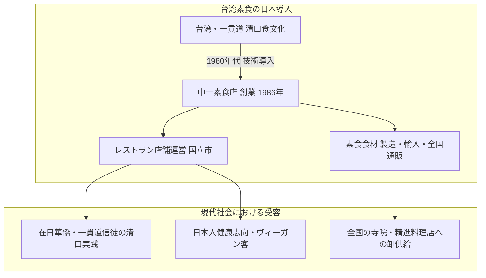

# 中一素食店（台湾素食レストラン） 専門構造分析ノート

> [!warning] 執筆前の確認事項
> - **中一素食店（ちゅういつそしょくてん / Nakaichi Vegetarian Restaurant）**は、東京都国立市に所在する、1986年創業の**日本における本格台湾素食（オリエンタルベジタリアン中華）の草分け・老舗レストラン**である。
> - 一貫道の厳格な終身菜食戒律**「清口（チンコウ）」**を実践する在日華僑・信徒の食生活を支えるインフラとして誕生し、40年近くにわたり日本のベジタリアン・ヴィーガン文化をリードしてきた。
> - 肉・魚だけでなく、**五葷（ネギ・ニンニク・ニラ・ラッキョウ・アサツキ）を一切使用しない**徹底した調理基準を保持し、大豆タンパクや湯葉、自家製こんにゃくを用いた世界最高水準の代替肉（New精進料理）を提供する。

> [!summary] 要旨
> **中一素食店**は、台湾で発展した高度な素食（精進料理）技術を日本に定着させた記念碑的レストランである。1986年に東京都国立市で開業。一貫道をはじめとする中華系宗教の「不殺生・五葷禁忌」を厳格に守りつつ、本場の中華料理と見紛う精巧な素酢豚、精進点心、湯葉料理を提供。店舗営業のみならず、業務用・個人向けの冷凍素食食材（大豆ミート・精進ハム等）の全国通信販売を展開し、日本全国のオリエンタルベジタリアンおよび寺院・仏教徒の食生活を支える中核拠点となっている。

---

## 1. 諸見解・機能の対比（一般客 vs 素食信仰実践）

### 比較考察マトリクス表

| 比較軸 | 一般消費者・健康志向客（etic） | 宗教的素食実践者（emic） |
| :--- | :--- | :--- |
| **利用動機** | ヘルシーで美味しい中華、アレルギー対応、ヴィーガン食 | **「清口」の戒律維持**（殺生カルマ回避・五臓の気清浄化） |
| **代替肉の評価** | 驚くほど肉に似ている大豆ミート技術・精進料理 | 肉食の執着を無理なく断ち切るための**「慈悲の方便」** |
| **五葷抜きの意味** | 匂いが残らない、刺激が少ない、胃もたれしない | **霊性の向上**（怒り・情欲を鎮め、言葉と魂を清める） |
| **通販・卸の機能** | 自宅で手軽に楽しめるベジタリアン冷凍食品 | 外食困難な日本各地の信徒・ベジタリアンを救う**食のライフライン** |

---

## 2. 概要と基本情報

| 項目 | 内容 |
| :--- | :--- |
| **店舗名** | 中一素食店（チュウイツソショクテン） |
| **運営会社** | 中一フーズ 株式会社 |
| **創業** | 1986年（昭和61年） |
| **所在地** | 東京都国立市中1-19-8 |
| **席数・形態** | レストラン（テーブル席・宴会個室） ＋ 店頭物販・冷凍ショーケース |
| **代表メニュー** | 精進酢豚、素鶏の唐揚げ、湯葉巻き蒸し、精進小籠包、五目あんかけ素ラーメン、ベジチャーハン |
| **食事規定** | 完全植物性（プラントベース）、五葷（ネギ・ニンニク等）完全不使用、化学調味料無添加 |
| **公式URL** | `http://www.nakaichifoods.co.jp/` ／ `http://nakaichifu.jp/` |

---

## 3. 創業の経緯と日本における展開

### (1) 1980年代の日本における「素食砂漠」と創業
1980年代当時、日本国内には欧米式自然食や伝統的日本精進料理は存在したものの、五葷（ニンニク・ネギ等）を完全に抜いた中華系ベジタリアン（素食）レストランは皆無に等しかった。在日台湾人や一貫道の信徒（道親）たちは外食に深刻な困難を抱えていたため、本場台湾の素食調理技術者を招聘し、1986年に国立市に「中一素食店」を開業した。

### (2) 代替肉技術の進化と日本人の味覚への適応
湯葉、大豆タンパク、椎茸の軸、自家製蒟蒻などを巧みにブレンドし、動物性エキスを一切使わずに昆布や野菜の出汁で深いコクを出す独自の調理法を開発。単なる「味気ない精進料理」のイメージを覆し、近隣の一橋大学関係者や武蔵野エリアの文化人・一般客からも絶大な支持を獲得した。

### (3) 食材供給インフラ（中一フーズ）の確立
レストラン営業と並行して、台湾から高品質な大豆タンパク素材・調味料を直輸入し、自社工場で加工する「中一フーズ」を設立。全国の寺院、自然食品店、ベジタリアンレストラン、個人顧客へ向けた冷凍素食食材の通信販売網を構築した。

---

## 4. 食文化・調理技術の深層解剖

### 4-1. 五葷禁忌の徹底
ネギ、ニンニク、ニラ、ラッキョウ、アサツキを一切厨房に持ち込まない。中華料理の基本である「香味野菜（ネギ油・ニンニク炒め）」の代わりに、生姜、胡麻油、当帰、クコの実、八角、干し椎茸の戻し汁などを高度に調合し、豊かな香りと深みを生み出している。

### 4-2. 台湾素食の三大素材
1. **大豆タンパク・グルテン**: 繊維状に加工し、鶏肉・豚肉の弾力とジューシーさを再現（素唐揚げ、素酢豚）。
2. **湯葉（腐竹・千張）**: 何層にも重ねて蒸し・揚げを行うことで、白身魚や鴨肉の層状食感を再現。
3. **蒟蒻・椎茸の軸**: 独特の歯ごたえを利用し、イカやアワビ、ナマコなどの高級海鮮素食を演出。

---

## 5. 宗教学的・食文化史的意義

### 5-1. 日本におけるオリエンタルベジのパイオニア
- 欧米の「ヴィーガン（動物愛護・環境倫理）」とは異なる、東洋の宗教的解脱・業（カルマ）思想に基づく「オリエンタルベジタリアン」の概念を日本に定着させた原点である。
- [[菜食健美（大晶企画・道徳会館）]]や[[健福（台湾素食レストラン）]]など、後発の素食店にとっても技術的・文化的な道標となった。

### 5-2. インバウンド・宗教多様性対応の先駆
- 訪日台湾人観光客、東南アジアの華僑、厳格な仏教徒、イスラム教徒（ハラール対応可能な完全菜食）など、現代のインバウンド食のバリアフリー化において極めて重要な役割を果たしている。

---

## 6. 関連教団・関連人物・関連概念

- **[[一貫道と台湾素食レストラン]]**: 台湾素食文化の総合分析ノート
- **[[天道（一貫道）]]**: 清口教理の母体宗教
- **[[菜食健美（大晶企画・道徳会館）]]**: 道徳会館系のオリエンタルベジレストラン
- **[[健福（台湾素食レストラン）]]**: 横浜中華街の素食専門店
- **[[清口]]**: 終身完全菜食の誓約
- **[[五葷]]**: 刺激性野菜の禁忌

---

## 7. 史料・参考文献

- 中一フーズ 公式アーカイブ (`http://www.nakaichifoods.co.jp/`)
- 台湾文化部『台湾素食文化志』
- 『料理通信』『dancyu』ベジタリアン・精進料理特集号

---

## 8. 関連ノート (Vault内)

- [[一貫道と台湾素食レストラン]]
- [[菜食健美（大晶企画・道徳会館）]]
- [[健福（台湾素食レストラン）]]
- [[佛光山「滴水坊」法水寺店]]
- [[静思書軒（Jing Si Books & Cafe）]]
- [[Loving Hut（ラビングハット）]]
- [[各教団の食の教義・タブー比較]]

---

## 9. 検証・品質ゲートと留保事項

> [!warning] 留保事項
> - **店舗の開放性**: 宗教的ルーツを持ちながらも、完全な一般商業レストランとして運営されており、宗教勧誘等は一切行われない純粋な飲食店である。
> - **evidence_type**: `primary_and_secondary_sources`
> - **confidence**: `5`

---

*※本稿は[[_分派・異端研究ポータル]]の飲食・食品関連および台湾素食文化実践に関する専門構造分析ノートである。*
