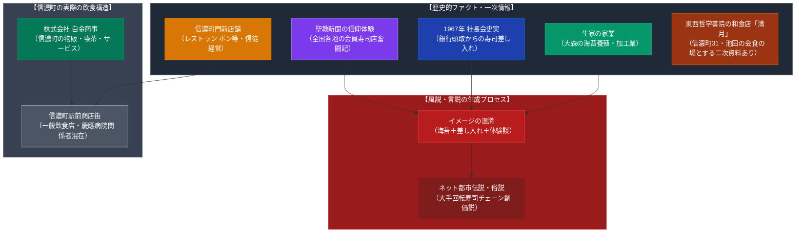

# 信濃町の飲食文化と池田大作（創価学会・風説の検証） 専門構造分析ノート

> [!warning] 執筆前の確認事項
> - **創価学会総本部（東京都新宿区信濃町）**の周辺には、全国から参拝・会合・研修に訪れる信徒（学会員）を受け入れるため、信徒が経営する喫茶店・洋食店・日本料理店や、外郭企業「株式会社白金商事」が運営する物販・喫茶機能が発達してきた。
> - 一方で、インターネット上や週刊誌報道等において「**池田大作が関わった寿司屋**」「**大手回転寿司チェーン〇〇は創価学会系**」といった言説や噂が長年語られてきた。
> - 一次情報および公的記録を精査した結果、以下の客観的事実が判明している：
>   1. **生家の家業**: 池田大作の実家（東京・大森）は**「海苔の製造・養殖業」**（漁師）であり、寿司の主たる巻材である海苔の生家背景が「寿司屋」と混同されやすい。
>   2. **歴史的記録（社長会でのすし差し入れ）**: 1967年6月に築地の料亭で開かれた創価学会系企業の「社長会」（対外的には「金剛会」）第1回会合に、当時の三菱銀行頭取から**すしやデザートの差し入れ**が届いたと東洋経済オンライン（高橋篤史「池田氏は｢創価財閥｣を夢想した」）が報じている。
>   3. **信徒店舗の体験談**: 『聖教新聞』紙面には、全国各地で困難を克服して寿司店を営む学会員の信仰体験記が数多く掲載されている。
>   4. **資本・経営の否定**: 池田大作個人が特定の寿司店に直接出資・経営した公的記録はなく、大手回転寿司チェーンが教団の直営であるという証拠も存在しない（俗説・都市伝説）。
>   5. **社長会企業・東西哲学書院の和食店「満月」**: 社長会の一社・東西哲学書院は、博文堂書店・博文栄光堂（土産・仏具）とともに、そば・寿司・天ぷらの和食店「満月」（新宿区信濃町31、博文栄光堂の奥）を現在も運営している（同社公式サイト）。池田大作がすし屋チェーン「満月」を気に入り学会・公明党首脳との会食に頻用したとする記述は二次資料のみ（日比野日誌「すしとあの人・165」、出典明示なし・低確度）。

> [!summary] 要旨
> **信濃町の飲食文化**は、巨大宗教本部を核として自然発生的に形成された「現代の門前町グルメ」の様相を呈している（洋食店「レストラン ボン」など）。「池田大作が寿司屋を経営した」「大手回転寿司チェーンは創価学会系」といった言説は、実家の海苔製造業、社長会におけるすしの差し入れ史実、聖教新聞の体験談記事、およびネット上の企業紐付け俗説が重層的に混交して生まれた現代の宗教都市伝説である。一方、学会系企業・東西哲学書院は信濃町で和食店「満月」（そば・寿司・天ぷら）を運営しており、池田大作がこの「満月」を会食に愛用したとする二次資料もある。池田個人の経営ではなく、学会系企業の店と顧客・会食の場という関係である。

---

## 1. 諸見解・機能の対比（事実関係 vs 流布する風説）

| 比較軸 | 客観的ファクト・一次記録（事実 / Fact） | 流布する言説・都市伝説（風説 / Rumor） |
| :--- | :--- | :--- |
| **池田大作と寿司屋** | 実家は大森の**海苔養殖・製造業**。個人での寿司屋出資・経営の事実はなし。学会系企業・東西哲学書院が和食店「満月」（そば・寿司・天ぷら）を信濃町で運営（公式サイト）。池田がすし屋「満月」を会食に愛用したとの記述は二次資料のみ（低確度） | 「池田大作が寿司屋を経営していた」「元寿司職人だった」等の誤認 |
| **外食・寿司チェーン** | 大手チェーン（くら寿司、スシロー、銚子丸等）との直接資本関係は確認不能 | 「大手回転寿司チェーンやファミレスは創価学会の資金源」というネット俗説 |
| **信濃町の飲食店** | 信徒が個人経営する老舗（レストラン ボン等）が学会員に愛当・定着 | 教団本部が街全体の飲食店を一元的に直営支配しているという誇張 |
| **歴史的エピソード** | 1967年「社長会」初会合で銀行側からすしの差し入れがあった史実 | 「巨大な寿司コネクションが裏で動いている」とする陰謀論的解釈 |

---

## 2. 概要と基本情報

| 項目 | 信濃町の信徒飲食文化 | 池田大作の出自と食の史実 | 外郭企業：白金商事 |
| :--- | :--- | :--- | :--- |
| **中心エリア** | 東京都新宿区信濃町（JR信濃町駅〜世界聖教会館周辺） | 東京府荏原郡入新井町（現・大田区大森北） | 東京都新宿区信濃町 |
| **代表的店舗** | 洋食「レストラン ボン」、博文栄光堂周辺のカフェ | 生家：海苔養殖業「池田屋」（父・子之吉） | 信濃町周辺の店舗・物販・喫茶事業 |
| **利用形態** | 全国の学会員による本部参拝時の会食・打ち合わせ | 少年期：過酷な冬の海苔採り作業の経験 | 会員向け記念品、書籍、喫茶アメニティ |
| **言説の発生源** | 参拝ツアーによる特定店舗への集中利用 | 「海苔＝寿司」の連想、1960年代社長会議事録報道 | ネット掲示板、暴露本、週刊誌の憶測記事 |

---

## 3. 史的経緯と飲食をめぐる言説の変遷

### (1) 信濃町における「宗教門前町」の形成
創価学会は1953年に信濃町へ本部を移転。1960〜70年代の会員激増に伴い、全国から信濃町を訪れる「本部登山」「本部幹部会」の信徒向けに、信徒有志による飲食店や喫茶店が自然発生した。特に「レストラン ボン」などは、ボリュームある洋食とアットホームな接客で学会員の定番スポットとなり、公明党議員や教団幹部も利用する一種の「聖地サロン」として定着した。

### (2) 「池田大作と寿司」をめぐる誤認の系譜
池田大作氏と寿司を結びつける言説は、以下の3つの要素が年月を経て混淆した結果と考えられる：
1. **実家の海苔産業**: 大森海岸での海苔養殖・加工という生家の背景。
2. **社長会（金剛会）の会合記録**: 1960年代後半、教団の外郭企業（日誠産業、白金商事、栄光建設、潮出版社等）のトップが集まった社長会において、外部金融機関の頭取から「高級すしの差し入れ」が届いたというエピソードが、1980年代以降の山崎正友元弁護士らの内部告発や東洋経済等の経済分析で活字化されたこと。
3. **聖教新聞の信仰体験記**: 地方の衰退や自然災害（東日本大震災など）に直面した信徒の寿司職人が、池田氏の指導を励みに事業を再建させたという美談が定期的に紙面に掲載され、「創価学会＝寿司屋の支援」という印象が強化されたこと。

### (2-b) 社長会企業・東西哲学書院と和食店「満月」
日比野日誌「すしとあの人・165『池田大作』」（note、2024年11月29日）は次のように記す。
- 社長会のなかで最も成功したのが**東西哲学書院**で、学会本部入口近く（御苑東通り・慶応大学病院の向かい）で**博文堂書店**と**レストラン博文**を出店し、さらにすし屋チェーン**「満月」**も手がけて成功した。
- 池田大作の会食には「満月」、レストラン博文の2階、聖教新聞社近くの**「光亭」**の3か所が多く使われ、なかでも**青山一丁目近くの「満月」**は池田の気に入りの店で、学会・公明党首脳を連れて頻繁に会食した。学会本部や聖教新聞社の専用室で「出張すし」が振る舞われることも度々あった。
- 東西哲学書院社長の**篠原善太郎**は、死の直前には池田のそうした態度に批判的だったという。

篠原善太郎（筆名・河田清史、1909-1991）が創価学会系企業・東西哲学書院の元代表取締役であることは Wikipedia「河田清史」で確認できる。また東西哲学書院の公式サイトは、飲食事業として和食店**「満月」**（〒160-0016 東京都新宿区信濃町31、博文栄光堂の奥。そば・寿司・天ぷら中心）と「中国料理 はくぶん」を掲げており、同社が「満月」を運営している点は一次資料で確認できる。同記事のいう「青山一丁目近く」の「満月」に該当する店として、食べログには閉店店舗**「青山 満月」**（東京都港区北青山1-4-1 ランジェ青山、青山一丁目から徒歩1分、日本料理・寿司・天ぷら、60席・個室有）が掲載されている（https://tabelog.com/tokyo/A1306/A130603/13030235/ ）。信濃町店と業態（寿司・天ぷら中心の和食）が共通するが、同ページに運営会社・閉店時期の記載はなく、東西哲学書院との関係、チェーン展開の実態、池田大作の利用・篠原の池田批判については同記事以外の裏付けがない。これらは低確度の情報として扱う。

### (3) インターネット時代の「学会系企業」レッテル貼り
1990年代後半以降のネット空間（2ちゃんねる等）において、「〇〇寿司は創価系」「ファミリーレストラン〇〇は学会員が創業」といった真偽不明のコピペが大量に拡散した。これらは、企業創業者個人の個人的信仰と法人の資本関係を混同したものであり、客観的・法的な裏付けを欠くものが大半である。

---

## 4. 施設・言説の構造連関図

---

## 5. 現地利用・観察ポイント

1. **信濃町駅周辺の景観**:
   JR総武線「信濃町駅」を出ると、慶應義塾大学病院と明治神宮外苑に挟まれた落ち着いた街並みが広がる。駅前のアトレ信濃町や周辺路地には、学会本部関係者と病院関係者が混在して利用する飲食店が点在する。
2. **信徒経営店舗の特徴**:
   「レストラン ボン」など信徒が営む老舗飲食店では、店内の一角に公明党ポスターや学会関連の記念品が控えめに飾られていることがあるが、一般客に対しても極めて礼儀正しく親切な接客が行われており、一般の食事利用において何ら支障はない。
3. **物販・喫茶スポット**:
   東西哲学書院が運営する「博文堂書店」（書店）や「博文栄光堂」（土産・念珠・仏具）では、信濃町限定の菓子やグッズが販売されており、参拝信徒の定番の手土産となっている。博文栄光堂の奥には同社の和食店「満月」がある。

---

## 5-1. 東西哲学書院の事業と店舗（満月・中国料理はくぶん・ドトール博文堂国立店）

### (1) 会社概要（同社公式サイト「会社概要」）
| 項目 | 内容 |
| :--- | :--- |
| 社名 | 株式会社 東西哲学書院 |
| 設立 | 1964年（昭和39年）4月28日 |
| 資本金 | 5,000万円 |
| 代表者 | 代表取締役 和田吉隆 |
| 本社 | 〒160-0016 東京都新宿区信濃町30番地 |
| 事業内容 | 書籍土産等販売、飲食 |
| 従業員数・支店数 | 52名・13店 |

13店の内訳は、博文堂書店（本店・君津店・那須塩原店・田無店・セブンタウンせんげん台店）、ドトール博文堂 国立店、博文栄光堂（本店・ショールーム・サポート館・関西店）、日本めぐり はくまる庵、満月、中国料理 はくぶん。

### (2) 飲食事業：満月と中国料理はくぶん
同社の飲食事業は、信濃町の和食店と中華料理店の2店で、公式サイトは「信濃町へお越しのみなさまを、まごころのお料理と落ち着いた空間でおもてなし」と案内している。いずれも学会総本部への来訪者を主な客層とする門前の飲食店である。

| 項目 | 満月 | 中国料理 はくぶん |
| :--- | :--- | :--- |
| 所在地 | 〒160-0016 新宿区信濃町31番地（信濃町駅近く、博文栄光堂の奥） | 〒160-0016 新宿区信濃町30番地（信濃町駅から徒歩3分、同社本社と同番地） |
| 業態 | 和食（そば・寿司・天ぷら中心。天ぷらそば、にぎり、ちらし、もち豚かつ丼・定食など） | 中華（麺類・ご飯もの中心。「日常の食事から会食まで」） |
| 営業時間 | 11:00〜17:30（L.O. 17:00） | 10:45〜17:30（L.O. 17:00）、月曜定休（祝日の場合は翌日） |
| 史料上の位置づけ | 二次資料は、社長会企業・東西哲学書院が手がけたすし屋チェーン「満月」を池田大作の愛用店とする（§3 (2-b)） | 二次資料のいう「レストラン博文」（2階が池田の会食に使われたとされる）と名称が共通するが、同一店・後継店かは未確認 |

両店とも営業は夕方まで（L.O. 17:00）で、総本部への来訪者の昼食需要に合わせた営業形態である。

### (3) ドトール博文堂国立店（書店とドトールの複合店）
- **店舗**: 東京都国立市中1-9-28 国立貳壹九ビル1階（国立駅南口から徒歩2分）。年中無休・7:30〜20:00（同社公式サイト）。
- **形態**: 同社公式サイトは「ドトールコーヒーショップと書店が一体となった複合店舗」と紹介し、書店部門（博文堂）の一店舗として掲載している。地域情報サイトによれば2020年3月27日開店で、書籍と飲料は別レジ。書店部分は雑誌・小説・ギフト・雑貨を扱う。
- **ドトールとの関係**: ドトール公式の店舗検索に「ドトールコーヒーショップ 博文堂国立店」（国立市中1-9-28）として掲載されている。ドトールの店舗網に組み込まれた店を東西哲学書院が自社店舗として運営していることから、**同社がドトールコーヒーのフランチャイズ加盟店として運営する形態と推定される**。加盟契約の明示的な記載は確認できていない。ドトール本体と創価学会・東西哲学書院との資本関係を示す資料はない。
- 信濃町以外の一般市街地で、学会色を出さない書店＋カフェ業態を展開している点で、門前町型の満月・はくぶんとは性格が異なる。

> [!info] 出典
> - 東西哲学書院公式サイト：会社概要 https://www.hakubundo.co.jp/company/ ／飲食事業 https://www.hakubundo.co.jp/service/restaurant/ ／満月 https://www.hakubundo.co.jp/service/restaurant/mangetsu/ ／中国料理はくぶん https://www.hakubundo.co.jp/service/restaurant/hakubun/ ／ドトール博文堂国立店 https://www.hakubundo.co.jp/service/bookstore/kunitachi/
> - ドトール公式 店舗検索（国立周辺） https://shop.doutor.co.jp/doutor/station/spot/list?node=00002682&radius=5
> - いいね国立「本屋カフェってサイコー！3月27日オープンの『ドトールコーヒーショップ 博文堂国立店』」 https://iine-kunitachi.net/open/4378/

---

## 6. 関連ノート

- [[創価学会]]
- src_note_hibino_ikeda_mangetsu
- [[びっくりドンキーと生長の家（風説の検証）]]
- [[うまかろう安かろう亭（オウム真理教飲食事業）]]
- [[大聖堂食堂（立正佼成会・立花産業）]]
- [[GINZA BOOK CAFE・SHIBUYA BOOK CAFE（幸福の科学）]]
- [[_分派・異端研究ポータル]]
