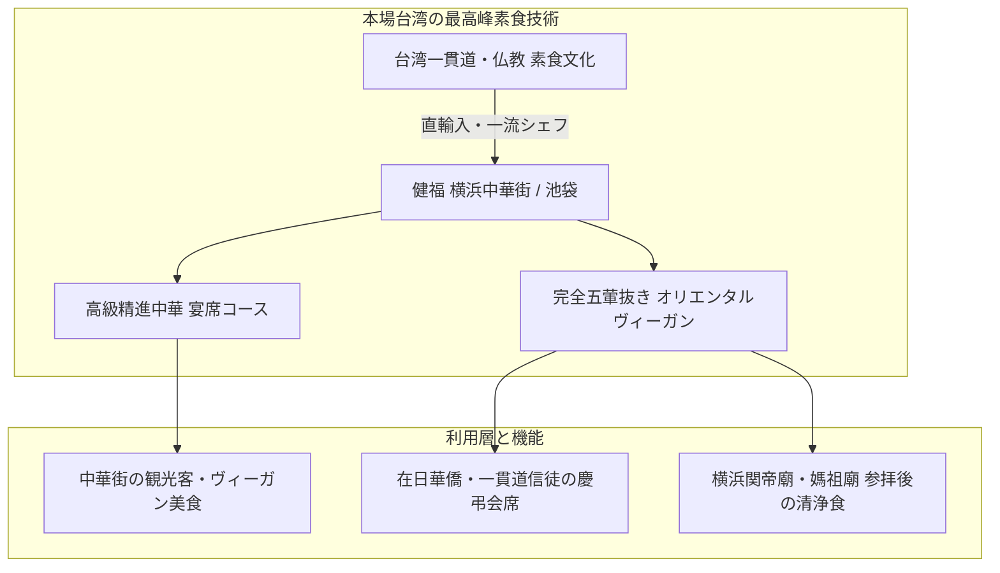

# 健福（台湾素食レストラン） 専門構造分析ノート

> [!warning] 執筆前の確認事項
> - **健福（チェンフー / Chien-Fu）**は、横浜中華街および東京都豊島区西池袋等に展開する、**日本屈指の本格台湾素食（オリエンタルベジタリアン中華）専門店**である。
> - 一貫道信徒の厳格な**「清口（五葷抜き完全菜食）」**に完全対応し、肉・魚・卵・乳製品はもちろん、ニンニクやネギなどの五葷を一切使用しない。
> - 本場台湾から直輸入された最上級の素食素材を用い、「精進北京ダック」「精進フカヒレ」「精進エビチリ」など、伝統的な高級中華料理の味・食感・外観を驚くべき完成度で再現している。

> [!summary] 要旨
> **健福**は、日本最大のチャイナタウンである横浜中華街において、伝統的な中華宴席料理を完全なオリエンタルヴィーガン仕様で提供する台湾素食の最高峰レストランである。宗教的戒律（不殺生・五葷禁忌）を遵守する華僑・信徒の公式会食・慶弔儀礼の場として機能する一方、健康志向の日本人や訪日外国人観光客に「肉や魚を使わない極上の中華美食体験」を提供し、日本の素食文化の高度化を象徴する存在となっている。

---

## 1. 諸見解・機能の対比（一般観光客 vs 台湾素食実践）

### 比較考察マトリクス表

| 比較軸 | 一般観光客・中華街来訪者（etic） | 宗教的素食実践者（emic） |
| :--- | :--- | :--- |
| **料理の驚き** | 「これが本当に大豆？湯葉？」という精巧な味・食感の再現 | 安心して全メニューを食べられる**「無漏（清浄）の食卓」** |
| **五葷抜きの評価** | 食後の口臭が気にならず、さっぱりとして胃もたれしない | **五臓の気を乱さず、霊性を清らかに保つ戒律遵守** |
| **立地の意義** | 中華街の食べ歩き・観光の中の珍しいベジ専門店 | **[[横浜関帝廟・横濱媽祖廟]]**での参拝と連動する聖なる食生活 |
| **高級コース料理** | 北京ダックやフカヒレの精進再現を楽しむエンタメ性 | 結婚式・法事など信徒同士の公式行事を祝うための**正統宴席** |

---

## 2. 概要と基本情報

| 項目 | 内容 |
| :--- | :--- |
| **店舗名** | 台湾素食 健福（チェンフー） |
| **主要店舗** | 横浜中華街店（横浜市中区山下町217） ／ 西池袋店（豊島区西池袋5-25-2） |
| **代表メニュー** | 素北京ダック（湯葉クリスピー揚げ）、素フカヒレ姿煮風スープ、素エビのチリソース、素アワビの醤油煮、精進小籠包 |
| **調理規定** | 動物性食材完全ゼロ、五葷（ネギ・ニンニク等）完全ゼロ、無添加植物油使用 |
| **近隣関連施設** | [[横浜関帝廟・横濱媽祖廟]]（横浜中華街店内） |
| **公式URL** | `http://www.chien-fu.com/` |

---

## 3. 調理技術と代表的精進メニューの解剖

### 3-1. 素北京ダック（精進ダック）
- 特製の湯葉を何重にも折り重ねて秘伝のタレに漬け込み、高温の植物油で表面をパリッと飴色に揚げた名物料理。薄餅（ピン）に胡瓜・特製甜麺醤（五葷抜き味噌）とともに包んで食す。

### 3-2. 素フカヒレ・素アワビ
- 高級海燕の巣やフカヒレの繊維感を「寒天・キノコ抽出エキス」で再現。アワビの弾力は肉厚の椎茸やエリンギを長時間煮込んで表現。

### 3-3. 五葷抜き中華調味料の独自開発
- 市販の中華調味料（オイスターソース、鶏ガラスープ、ネギ油等）は一切使えないため、干し椎茸、昆布、大豆発酵調味料（豆豉・味噌）、生姜油、特製香味植物油を駆使して深遠な旨味を構築している。

---

## 4. 宗教学的・食文化史的意義

- **横浜中華街における食の多様性の象徴**:
  豚肉や海鮮を多用する広東・四川料理がひしめく中華街の中で、台湾の厳格なオリエンタルベジタリアンを貫く貴重な拠点。
- **神仏参拝と精進潔斎の結節点**:
  [[横浜関帝廟・横濱媽祖廟]]への参拝前後に身を清める「素食」の場として、華僑コミュニティに不可欠な役割を担っている。

---

## 5. 関連教団・関連人物・関連概念

- **[[一貫道と台湾素食レストラン]]**: 台湾素食の総合分析
- **[[天道（一貫道）]]**: 清口戒律の母体宗教
- **[[横浜関帝廟・横濱媽祖廟]]**: 中華街の道教信仰二大廟
- **[[中一素食店（台湾素食レストラン）]]**: 日本における台湾素食の草分け老舗
- **[[菜食健美（大晶企画・道徳会館）]]**: 道徳会館系のオリエンタルベジレストラン

---

## 6. 史料・参考文献

- 健福 公式アーカイブ (`http://www.chien-fu.com/`)
- 横浜中華街発展会協同組合『横浜中華街公式ガイド』
- 台湾文化部『台湾素食文化志』

---

## 7. 関連ノート (Vault内)

- [[一貫道と台湾素食レストラン]]
- [[中一素食店（台湾素食レストラン）]]
- [[菜食健美（大晶企画・道徳会館）]]
- [[横浜関帝廟・横濱媽祖廟]]
- [[東京媽祖廟]]
- [[各教団の食の教義・タブー比較]]

---

## 8. 検証・品質ゲートと留保事項

> [!warning] 留保事項
> - **店舗運営の性格**: 一般に広く開放された中国料理店であり、信徒以外の一般観光客・グルメ愛好家も多数利用している。
> - **evidence_type**: `primary_and_secondary_sources`
> - **confidence**: `5`

---

*※本稿は[[_分派・異端研究ポータル]]の飲食・食品関連および台湾素食文化実践に関する専門構造分析ノートである。*
