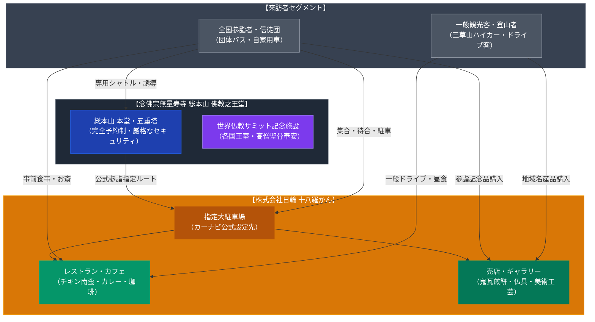

# 十八羅かん（念佛宗・佛教之王堂門前） 専門構造分析ノート

> [!warning] 執筆前の確認事項
> - **十八羅かん（じゅうはちらかん）**は、兵庫県加東市の山中に位置する世界最大級の仏教建築群「念佛宗三宝山無量寿寺 総本山 佛教之王堂」の門前に構える大型複合飲食・物販施設である。
> - 運営母体は、仏壇・仏具・伝統美術工芸品の製造販売や旅行事業（ムーンライトツアー）を手がける**「株式会社日輪（にちりん）」**（社本店が当施設内）。
> - 佛教之王堂への参詣は原則として完全事前予約制・信者同伴が基本となっているが、公式案内および公式サイトにおいて**「カーナビを設定する際の目的地および参詣専用駐車場」としてこの「十八羅かん（加東市畑640-2）」が指定**されている。
> - 施設内にはカフェ・レストランが併設され、名物のチキン南蛮定食や特製カレー、自家焙煎珈琲を提供しているほか、オリジナル銘菓「鬼瓦煎餅」や工芸品が販売されており、一般のドライブ客や三草山のハイカーにも広く利用されている。

> [!summary] 要旨
> **十八羅かん**は、念佛宗無量寿寺の超巨大聖地「佛教之王堂」へのアプローチにおいて、事実上の総合ゲートウェイ・レセプション機能を担う門前飲食・物販拠点である。運営企業「株式会社日輪」の直営のもと、参詣者の待合・昼食・土産物需要を吸収するとともに、秘匿性の高い本殿内部とは対照的に、一般外部社会に対して開放された明るい観光・飲食インターフェースとして機能している。

---

## 1. 諸見解・機能の対比（観光客・ハイカー vs 参詣者・教団）

| 比較軸 | 一般観光客・ハイカー（外部視点 / etic） | 念佛宗・参詣者・日輪（内部視点 / emic） |
| :--- | :--- | :--- |
| **存在意義** | 三草山山麓の清潔で広々としたロードサイドレストラン・売店 | 「佛教之王堂」参詣への結界前待合所・専用駐車場・指定受付拠点 |
| **利用形態** | チキン南蛮やカレーの昼食、珈琲ブレイク、鬼瓦煎餅等の購入 | 参詣前後の身支度・お斎（食事）・記念品および仏具受納の場 |
| **宗教色** | 高級感のある木造和風建築と美術品が並ぶが、勧誘等はない | 世界仏教サミットを推進する最高峰の聖地にふさわしい荘厳な門前空間 |
| **組織構造** | 加東市の地域観光協会に掲載される一般飲食店 | 株式会社日輪が担う聖地ロジスティクス・物販事業の社本店 |

---

## 2. 概要と基本情報

| 項目 | 内容 |
| :--- | :--- |
| **施設名** | 十八羅かん（じゅうはちらかん） |
| **所在地** | 兵庫県加東市畑640-2 |
| **運営企業** | 株式会社 日輪（にちりん / 社本店） |
| **主要飲食メニュー** | チキン南蛮定食、特製欧風カレー、うどんセット、ブレンドコーヒー、スイーツ |
| **物販・展示内容** | 名物「オリジナル鬼瓦煎餅」、播州銘産品、仏具・仏壇、高級美術工芸品 |
| **設備** | 大駐車場完備（佛教之王堂参詣者指定駐車場）、テーブル席・座敷席、売店 |
| **アクセス** | 中国自動車道「ひょうご東条IC」または「滝野社IC」より車で約15〜20分 |

---

## 3. 史的経緯と聖地ロジスティクスにおける役割

### (1) 佛教之王堂の建立と門前機能の整備
念佛宗無量寿寺は、世界32カ国の仏教最高指導者や王室が参加する「世界仏教サミット」を発議し、2008年に兵庫県加東市に敷地面積約180万㎡に及ぶ「総本山 佛教之王堂」を落慶させた。日本伝統社寺建築の粋を集めた総檜造りの本堂、五重塔、巨石工芸、世界最大の和鐘（老子製作所鋳造）などを擁する巨大聖地の完成に伴い、全国・全世界から大型バスで押し寄せる参詣団を受け入れる広大な駐車場と飲食機能が不可欠となった。

### (2) 「株式会社日輪」による直営一元管理
この聖地インフラの中核として配置されたのが「十八羅かん」である。運営元の株式会社日輪は、教団の仏具調達や美術工芸品の製造、さらには参詣ツアーの企画運営を行う実質的な教団外郭企業であり、飲食部門もその一環としてプロフェッショナルに運営されている。

### (3) 一般開放と地域融和のバッファー機能
念佛宗の境内そのものはセキュリティが極めて厳格であり、事前予約のない一般人の自由参拝は制限されている。これに対し、門前に位置する「十八羅かん」は年中無休で一般来訪者に開放されており、加東市の観光ガイドにも登録されるなど、地域社会や一般観光客とのあいだの「緩衝地帯（バッファーゾーン）」として極めて重要な社会的役割を果たしている。

---

## 4. 施設・機能の構造連関図

---

## 5. 現地利用・観察ポイント

1. **アクセスと立地**:
   中国自動車道「滝野社IC」または「ひょうご東条IC」から車で約15分。三草山の登山口に隣接し、広大な舗装駐車場が整備されている。敷地内には重厚な日本瓦と梁を用いた大型建築が建ち並ぶ。
2. **メニューの特徴**:
   ロードサイドレストランとして非常にハイレベルな定食メニューを提供。特にボリューム満点のチキン南蛮定食や、深いコクのある特製カレーが名物として知られ、Googleマップ等の口コミでも一般客から高評価を得ている。
3. **売店と鬼瓦煎餅**:
   店内売店には、佛教之王堂の大屋根に載せられた巨大な鬼瓦を模した「鬼瓦煎餅」が山積みされており、参詣者・観光客の定番土産となっている。奥には高級な仏具や仏像の展示サロンが配置されている。

---

## 6. 関連ノート

- [[PL病院 カフェレストラン（パーフェクト リバティー教団）]]
- [[MIHO MUSEUM レストラン「ピーチ」（秀明自然農法）]]
- [[愛光会館（大山ねずの命神示教会・神総本部）]]
- [[_分派・異端研究ポータル]]
