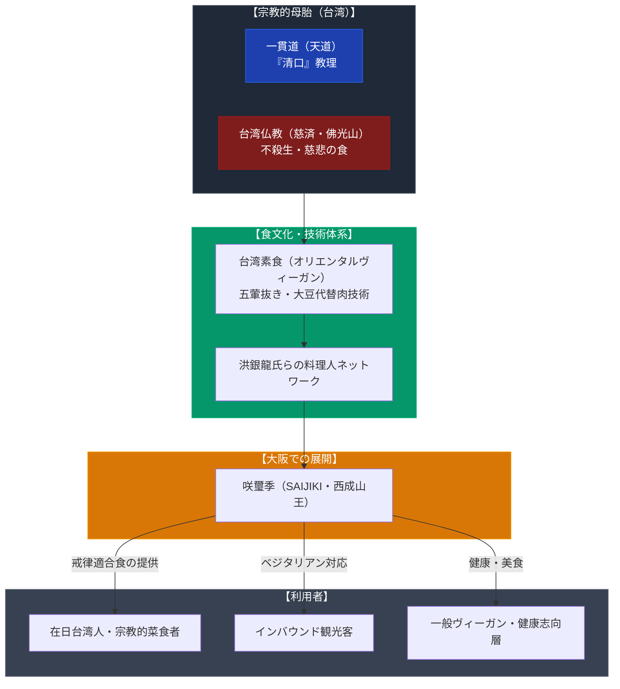

# 咲璽季（台湾素食・オリエンタルヴィーガン） 専門構造分析ノート

> [!warning] 執筆前の確認事項
> - **咲璽季（SAIJIKI）**は、大阪市西成区山王（天王寺エリア至近）にある台湾素食・オリエンタルヴィーガン対応レストランである。
> - 台湾のテレビ番組や素食界で著名な重鎮料理人・**洪銀龍**氏が監修に関わっていることで知られる。
> - **宗教的背景**: 台湾における「素食（スーシー）」は、一貫道（天道）の「清口（五葷抜き生涯菜食の戒律）」や台湾仏教（慈済会・佛光山など）の不殺生思想を母胎として発展した世界屈指の菜食産業である。
> - 店舗自体は宗教団体の直営施設ではなく、宗教的食文化の規範を忠実に継承した民間レストランであるが、宗教的戒律を持つ信徒や敬虔なベジタリアンが安心して利用できる社会的インフラとなっている。

> [!summary] 要旨
> **咲璽季（SAIJIKI）**は、大阪において本格的な「台湾素食」を提供する代表的店舗である。肉・魚だけでなく、仏教や道教系新宗教で禁忌とされる「五葷（ネギ・ニンニク・ニラ・ラッキョウ・アサツキ）」を一切使用しないオリエンタル・ベジタリアンに完全対応し、大豆ミートや湯葉等を用いた精巧な代替肉技術を取り入れている。宗教的戒律食が一般の健康志向やインバウンド観光客向け外食として高度に定着した現代的受容事例である。

---

## 1. 諸見解・機能の対比（一般客 vs 宗教的菜食者）

| 比較軸 | 一般ヴィーガン・観光客（外部視点 / etic） | 宗教的菜食者・一貫道/仏教徒（内部視点 / emic） |
| :--- | :--- | :--- |
| **存在意義** | ヘルシーで美味しい台湾料理、大豆ミートの専門店 | 殺生を避け「清口」や「不殺生戒」を破ることなく食事ができる聖なる食卓 |
| **五葷の排除** | ニンニクやネギが入っていない優しい味付け | 気の乱れを防ぎ、霊性を清らかに保つための絶対的な宗教規定の実践 |
| **代替肉の評価** | 驚くほど肉に近い精巧なフェイクミート技術 | 衆生の肉食への執着を解き放ち、菜食へと導く「慈悲の方便」 |
| **運営形態** | 天王寺・西成のおしゃれな健康志向レストラン | 台湾から世界へ広がる素食ネットワークの大阪における着床点 |

---

## 2. 概要と基本情報

| 項目 | 内容 |
| :--- | :--- |
| **店舗名** | 咲璽季（SAIJIKI / サイジキ） |
| **所在地** | 大阪府大阪市西成区山王1-1-10（JR・大阪メトロ天王寺駅 徒歩圏） |
| **食の規定** | オリエンタルヴィーガン対応（動物性食材完全不使用、五葷抜き対応） |
| **技術的ルーツ** | 台湾素食（洪銀龍氏らの提唱する精進中華料理・大豆加工技術） |
| **主要メニュー** | 香椿炒麺（台湾風焼きそば）、素排骨（精進唐揚げ）、台湾素食弁当、薬膳スープ、豆花 |
| **客層** | 在日台湾人、訪日観光客、オリエンタルヴィーガン信徒、一般健康志向層 |
| **主要史料・リンク** | Vegewel店舗取材記事、大阪メトロ公式観光情報 |

---

## 3. 思想的背景と「五葷抜き」の教理構造

### (1) 一貫道（天道）の「清口」と台湾素食産業の興隆
台湾が世界有数のベジタリアン大国となった背景には、一貫道の教理である「清口（チンコウ）」がある。一貫道では、指導的信徒となるために肉・魚・五葷・酒を永久に断つ誓いを立てる。この莫大な国内需要に応えるため、信徒たちが素食店（自助餐など）を次々と起業し、世界最高峰の大豆ミート・湯葉加工技術が開発された。

### (2) 「五葷（ごくん）」を避ける宗教的理由
仏教（『楞厳経』等）および道教・天道では、五葷（ネギ・ニンニク・ニラ・ラッキョウ・アサツキ）を食べると「火を通して食べれば淫心をまし、生で食べれば嗔恚（怒り）を増す」とされ、修行や精神の清浄化を著しく妨げるものとして固く禁じられている。

---

## 4. 台湾素食の文化・産業受容構造図

---

## 5. 関連ノート (Vault内)

- [[一貫道と台湾素食レストラン]]（台湾素食と一貫道の関係に関する基幹分析ノート）
- [[中一素食店（台湾素食レストラン）]]（東京における台湾素食の老舗）
- [[健福（台湾素食レストラン）]]（国内の代表的台湾素食店）
- [[菜食健美（大晶企画・道徳会館）]]（道徳会館系素食レストラン）
- [[大阪ハラールレストラン（大阪マスジド）]]（大阪における宗教的食事戒律拠点の比較）
- [[_分派・異端研究ポータル]]

---

## 6. 検証・品質ゲートと留保事項

> [!summary] 検証記録
> - **店舗所在地と業態**: 大阪市西成区山王1丁目での営業実態、および完全植物性・五葷抜き対応（オリエンタルヴィーガン）の提供方針は一次情報および店舗メディア取材で確認済み。
> - **宗教団体直営の有無**: 本店舗自体は宗教法人の登記施設ではなく、民間企業・個人による店舗運営である。台湾素食の宗教的思想・戒律を忠実に踏襲した「文化・戒律適合型レストラン」として位置づけられる。
