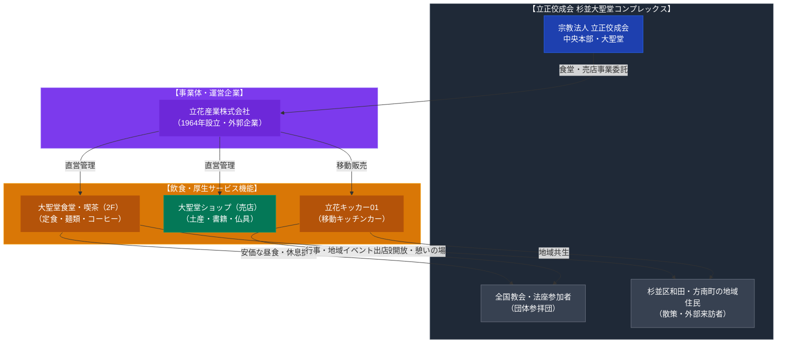

# 大聖堂食堂（立正佼成会・立花産業） 専門構造分析ノート

> [!warning] 執筆前の確認事項
> - **大聖堂食堂**は、法華経系新宗教の国内最大級教団「立正佼成会」の中央本部・大聖堂（東京都杉並区和田）2階に常設されている大規模食堂・喫茶施設である。
> - 運営は、1964年に立正佼成会の外郭事業体として設立された**「立花産業株式会社」**が担当している。
> - 信徒の団体参拝（本部参拝・法座研修）における食事処であると同時に、近隣住民や一般来訪者にも広く開放されており、安価で良質なランチ定食、麺類、コーヒー等を提供している。
> - 近年は教団行事や地域イベントへ出動する専用キッチンカー**「立花キッカー01（ゼロワン）」**の運行や、大聖堂ショップ（売店）の運営も一括して立花産業が手がけている。

> [!summary] 要旨
> **大聖堂食堂（立正佼成会）**は、杉並区和田の広大な教団本部コンプレックス（大聖堂、普門館跡地、法輪閣、佼成病院、学林、中高学校群）を支える中核厚生・飲食インフラである。外郭企業「立花産業」による安定した直営管理のもと、全国から集う信徒の胃袋を満たすとともに、地域社会との緩やかな共生インターフェースとして機能している。

---

## 1. 諸見解・機能の対比（一般来訪者 vs 教団共同体）

| 比較軸 | 地域住民・一般来訪者（外部視点 / etic） | 立正佼成会・立花産業（内部視点 / emic） |
| :--- | :--- | :--- |
| **存在意義** | 方南町・和田エリアの静かで安価な大衆食堂・喫茶スペース | 本部参拝者・法座参加者の身心を調え、和合を深める「お斎」の場 |
| **利用体験** | 日替わりランチ、うどん・ラーメン、コーヒーの気兼ねない飲食 | 全国各地の教会から訪れたサンガ（信徒仲間）が語り合い、感謝を捧げる時間 |
| **宗教色** | 大聖堂の威容はあるが、食堂内での強引な勧誘等は一切ない | 法華経の慈悲と菩薩行を「食の奉仕」を通じて具現化する教団厚生施設 |
| **運営形態** | 一般の社食・学食に類似したセルフサービス方式 | 1964年設立の外郭会社「立花産業」による規律ある直営事業運営 |

---

## 2. 概要と基本情報

| 項目 | 大聖堂食堂・喫茶スペース | 移動販売「立花キッカー01」 | 運営企業：立花産業株式会社 |
| :--- | :--- | :--- | :--- |
| **所在地** | 東京都杉並区和田2-11-1 大聖堂2階 | 主に大聖堂周辺・行事会場・地域催事 | 東京都杉並区和田2-11-1（大聖堂内） |
| **営業時間** | 喫茶 8:30〜15:00 / 昼食 11:30〜13:30 | 行事・イベント開催時に応じて営業 | 1964年設立（教団外郭事業体） |
| **定休日** | 日曜・祝日、毎月6日・16日・26日（式典時変動） | 不定期（出店要請による） | 土・日・祝日・式典休業日 |
| **主要メニュー** | 日替わり定食、カレー、うどん、そば、ラーメン、珈琲 | ホットスナック、カフェドリンク、軽食 | 食堂・売店、保険代理店、施設管理、商事 |
| **利用対象** | 全国の参拝信徒、一般市民、職員、地域住民 | 参拝者、青少野外活動参加者、地域住民 | 立正佼成会グループ各組織・会員 |

---

## 3. 史的経緯と教団都市「杉並・和田」の飲食インフラ

### (1) 大聖堂の建立（1964年）と立花産業の設立
立正佼成会は1960年代、開祖・庭野日敬のもとで会員数が爆発的に増加し、1964年に東京・杉並の地に巨大な円形神殿「大聖堂」を建立落慶させた。これと時を同じくして、全国から参拝する数万人規模の信徒に対する食事提供、宿泊、売店、保険、施設営繕等を担う専門事業体として**立花産業株式会社**が設立された。

### (2) 普門館から大聖堂食堂への集約
かつて「吹奏楽の甲子園」として全日本吹奏楽コンクールが開催され、世界的指揮者カラヤンが絶賛した名ホール「普門館」（5,000人収容、2018年解体）にも多数の喫茶・飲食スペースが備えられていた。普門館解体後も、大聖堂2階の食堂および法輪閣などの諸施設において、参拝者の飲食需要を賄い続けている。

### (3) 移動式飲食展開（キッチンカー）の導入
近年、立花産業は固定店舗にとどまらず、キッチンカー「立花キッカー01」を導入した。大規模法要時の混雑緩和や、青少年の野外活動、防災訓練、地域フェスティバルなどでの機動的な温食・ドリンク提供を実現し、時代に即した飲食サービスの近代化を進めている。

---

## 4. 施設・機能の構造連関図

---

## 5. 現地利用・観察ポイント

1. **アクセスと入館**:
   東京メトロ丸ノ内線「方南町駅」東口より徒歩約12分、または中野駅・永福町駅より京王バス「佼成会聖堂前」下車すぐ。警備員が常駐しているが、一般の参拝・見学・食堂利用も基本的に拒まれない。
2. **食堂の雰囲気と利用法**:
   大聖堂2階に位置し、食券機で食券を購入してカウンターで受け取る典型的な大衆社食スタイル。清潔で広々とした座席配置となっており、法衣を着た教団職員や参拝信徒に混じって、近隣の散策客や作業員が食事をとる光景が見られる。
3. **営業日の注意点**:
   毎月「1日（朔日）・6日（長沼妙佼祥月命日）・16日（開祖祥月命日）・26日」などの教団特定式典日は混雑や営業時間変更が生じやすいため、訪問時は立花産業公式サイト等での事前確認が望ましい。

---

## 6. 関連ノート

- [[立正佼成会]]
- [[PL病院 カフェレストラン（パーフェクト リバティー教団）]]
- [[愛光会館（大山ねずの命神示教会・神総本部）]]
- [[円応社食堂]]
- [[_分派・異端研究ポータル]]
