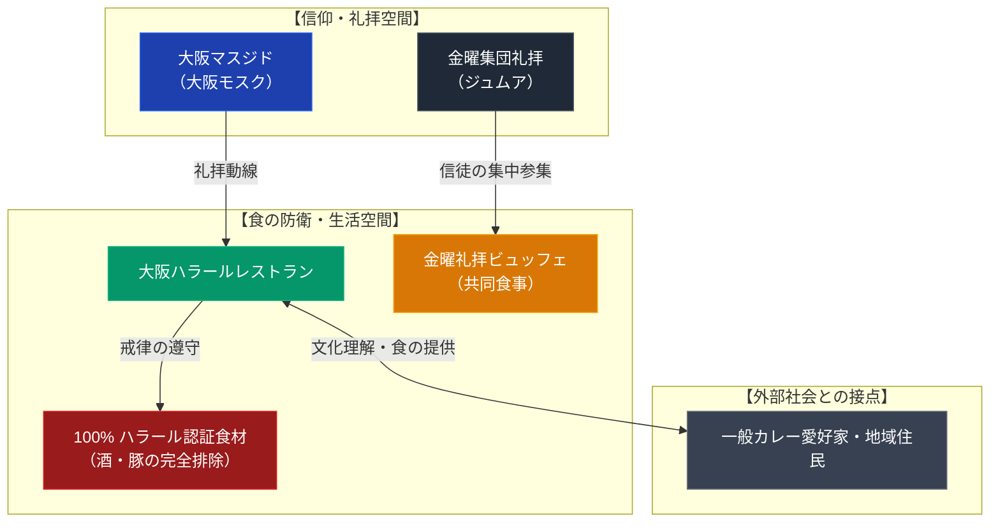

# 大阪ハラールレストラン（大阪マスジド） 専門構造分析ノート

> [!warning] 執筆前の確認事項
> - **大阪ハラールレストラン（Osaka Halal Restaurant）**は、西日本最大級のモスクである「大阪マスジド（大阪モスク）」の真向かい・東隣に位置する本格パキスタン料理店である。
> - 単なる商業エスニック料理店ではなく、モスクに集う在日ムスリム（イスラム教徒）の「ハラール食防衛インフラ」およびコミュニティ維持の核として設立・機能している。
> - 店内では酒類の提供・持ち込みが一切禁止されており、提供されるすべての食材・調味料がイスラム法の戒律（シャリーア）に厳格に適合した100%ハラール仕様となっている。

> [!summary] 要旨
> **大阪ハラールレストラン**は、大阪市西淀川区大和田に所在し、西日本最大規模のイスラム教礼拝堂「大阪マスジド」と不可分の共生関係を結ぶ宗教的食文化拠点である。特に毎週金曜日の集団礼拝（ジュムア）においては、近畿圏一円から参集する多数のムスリムに対してビュッフェ形式の食事が提供され、信仰実践と共同体の連帯を支える重要な社会的役割を果たしている。同時に、本場のビリヤニやスパイス料理を求める非ムスリムの一般客・愛好家にも広く開放されており、日本の地域社会と在日イスラム社会の接点としても機能している。

---

## 1. 諸見解・機能の対比（一般愛好家 vs ムスリム共同体）

| 比較軸 | 一般来訪者・カレー愛好家（外部視点 / etic） | 在日ムスリム・モスク参拝者（内部視点 / emic） |
| :--- | :--- | :--- |
| **存在意義** | 本場パキスタンの本格的なビリヤニやカレーが味わえる名店 | 日常および金曜礼拝における「ハラール（清浄・合法）」の厳格な実践拠点 |
| **食の規定** | 現地そのままの濃厚でスパイシーなエスニック料理 | アッラーの掟（クルアーン）に基づく完全無欠のハラール（豚肉・アルコール完全排除） |
| **空間体験** | 異国情緒とモスクの景観を楽しめるオープンなグルメスポット | 金曜集団礼拝後の同信徒との団欒・相互扶助・情報交換の場 |
| **アルコール** | ビールや酒類が置いていないレストラン | ハラーム（禁忌）である酒類の完全排除による安心・安全な聖域 |

---

## 2. 概要と基本情報

| 項目 | 内容 |
| :--- | :--- |
| **店舗名** | 大阪ハラールレストラン（Osaka Halal Restaurant） |
| **所在地** | 大阪府大阪市西淀川区大和田4-13-2（阪神本線千船駅 徒歩約8分） |
| **立地関係** | 宗教法人大阪マスジド（西日本最大のモスク）の東隣・門前 |
| **主要料理** | 本格パキスタン料理（チキンビリヤニ、マトンマサラ、ニハリ、ハリーム、ナン、ロティ等） |
| **認証・戒律** | 100%ハラール（アルコール類完全不提供・持ち込み禁止、ハラール認証肉使用） |
| **特筆事項** | 毎週金曜日の集団礼拝（ジュムア）に合わせて礼拝者向けの特別バイキング（ビュッフェ）を実施 |
| **主要史料・リンク** | 店舗公式サイト、大阪マスジド公式情報、ハラールグルメジャパン |

---

## 3. 史的経緯と大阪マスジドとの共生関係

### (1) 西淀川区におけるムスリム共同体の形成
大阪市西淀川区周辺は、中古車輸出ビジネスや金属加工・町工場などに従事するパキスタン人、バングラデシュ人、インドネシア人などのムスリムが多く居住するエリアとなった。これら在日ムスリムの強い要望により、2010年に本格的なドームとミナレットを備えた「大阪マスジド」が建立された。

### (2) 門前レストランの誕生とコミュニティ形成
モスク建立に伴い、礼拝に訪れる信徒たちが安心して日常の食事をとれる環境の整備が求められた。モスクのすぐ隣に「大阪ハラールレストラン」が開業したことで、礼拝施設と食事処が一体化した宗教的・生活的な結節点が完成した。

### (3) 一般層への浸透と多文化共生の場
当初は在日ムスリムの自給・コミュニティ向けが主たる役割であったが、妥協のない本場の調理技法とハラール肉の旨味が関西のカレー・スパイス料理ファンの間で評判を呼び、現在では日本人一般客と外国人ムスリムが自然に同席する文化交流の空間となっている。

---

## 4. 教理・思想との関係と共同体インフラ機能

### (1) 金曜集団礼拝（ジュムア）と共同食事
イスラム教において金曜正午過ぎの集団礼拝は義務（ワージブ）であり、近隣のみならず遠方からも多くの信徒が集まる。大阪ハラールレストランではこの礼拝時間帯に合わせて特別なビュッフェを用意し、礼拝を終えた信徒たちが互いの安否を確認し、連帯を深める「共同の食卓（スンナの実践）」を提供している。

### (2) 完全なハラール環境の担保
非ムスリム向けの一般的な飲食店では、たとえ肉自体がハラールであっても、調理器具の共有、みりん・料理酒などの微量アルコールの混入、客席での飲酒などが生じるため、敬虔なムスリムは強い心理的・宗教的不安を抱える。大阪ハラールレストランは「店内に一切のアルコールを置かない」「調味料・肉類すべてを正規ハラールルートで確保する」ことを徹底しており、信徒にとって絶対的な安心領域となっている。

---

## 5. 関連ノート (Vault内)

- [[東京ジャーミイ トルコカフェ＆ハラールマーケット]]（首都圏におけるモスク直営ハラール飲食・物販拠点）
- [[David's Deli]]（宗教的食事規定〈コーシャ〉に基づくユダヤ料理店）
- [[一貫道と台湾素食レストラン]]（宗教的戒律〈菜食〉に基づく東アジアの飲食拠点）
- [[三育フーズとSDA菜食レストラン]]（キリスト教安息日再臨派の食養生実践）
- [[_分派・異端研究ポータル]]

---

## 6. 検証・品質ゲートと留保事項

> [!summary] 検証記録
> - **所在地・直結関係**: 大阪マスジド（西淀川区大和田4-12-21）および大阪ハラールレストラン（同4-13-2）の近接性は現地マップおよび双方の公式情報で確認済み。
> - **ハラール規律**: 店頭でのアルコール不提供、ハラール肉の使用、金曜特別ビュッフェの実施は一次情報および訪問客レビュー・取材報道で確認済み。
> - **経営形態**: 宗教法人大阪マスジドの直接会計による「直営」ではなく、モスク信徒共同体のパキスタン人経営者による「門前コミュニティ連携型独立経営」である。宗教法人直営と誤認しないよう留意する。
