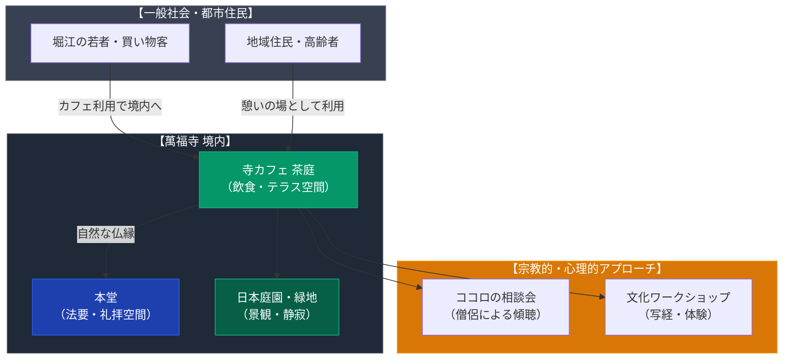

# 寺カフェ 茶庭（萬福寺） 専門構造分析ノート

> [!warning] 執筆前の確認事項
> - **萬福寺「寺カフェ 茶庭（さてい）」**は、大阪市西区南堀江の繁華街（オレンジストリート周辺）に位置する浄土真宗本願寺派寺院「萬福寺」の境内にある寺カフェである。
> - **同名寺院との混同に注意**: 京都府宇治市にある黄檗宗大本山「萬福寺」（普茶料理で全国的に著名な寺院）とは宗派も所在地も異なる別の寺院である。本ノートは大阪・南堀江の浄土真宗本願寺派寺院に関するものである。
> - 単なる商業飲食店ではなく、寺院の敷地開放、僧侶による対話・傾聴活動（「ココロの相談会」など）を組み込んだ都市型寺院の再生・教化モデルとして運営されている。

> [!summary] 要旨
> **寺カフェ 茶庭**は、若者やカルチャーの発信地である大阪・南堀江に所在する浄土真宗本願寺派・萬福寺が境内に開設したコミュニティカフェである。都心の喧騒の中で日本庭園を眺めながらお抹茶や和スイーツを楽しめる空間として一般開放されており、仏教・寺院への心理的ハードルを下げ、若年層や地域住民との接点を再構築する現代仏教の「開かれた寺院（寺カフェ）」運動の大阪における代表的事例である。

---

## 1. 諸見解・機能の対比（一般カフェ客 vs 寺院・教化活動）

| 比較軸 | 一般来訪者・若年層客（外部視点 / etic） | 萬福寺・僧侶（内部視点 / emic） |
| :--- | :--- | :--- |
| **存在意義** | 南堀江のおしゃれなエリアにある緑豊かな隠れ家和風カフェ | 檀家制度の衰退期における一般衆生との「結縁（仏縁）」の創出空間 |
| **空間体験** | 日本庭園風のテラスや落ち着いた境内でリフレッシュする場 | 寺院を地域に開き、心の平安と教えに触れるエントリースペース |
| **提供価値** | 抹茶ラテ、和パフェ、上質な日本茶などのカフェメニュー | 「ココロの相談会」や法話、ワークショップによる傾聴と精神的ケア |
| **宗教性** | 敷居の低いリラクゼーションスポット（勧誘等はなし） | 押し付けのない自然な仏教理解と都市コミュニティの拠点形成 |

---

## 2. 概要と基本情報

| 項目 | 内容 |
| :--- | :--- |
| **施設名** | 寺カフェ 茶庭（さてい） |
| **運営寺院** | 宗教法人 萬福寺（浄土真宗本願寺派） |
| **所在地** | 大阪府大阪市西区南堀江1-11-17（大阪メトロ四ツ橋駅・心斎橋駅徒歩圏） |
| **環境・景観** | 萬福寺境内、都会のビル群に囲まれた緑豊かな中庭・テラス席 |
| **主要メニュー** | お抹茶（生菓子付き）、ほうじ茶ラテ、和パフェ、季節の甘味、各種日本茶等 |
| **付帯活動** | 僧侶による「ココロの相談会」、写経・写仏、寺院ワークショップ |
| **主要史料・リンク** | 萬福寺公式サイト、大阪メトロ情報メディア（METRO NINE等） |

---

## 3. 設立の背景と都市型寺院の現代的役割

### (1) 南堀江という都市環境と萬福寺
萬福寺が位置する南堀江は、家具の街からアパレルショップ、カフェ、インテリアショップが立ち並ぶ大阪屈指のファッショナブルな街並みへと大きく変貌した。こうした都市の変容の中で、伝統的な檀家中心の寺院運営にとどまらず、街を行き交う若い世代や地域の人々に開かれた場を提供することが模索された。

### (2) 「寺離れ」への対抗策としての寺カフェ
高度経済成長以降の都市化と過疎化により「檀家離れ・寺離れ」が進む中、全国の伝統仏教寺院では「築地本願寺カフェ Tsumugi」などを先駆けとして、境内に飲食・カフェスペースを設ける試みが広がった。萬福寺の「茶庭」は、大阪都心部におけるその実践例であり、飲食を通じて自然に寺の門をくぐらせる心理的導線を構築した。

### (3) 「ココロの相談会」に見る現代的布教
単なるスペースの賃貸や飲食業の外注化にとどまらず、僧侶自らがカフェ空間を活用して定期的に悩み相談を受け付けるなど、現代人のストレスや孤立に対する「傾聴の場」としての機能を維持している点に宗教的特徴がある。

---

## 4. 境内空間の構造と機能連関

---

## 5. 関連ノート (Vault内)

- [[伝統仏教系の寺カフェ・宿坊一覧]]（全国の寺カフェ・宿坊の総合ハブノート）
- [[萬福寺の普茶料理]]（京都府宇治市・黄檗宗大本山萬福寺の中国風精進料理 ※同名寺院の比較）
- [[大阪ハラールレストラン（大阪マスジド）]]（大阪における他宗教の飲食共生事例）
- [[_分派・異端研究ポータル]]

---

## 6. 検証・品質ゲートと留保事項

> [!summary] 検証記録
> - **所在地・宗派確認**: 大阪府宗教法人名簿および萬福寺公式サイトにより、所在地（大阪市西区南堀江1-11-17）および所轄宗派（浄土真宗本願寺派）を確認済み。
> - **京都・萬福寺との混同防止**: 京都宇治の萬福寺（黄檗宗）と本寺院は、漢字表記が完全一致するものの全く別の法人・宗派である。普茶料理ではなく和カフェ形態である点を確認済み。
