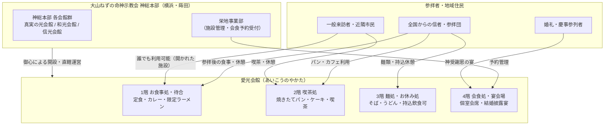

# 愛光会館（大山ねずの命神示教会・神総本部） 専門構造分析ノート

> [!warning] 執筆前の確認事項
> - **愛光会館（あいこうのやかた）**は、神奈川県横浜市南区蒔田地区に所在する「大山ねずの命神示教会 神総本部」の境内に常設された、地上4階建ての総合飲食・休憩施設である。
> - 教団の恒久的な建築物の中では最も古い歴史を持ち、教勢拡大期を牽引した指導者・直使**供丸姫（森日出子、1946–2002）**の「全国からの参拝者に憩いの場を」という意向（御心）に基づいて開設された。
> - 一般の信者・参拝者のみならず、誰でも利用可能な開かれた施設として公式に案内されており、食事処、喫茶処、持込休憩スペース、個室会席料理、結婚披露宴（神受謝恩の宴）会場など多層的な飲食・集会インフラを備える。

> [!summary] 要旨
> **愛光会館**は、大山ねずの命神示教会神総本部（横浜市蒔田）における信者厚生・対外開放の中核飲食施設である。1階のお食事処（定番のカレーライス、定食、月6回限定のラーメン等）、2階の喫茶処（焼きたてパン、ケーキ、喫茶）、3階のお食事処（麺類・うどんそば）および持ち込み可能なお休み処、4階の会席・婚礼宴会場（神受謝恩の宴）で構成される。会館には「水色（清い水・食堂職員エプロン）」と「紅色（心の喜び）」のテーマカラーが制定されており、宗教的救済の空間において「心身の安らぎと喜び」を具体化する重要な生活インフラとして機能している。

---

## 1. 諸見解・機能の対比（一般来訪者 vs 教団内部・信者視点）

| 比較軸 | 一般来訪者・近隣地域視点（外部視点 / etic） | 教団・信者視点（内部視点 / emic） |
| :--- | :--- | :--- |
| **存在意義** | 蒔田駅至近に位置する大規模な複合食堂・喫茶・休憩処 | 「心の故郷」である神総本部で参拝・学びの後に心安らぐ聖なる憩いの場 |
| **利用動機** | 食事、喫茶、待ち合わせ、地域行事時の利用 | 参拝前後の直使の御心への感謝、信者同士の和楽、慶事（結婚式披露宴） |
| **象徴的色彩** | 爽やかな水色と紅色のインテリア・スタッフ制服 | 「水色」（すべてを洗い流す清い水）と「紅色」（神の守護と心の喜び）の教理的具現 |
| **都市的機能** | 蒔田の住宅・寺社街における巨大宗教施設群の対外結節点 | 全国からの参拝団を迎える受入・給食インフラの中核 |

---

## 2. 概要と基本情報

| 項目 | 内容 |
| :--- | :--- |
| **施設正式名称** | 愛光会館（あいこうのやかた） |
| **所在地** | 〒232-0055 神奈川県横浜市南区中島町1丁目8番地1（神総本部境内） |
| **最寄駅・アクセス** | 横浜市営地下鉄ブルーライン「蒔田駅」出口2・3より徒歩約3分 |
| **運営主体** | 宗教法人大山ねずの命神示教会（神総本部 栄地事業部） |
| **建築構造** | 地上4階建て |
| **発願・開館経緯** | 直使・供丸姫（森日出子）の提唱により、恒久的建築として最古期に建設 |
| **主要飲食機能** | 1Fお食事処（定食・カレー・限定ラーメン）、2F喫茶処（焼きたてパン・ケーキ）、3Fお食事処（うどん・そば）・お休み処、4F会食処（個室会席・結婚披露宴） |
| **利用対象** | 信者、参拝者、一般来訪者（誰でも利用可能） |
| **テーマカラー** | 水色（もろもろの思いを流しゆったりした心に戻る清い水）、紅色（心の喜び） |
| **公式案内URL** | https://shinjikyoukai.jp/ |

---

## 3. 史的経緯と教理的背景・象徴性

### (1) 開設の経緯と直使・供丸姫の御心
大山ねずの命神示教会は、1953年に横浜市西区戸部町で立教された後、1987年に横浜市南区宮元町・中島町の一帯へと本部を移転し「神総本部」を整備した。
この神総本部の諸施設（真実の光会館、友和会館、信光会館、和光会館、光寿会館等）の中で、**愛光会館は恒久的な建物としては最も古い歴史**を有する。
教団側の公式解説によれば、「全国からの参拝者に憩いの場を」と願った指導者・直使**供丸姫（森日出子）**の御心によって開かれたとされ、信仰の学びや祈願を終えた人々が心身を休め、幸福感を深めるための場と位置づけられている。

### (2) テーマカラー（水色と紅色）と職員エプロン
愛光会館には明確なテーマカラーが設定されており、建築意匠や調度に反映されている：
* **水色**: 全てを洗い流す清い水の色。もろもろの執着や雑念を洗い流し、澄んだ水のようにゆったりとした心に戻ることを意味する。開館当時、直使・供丸姫は、食堂職員のエプロンを教団制服の濃紺色ではなく、この「水色」にするよう特別に指定したという伝承が残されている。
* **紅色**: 心の喜びを表す色。神の守護のもとで、誰もが必ず心に真実の喜びを得られることを意味する。

---

## 4. フロア構成と提供飲食サービス詳細

愛光会館は各フロアごとに明確な目的・メニュー設定がなされている。

```
【愛光会館 フロア構成】
4階: 会食処（個室会席料理・予約制）／ 神受謝恩の宴（結婚披露宴会場）
3階: お食事処（うどん・そば）／ お休み処（持込飲食可・自販機）／ キッズ・ベビーケアルーム
2階: 喫茶処（焼きたてパン・ケーキ・喫茶 / 土日祝・特定日開室）
1階: お食事処（カレーライス・定食・月6回限定ラーメン・甘味）／ 待合コーナー（足休め）
```

### 1階：待合コーナーおよびお食事処
* **待合コーナー**: 9:00～16:00。参拝者の足休めや待ち合わせ用のロビー（飲食不可）。
* **お食事処**: 11:00～14:30（L.O. 14:00）。
  * 主なメニュー: カレーライス、日替わり定食、コーヒー、紅茶、ケーキ等の甘味。
  * **名物ラーメンの限定提供**: ラーメンは毎日提供されるのではなく、**月6回限定**（毎月1日、15日、23日、29日、第2月曜日、第3月曜日 ※休講日の場合は翌日振替）に提供される特別メニューとなっている。

### 2階：喫茶処
* **営業時間**: 11:00～15:30（L.O. 15:00）。
* **開室日**: 土曜、日曜、祝日、および教団特定日（1日、15日、23日、29日）。秋の「光寿信者参拝時（9月23日～11月15日）」は休講日を除き連日開室される。
* **主要メニュー**: ベーカリー風の**焼きたてパン**、各種カットケーキ、コーヒー・ソフトドリンク。カフェ感覚でくつろげる空間となっている。

### 3階：お食事処・お休み処・ファミリー設備
* **お食事処**: 11:00～14:30（L.O. 14:00）。
  * 主なメニュー: かき揚げうどん、わかめそば等の日本麺類を中心に提供。
  * 団体参拝の昼食会場としても指定されており、特定時間帯（12:30まで等）に貸切運用される場合がある。
* **お休み処**: 11:00～15:00（日祝・特定日は9:00～15:00）。
  * 外から持ち込んだ弁当・軽食を自由に飲食できるフリースペース。飲料用自動販売機が常設されている。
* **キッズルーム・ベビーケアルーム**: 授乳室、おむつ交換台を完備し、子連れ信者・参拝客への配慮がなされている。

### 4階：会食処（個室）・結婚披露宴会場
* **会食処**: 11:00～16:00（完全予約制。神総本部 和光会館1階 栄地事業部受付にて受付）。
  * 旬の食材を用いた本格的な個室会席料理（前菜、お造り、煮物、揚げ物、御飯、赤出汁、水菓子等 / 1人あたり3,500円等のコース）を提供。
* **神受謝恩の宴**: 信者の結婚式（神受の儀）に伴う披露宴会場として使用される。

### 近隣の関連付帯施設
* **愛光会館お泊まり処**: 遠方からの信者・参拝者のための素泊まり宿泊施設。
* **愛光会館別館**: 会館本館に隣接し、地域の「南区桜まつり（大岡川沿い）」等のイベント時には出店や市民への開放スペースとしても協力活用された実績がある。

---

## 5. 施設・機能の構造連関図



---

## 6. 関連ノート (Vault内)

- [[大山ねずの命神示教会]]（教団本部の歴史・教理・組織ノート）
- [[PL病院 カフェレストラン（パーフェクト リバティー教団）]]（新宗教の境内・系列施設における一般開放型レストランの事例）
- [[生長の家オープン食堂]]（新宗教本部における信者・一般向け給食・食堂インフラ）
- [[円応社食堂]]（新宗教教団本部における食事処・給食施設）
- [[佛光山「滴水坊」法水寺店]]（仏教寺院境内における大規模直営喫茶・素食処）
- [[_分派・異端研究ポータル]]

---

## 7. 史料・参考文献

1. 大山ねずの命神示教会 公式サイト「愛光会館案内」（https://shinjikyoukai.jp/ ）
2. 大山ねずの命神示教会 公式サイト「神総本部 施設案内」（https://shinjikyoukai.jp/honnbu/ ）
3. 大山ねずの命神示教会 公式サイト「神受謝恩の宴（結婚披露宴）」（https://shinjikyoukai.jp/honnbu/info/utage.html ）
4. 『宗教年鑑』文化庁編（教団公称諸元参照）
5. 横浜市南区地域情報・地域イベント記録（南区桜まつりとお花見ふれあい市会場記録）

---

## 8. 検証・品質ゲートと留保事項

> [!summary] 検証記録
> - **公式情報の一次裏付け**: 施設名称、フロア別提供内容（カレー、月6回限定ラーメン、焼きたてパン、うどん・そば、会席料金3,500円等）、開室時間、供丸姫の発願理由、テーマカラー（水色・紅色）の由来は、教団公式サイトの現行施設紹介ページを直接確認・突合済み。
> - **一般開放性の確認**: 公式案内において「食事や休憩に誰でも利用できます」と明記されており、信者専用施設ではなく一般来訪者にも開かれた施設であることを確認。
> - **食中毒に関する留保**: 過去の二次資料等で言及が見られる2000年の食中毒事案については、本愛光会館の厨房設備改修との直接の因果関係は一次資料上未詳であり、混同を避けるため教団本体ノートの事件節に留保事項として記載している。
