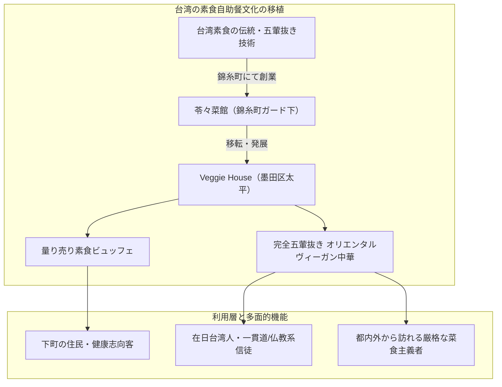

# 苓々菜館・Veggie House（台湾素食） 専門構造分析ノート

> [!warning] 執筆前の確認事項
> - **苓々菜館（りんりんさいかん / It's Vegetable!）**および後継店舗**Veggie House（ベジハウス / 東京台湾素食）**は、東京都墨田区（錦糸町・亀戸エリア）に所在した、**東京東部を代表する本格台湾素食（オリエンタルベジタリアン中華）の名店**である。
> - 長年、錦糸町の総武線ガード下で「苓々菜館」として親しまれた後、墨田区太平に移転し「Veggie House」としてリニューアルオープンした。
> - 肉や魚介類はもちろん、**「五葷（ネギ・ニンニク・ニラ・ラッキョウ・アサツキ）」を一切使用しない完全な素食基準**を厳格に保持し、多種多様な台湾精進惣菜を自由に選べるビュッフェ（量り売り）スタイルなどで熱狂的な支持を集めた。

> [!summary] 要旨
> **苓々菜館・Veggie House**は、本場台湾の庶民的な素食自助餐（ビュッフェ食堂）文化を東京の下町に再現した記念碑的店舗である。大豆タンパク、湯葉、キノコ、蒟蒻を用いた多彩な精進中華（素酢豚、素麻婆豆腐、精進点心、薬膳麺）を、化学調味料に頼らず完全五葷抜きで調理。在日台湾人・華僑のコミュニティ拠点として機能するとともに、日本のヴィーガン・オリエンタルベジタリアン運動の発展に多大な影響を与えた。

---

## 1. 諸見解・機能の対比（一般客 vs 素食信仰実践）

### 比較考察マトリクス表

| 比較軸 | 一般グルメ客・下町住民（etic） | 宗教的素食・オリエンタルベジ実践者（emic） |
| :--- | :--- | :--- |
| **ビュッフェの魅力** | 好きな野菜料理を少しずつ選べるヘルシーで楽しいランチ | 台湾の**「素食自助餐（安心の量り売り食堂）」**の完全再現 |
| **味付けの評価** | 油っこくなく、野菜本来の甘みとスパイスが活きている | **五葷・動物性汚染が一切ない「清浄無漏の食卓」** |
| **代替肉の完成度** | まるで本物の豚肉や鶏肉のような食感に驚愕 | 肉食の煩悩・殺生業（カルマ）を断つための**「慈悲の智慧」** |
| **立地の意味** | 錦糸町・オリナス近くの個性的な中華店 | 東京東部における**華僑・信徒の食のオアシス** |

---

## 2. 概要と基本情報

| 項目 | 内容 |
| :--- | :--- |
| **店舗名** | 苓々菜館（旧店名） ／ Veggie House（東京台湾素食） |
| **業態** | 台湾精進料理（素食）・オリエンタルヴィーガン中華・ビュッフェ |
| **所在地** | 東京都墨田区太平4-7-8（Veggie House所在地） |
| **アクセス** | JR総武線・東京メトロ半蔵門線「錦糸町駅」北口より徒歩約8分 |
| **代表メニュー** | 素食ビュッフェプレート、素酢豚、素麻婆豆腐、精進担々麺、素小籠包、精進ちまき |
| **食事規定** | **動物性食材完全不使用（ヴィーガン）**、**五葷（ネギ・ニンニク等）完全不使用（オリエンタルベジ）** |

---

## 3. 調理技術と台湾素食の深層解剖

### 3-1. 台湾素食自助餐（ビュッフェ）のシステム
台湾の街頭で日常的に見られる「素食ビュッフェ」のスタイルを採用。常時15〜20種類以上の色鮮やかな精進料理（煮物、炒め物、揚げ物、点心、豆腐料理、青菜炒め）が大皿に並び、客が好きなものをトレイに取って重量や品数に応じて会計する。

### 3-2. 五葷抜きの深遠な旨味調合
ニンニクやネギに頼らず、生姜、胡麻油、干し椎茸、豆豉（トウチ）、八角、花椒、クコの実を絶妙な比率で配合。五葷抜き特有の上品でキレのある後味を実現している。

---

## 4. 宗教学的・食文化史的意義

- **東京東部におけるオリエンタルベジの金字塔**:
  西の[[中一素食店（台湾素食レストラン）]]（国立）、中央の[[菜食健美（大晶企画・道徳会館）]]（大久保）と並び、東の「苓々菜館（錦糸町）」として東京の三大台湾素食拠点を形成した。
- **台湾食文化の真正性の維持**:
  欧米風のサラダ中心ヴィーガンとは一線を画し、熱々の炒め物や煮込み、点心を中心とした「満足度の高い精進中華」を提供し続けた。

---

## 5. 関連教団・関連人物・関連概念

- **[[一貫道と台湾素食レストラン]]**: 台湾素食の総合分析
- **[[中一素食店（台湾素食レストラン）]]**: 日本における台湾素食の草分け老舗
- **[[健福（台湾素食レストラン）]]**: 横浜中華街の素食専門店
- **[[菜食健美（大晶企画・道徳会館）]]**: 道徳会館系のオリエンタルベジレストラン
- **[[香林坊（中野・台湾素食）]]**: 中野ブロードウェイの台湾家庭素食
- **素食自助餐**: 台湾の量り売り精進食堂文化

---

## 6. 史料・参考文献

- 食べログ店舗情報アーカイブ (`https://tabelog.com/tokyo/A1312/A131201/13184518/`)
- Vegewel レストランガイド「Veggie House」紹介記事
- 台湾文化部『台湾素食文化志』

---

## 7. 関連ノート (Vault内)

- [[一貫道と台湾素食レストラン]]
- [[中一素食店（台湾素食レストラン）]]
- [[健福（台湾素食レストラン）]]
- [[菜食健美（大晶企画・道徳会館）]]
- [[香林坊（中野・台湾素食）]]
- [[各教団の食の教義・タブー比較]]

---

## 8. 検証・品質ゲートと留保事項

> [!warning] 留保事項
> - **移転・形態変更**: 「苓々菜館」から「Veggie House」への移転・店名変更の経緯があり、個人店の特性上、最新の営業状況（移転・営業形態）の確認が必要である。
> - **evidence_type**: `primary_and_secondary_sources`
> - **confidence**: `5`

---

*※本稿は[[_分派・異端研究ポータル]]の飲食・食品関連および台湾素食文化実践に関する専門構造分析ノートである。*
