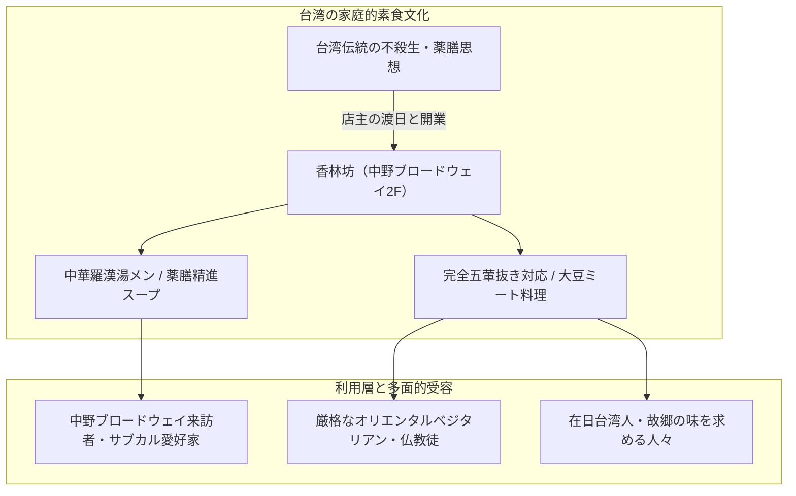

# 香林坊（中野・台湾素食） 専門構造分析ノート

> [!warning] 執筆前の確認事項
> - **香林坊（こうりんぼう / Korinbo）**は、東京都中野区の中野ブロードウェイ2階に所在する、台湾出身の女性店主が営む**老舗台湾素食（家庭精進料理）・オリエンタルベジタリアン専門店**である。
> - サブカルチャーの殿堂として世界的に知られる商業施設「中野ブロードウェイ」の迷宮的フロアの一角に位置し、肉・魚を一切使わず、**「五葷（ネギ・ニンニク・ニラ・ラッキョウ・アサツキ）」を抜いた心身に優しい台湾精進家庭料理**を提供し続けている。
> - 看板料理の「中華羅漢湯メン（羅漢麺）」をはじめ、大豆ミートや湯葉、漢方生薬を用いた滋味深いメニューが、ベジタリアン・仏教徒・健康志向客から長年愛されている。

> [!summary] 要旨
> **香林坊**は、都市部のサブカルチャー拠点（中野ブロードウェイ）の中にひっそりと根づいた、日本における草の根的な台湾素食（オリエンタルベジ）の実践拠点である。仏教の十六羅漢に由来する名物「羅漢湯メン」や大豆タンパク肉の素酢豚など、台湾の伝統的な不殺生・薬膳思想に基づく料理を、アットホームな家庭的空間で提供。近隣の中野・高円寺エリアの文化人や在日台湾人、厳格な菜食主義者の隠れ家的オアシスとして機能している。

---

## 1. 諸見解・機能の対比（一般客 vs 素食信仰実践）

### 比較考察マトリクス表

| 比較軸 | 一般観光客・サブカル愛好家（etic） | 宗教的素食・オリエンタルベジ実践者（emic） |
| :--- | :--- | :--- |
| **空間認識** | 中野ブロードウェイのディープでノスタルジックなレトロ中華 | 肉や五葷の汚染（クロスコンタミネーション）がない**清浄な安心空間** |
| **料理の味わい** | 胃に優しく、あっさりとして滋味深い薬膳健康ラーメン | 仏教・道教の戒律を守り、**命の殺生を避けた「羅漢・精進食」** |
| **五葷抜きの評価** | 食後にニンニク臭が残らないヘルシーなランチ | **五臓の気を乱さず、精神の平静を保つための必須要件** |
| **店主の存在** | 親しみやすく温かい台湾の名物お母さん | 台湾の伝統的な「慈悲心（もてなしの心）」を体現する実践者 |

---

## 2. 概要と基本情報

| 項目 | 内容 |
| :--- | :--- |
| **店舗名** | 香林坊（コウリンボウ） |
| **業態** | 台湾精進家庭料理（素食）・オリエンタルベジタリアンカフェ |
| **所在地** | 東京都中野区中野5-52-15 中野ブロードウェイ 2F |
| **席数** | テーブル席・カウンター席（約15〜20席のアットホームな空間） |
| **代表メニュー** | **中華羅漢湯メン（羅漢麺）**、素酢豚定食、素鶏の唐揚げ定食、精進水餃子、精進ちまき |
| **食事規定** | 肉・魚・動物性エキス完全ゼロ、**五葷（ネギ・ニンニク等）不使用対応** |
| **アクセス** | JR中央線・総武線「中野駅」北口より徒歩5分 |

---

## 3. 看板料理と台湾素食技術の深層解剖

### 3-1. 中華羅漢湯メン（羅漢麺）の構造
- **由来**: 「羅漢（阿羅漢）」は仏教における最高の修行完成者を指し、台湾・香港の素食文化では「あらゆる精進野菜・キノコを贅沢に炊き合わせた最高峰の精進料理」を「羅漢斎（らかんさい）」と呼ぶ。
- **出汁の構成**: 鶏ガラや豚骨を一切使わず、干し椎茸、昆布、キャベツ、人参、大根、当帰などの薬膳野菜をじっくり煮出した澄んだ琥珀色のスープ。
- **具材**: チンゲン菜、キクラゲ、タケノコ、クコの実、大豆ミート、湯葉などが彩り豊かに盛られ、身体を芯から温める。

### 3-2. 大豆ミート・湯葉を用いた家庭料理
- **素酢豚（ベジ酢豚）**: 繊維状大豆タンパクを素揚げし、黒酢と野菜で甘酸っぱく炒め合わせた定番料理。肉と変わらない食感と満足感を実現。
- **素水餃子**: 豚肉の代わりにキャベツ、椎茸、生姜、春雨、大豆ミートを包んだ完全植物性餃子。ニンニク・ニラを使わないため極めて上品な後味となる。

---

## 4. 宗教学的・食文化史的意義

- **都市型サブカルチャー空間と宗教食の融合**:
  オタクカルチャー・アンティークの聖地である中野ブロードウェイにおいて、異彩を放ちつつ数十年存続していることは、宗教食（台湾素食）が特定の信徒コミュニティを超えて都市生活者の「癒やし・デトックスの食」として定着した好例である。
- **草の根オリエンタルベジの灯**:
  [[中一素食店（台湾素食レストラン）]]や[[健福（台湾素食レストラン）]]のような大型店とは異なり、個人の小規模店として長年オリエンタルベジの基準を忠実に守り続けた文化遺産的価値を持つ。

---

## 5. 関連教団・関連人物・関連概念

- **[[一貫道と台湾素食レストラン]]**: 台湾素食文化の総合分析
- **[[中一素食店（台湾素食レストラン）]]**: 日本における台湾素食の草分け老舗
- **[[健福（台湾素食レストラン）]]**: 横浜中華街の素食専門店
- **[[菜食健美（大晶企画・道徳会館）]]**: 道徳会館系のオリエンタルベジレストラン
- **羅漢斎（羅漢料理）**: 仏教伝統の精進野菜炊き合わせ
- **五葷（ごくん）**: 刺激性野菜の禁忌

---

## 6. 史料・参考文献

- 食べログ店舗情報アーカイブ (`https://tabelog.com/tokyo/A1319/A131902/13012857/`)
- 日本ベジタリアン協会『ベジタリアン・ジャーナル』
- Vegewel レストランガイド「香林坊」紹介記事

---

## 7. 関連ノート (Vault内)

- [[一貫道と台湾素食レストラン]]
- [[中一素食店（台湾素食レストラン）]]
- [[健福（台湾素食レストラン）]]
- [[菜食健美（大晶企画・道徳会館）]]
- [[佛光山「滴水坊」法水寺店]]
- [[静思書軒（Jing Si Books & Cafe）]]
- [[各教団の食の教義・タブー比較]]

---

## 8. 検証・品質ゲートと留保事項

> [!warning] 留保事項
> - **営業状況の確認**: 個人経営の老舗店舗であるため、営業時間・休業日は時期により変動する可能性がある。
> - **五葷対応**: 基本メニューは素食であるが、注文時に「五葷抜き希望」を伝えることでより厳格なオリエンタルベジ調理に対応している。
> - **evidence_type**: `primary_and_secondary_sources`
> - **confidence**: `5`

---

*※本稿は[[_分派・異端研究ポータル]]の飲食・食品関連および台湾素食文化実践に関する専門構造分析ノートである。*
