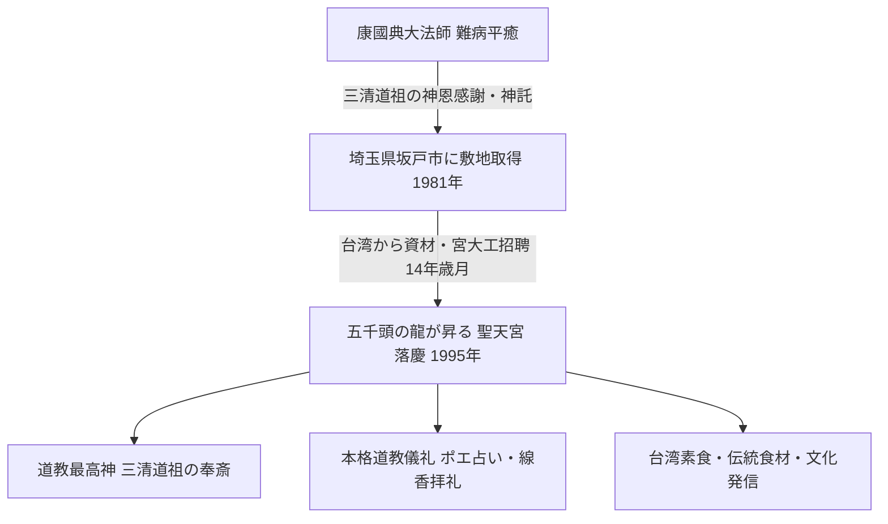

# 五千頭の龍が昇る聖天宮 専門構造分析ノート

> [!warning] 執筆前の確認事項
> - **五千頭の龍が昇る 聖天宮（せいてんきゅう / Seitenkyu）**は、埼玉県坂戸市に所在する日本国内最大規模の本格的な台湾伝統道教宮殿（道観・廟）である。
> - 台湾出身の道教法師・**康國典（こうこくてん）**が、40代半ばに不治の大病を患った際、道教の最高神「三清道祖」への祈願により一命をとりとめた神恩に感謝し、神託（「日本の埼玉県坂戸の地に宮を建てよ」）に従って私財を投じて建立した。
> - 建築資材、極彩色の装飾彫刻、瑠璃瓦、宮大工はすべて台湾から招聘・調達され、1981年の着工から14年をかけて1995年に落慶した。
> - 境内売店では、台湾直輸入の伝統茶、お守り、台湾素食（精進インスタント麺・食材・ドライフルーツ等）が販売されている。

> [!summary] 要旨
> **五千頭の龍が昇る聖天宮**は、道教の最高三神「三清道祖（元始天尊・道徳天尊・霊宝天尊）」を主神として祀る日本唯一の本格的宮殿式道教寺院である。台湾伝統の黄黄色瑠璃瓦、透かし彫りの九龍網（一枚岩から彫り出された龍のレリーフ）、五千頭以上の精巧な龍の彫刻、陰陽太極の八卦天井など、道教の宇宙観が建築意匠の全体に凝縮されている。在日台湾人・華僑の篤い信仰拠点であると同時に、本格的な道教参拝作法（九本の線香・ポエ占い・寿金焼納）を体験できる文化人類学的・宗教学的名所として広く一般公開されている。

---

## 1. 諸見解・機能の対比（一般観光客 vs 道教教理）

### 比較考察マトリクス表

| 比較軸 | 一般観光客・サブカルチャー視点（etic） | 道教信徒・宗教学的視点（emic） |
| :--- | :--- | :--- |
| **空間認識** | 埼玉の田園地帯に出現した異国情緒あふれる豪華絢爛な宮殿、コスプレ・ロケ地 | 道教の天界・至高神「三清境」を地上に具現化した聖域（道観） |
| **主神の捉え方** | 中国の仙人・神様 | 宇宙の始源・万物の根源道（タオ）を体現する至高神**「三清道祖」** |
| **参拝・祈願方法** | おみくじ感覚の占い（ポエ投げ） | **擲筊（ポエ）**による神仏との真剣な直接対話（神託確認） |
| **龍の彫刻（5000頭）** | 圧巻のインスタ映え装飾・美術工芸 | 陽気（至高の気）の充満、魔除け、天地の結節を象徴する聖獣 |
| **食と売店** | 珍しい台湾スナックやタピオカドリンク | 五葷抜き素食文化、仙果（ドライフルーツ）、不老長寿の養生茶 |

---

## 2. 概要と基本情報

| 項目 | 内容 |
| :--- | :--- |
| **宮名** | 五千頭の龍が昇る 聖天宮（せいてんきゅう） |
| **法人格** | 宗教法人 聖天宮（単立） |
| **創始建立者** | [[康國典]]（台湾出身の大法師、1919–2014） |
| **主神（祭神）** | **三清道祖**（元始天尊・霊宝天尊・道徳天尊） |
| **配祀神** | 南斗星君（延命の神）、北斗星君（厄除の神）、四聖大元帥（守護四武将） |
| **敷地面積** | 約7,000坪（境内・前庭含む） |
| **建築様式** | 台湾伝統閩南式・中国北方宮殿式の折衷宮殿建築（瑠璃瓦、組物、透かし彫り） |
| **開廟日** | 1995年（平成7年） |
| **所在地** | 埼玉県坂戸市塚越51-1 |
| **拝観時間** | 10:00〜16:00（年中無休） |
| **公式URL** | `https://www.seitenkyu.com/` |

---

## 3. 建立の経緯と創始者・康國典

### (1) 康國典の難病平癒と神託
台湾の貿易商・道教法師であった康國典は、40代半ばに重い病（不治の病と宣告された）を患った。医師から見放される中、道教の最高神「三清道祖」に一命を捧げる誓いを立てて祈願したところ、奇跡的に全快。その後、「神恩に報いるため、これまで縁のなかった日本の地に宮を建て、万人を救済せよ」という三清道祖の神託を受けた。

### (2) 埼玉県坂戸の地の選定と14年におよぶ大工事
康國典は日本各地の風水・霊地を探し歩き、清流（高麗川・越辺川水系）に恵まれ、富士山と秩父連山を望む埼玉県坂戸市塚越の地を龍脈が通る吉祥の地として選定。1981年（昭和56年）に着工した。
建材の木材・石材・黄瑠璃瓦はすべて台湾から大型船で輸送され、台湾屈指の宮大工・石工彫刻師が10年以上にわたり日本に滞在して手作業で組み上げた。1995年に本殿が落慶し、宗教法人として認証された。

---

## 4. 境内建築と道教美術の深層解剖

### 4-1. 天門・前殿・本殿の三進構造
中国正統の宮殿・道観様式である「三進式（前庭 ➔ 天門 ➔ 前殿 ➔ 本殿）」を踏襲。
- **天門（てんもん）**: 屋根に躍動する龍と鳳凰の極彩色陶器彫刻（剪花・剪粘工芸）が配置される。
- **前殿**: 巨大な一本の楠から彫り出された「九龍網（きゅうりゅうもう）」の石扉や、八卦太極を象った格天井が広がる。
- **本殿（三清殿）**: 中央に元始天尊（過去・宇宙の始まり）、左に道徳天尊（太上老君・現在・老子）、右に霊宝天尊（未来）の金身像が鎮座する。

### 4-2. 陰陽五行と八卦天井
本殿および前殿の天井には、釘を一本も使わずに木木を組み上げたドーム状の「太極八卦藻井（そうせい）」が施されている。八卦の配置により邪気を祓い、天からの清らかな霊気を地上に降ろす構造となっている。

### 4-3. 台湾道教の伝統参拝作法
聖天宮では、本場台湾と全く同一の正式作法が案内されている。
1. **九本の線香拝礼**: 寿金（神仏への捧げ物）とともに、玉皇上帝（天公炉）へ3本、三清道祖へ3本、前殿へ3本を順に捧げる。
2. **擲筊（ポエ占い）**: 三日月型の木片（筊杯）を2枚床に落とし、表と裏（陰と陽）が出るまで神仏に問いかける。
3. **金炉での寿金焼納**: 参拝後、神仏への感謝の紙幣（金紙）を特製の八角炉で燃やす。

---

## 5. 飲食・食文化との関わり

- **境内売店と台湾食材**:
  境内の売店では、道教の不老長寿思想・養生観に基づく台湾伝統茶（凍頂烏龍茶、東方美人茶等）や、台湾直輸入のドライフルーツ（愛玉子、仙草、龍眼等）が提供されている。
- **素食（オリエンタルベジ）への接続**:
  台湾の道教祭祀において「三牲（肉魚）」を捧げる伝統もある一方、身を清める「清醮（精進潔斎）」の期間には完全素食が義務づけられる。聖天宮の売店でも台湾製の精進インスタントラーメンや乾物が販売され、近隣の[[一貫道と台湾素食レストラン]]や埼玉・東京の台湾コミュニティと密接にリンクしている。

---

## 6. 関連教団・関連人物・関連概念

- **[[康國典]]**: 聖天宮開廟者・大法師
- **三清道祖**: 道教の至高三神（元始天尊・霊宝天尊・道徳天尊）
- **[[天道（一貫道）]]**: 台湾の救済新宗教（道教神を習合）
- **[[東京媽祖廟]]**: 東京都新宿区のビル型道教寺院
- **[[横浜関帝廟・横濱媽祖廟]]**: 神奈川県横浜中華街の道教廟
- **[[神戸関帝廟]]**: 兵庫県神戸市の道教廟
- **[[一貫道と台湾素食レストラン]]**: 台湾の精進食文化

---

## 7. 史料・参考文献

- 宗教法人聖天宮 公式パンフレット・公式サイト (`https://www.seitenkyu.com/`)
- 埼玉県総務部学事課『埼玉県宗教法人名簿』
- 野口鐵郎 ほか編『道教事典』（平河出版社）
- 窪徳忠『道教の神々』（講談社学術文庫）

---

## 8. 関連ノート (Vault内)

- [[天道（一貫道）]]
- [[道徳会館]]
- [[東京媽祖廟]]
- [[横浜関帝廟・横濱媽祖廟]]
- [[神戸関帝廟]]
- [[一貫道と台湾素食レストラン]]
- [[系統別分類カタログ]]

---

## 9. 検証・品質ゲートと留保事項

> [!warning] 留保事項
> - **道教の宗派的系統**: 聖天宮は特定の一貫道や新宗教ではなく、台湾の伝統的正統道教（正一派道教・三清信仰）に基づく寺院である。
> - **観光・ロケ地利用**: 特撮ヒーロー番組や映画・アニメのロケ地としても著名であるが、宗教法人としての礼拝・祭祀が日々厳格に執行されている生きた信仰空間である点に留意する。
> - **evidence_type**: `primary_source_based`
> - **confidence**: `5`

---

*※本稿は[[_分派・異端研究ポータル]]の道教・中華系宗教に関する専門構造分析ノートである。*
