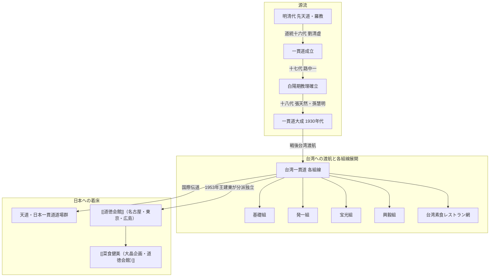

# 天道（一貫道） 専門構造分析ノート

> [!warning] 執筆前の確認事項
> - **一貫道（いっかんどう / Yiguandao）**（日本および一部海外では**「天道（てんどう）」**とも呼称）は、大宇宙の根源神である「無生老母（むしょうろうぼ）」を信奉し、儒教・仏教・道教・キリスト教・イスラム教の「五教合一（万教帰一）」を説く中華・台湾発祥の救済新宗教である。
> - 入門儀礼である**「求道（きゅうどう）」**において、点伝師より「玄関竅（急所）・口訣（五字真言）・合同（手印）」の**「三宝」**を秘密裏に伝授されることで、魂が輪廻の苦しみから脱し「理天（根源世界）」へ帰還できると説く。
> - 信徒の幹部要件として厳格な終身菜食の誓約**「清口（チンコウ）」**を課しており、台湾における世界屈指の「素食（五葷抜き精進料理）文化・産業」の最大の推進母体となった。
> - 日本においては、1950年代以降華僑や渡日伝道師により伝来し、各地の公共佛堂・家庭佛堂のほか、王建東による分派教団**「[[道徳会館]]」**を生み出した。

> [!summary] 要旨
> **天道（一貫道）**は、明清代の白蓮教・羅教・先天道の系譜を引く中国・台湾発祥の巨大救済新宗教である。1930年に第18代祖・張天然が教団を大成させた。戦後の中華人民共和国（共産党政権）による弾圧を経て台湾へ渡り、戒厳令下の非合法地下活動期を「素食食堂」などを拠点に乗り越えて爆発的信徒数を獲得、1987年に台湾で合法化された。宇宙の三期末劫（青陽期・紅陽期・白陽期）の歴史観に基づき、現代は白陽期の救済仏である「弥勒古仏」が掌天盤を司るとする。その厳格な「不殺生・清口（五葷抜き完全菜食）」の教義は、台湾および世界のオリエンタルベジタリアン食文化・代替肉産業の基盤を築いた。

---

## 1. 母体・関連教団との対比（一貫道本流 vs 伝統道教 vs 道徳会館）

### 比較考察マトリクス表

| 比較軸 | 伝統道教（正一派・全真派） | 天道（一貫道本流） | 日本の分派（道徳会館） |
| :--- | :--- | :--- | :--- |
| **最高主神** | **三清道祖**（元始・霊宝・道徳天尊） | **無生老母（明明上帝）**、弥勒仏、関聖帝君 | **弥勒仏**（日本社会向けに弥勒信仰を前面化） |
| **教理体系** | 道教の不老不死・符籙・科儀・内丹術 | **五教合一（儒・道・仏・基・回）**・三期末劫救済 | 一貫道教理を継承・日本現地化（三教合一・修養） |
| **核心儀礼** | 醮祭、護符、道観での祭祀 | **求道式における「三宝（玄関・口訣・合同）」伝授** | **三宝伝授**（秘教的口伝を継承） |
| **食の戒律** | 全真派は菜食、正一派は通常食（祭祀時禁忌） | **「清口」の誓約（肉魚卵五葷酒の終身完全排除）** | **完全素食（五葷抜き精進）の実践** |
| **拠点形態** | 宮殿式道廟（[[五千頭の龍が昇る聖天宮]]、関帝廟等） | ビル内・住居内の**「佛堂（佛堂・天壇）」** | 会館・道場（[[道徳会館]]各拠点） |
| **飲食事業** | 廟前売店での精進食材販売等 | **台湾素食レストラン・自助餐**（[[中一素食店（台湾素食レストラン）\|中一素食店]], [[健福（台湾素食レストラン）\|健福]]等） | **[[菜食健美（大晶企画・道徳会館）]]**（大晶企画） |

---

## 2. 概要と基本情報

| 項目 | 内容 |
| :--- | :--- |
| **教団名** | 天道（一貫道 / Yiguandao / 台湾天道） |
| **主神・信仰対象** | **明明上帝（無生老母）**、諸天神聖、万仙菩薩、弥勒古仏、観音菩薩、関聖帝君、呂洞賓等 |
| **道統祖師** | 東方前十八代（伏羲〜孟子） ➔ 西方二十八代（釈迦〜達磨） ➔ 東方後十八代（達磨〜張天然・孫慧明） |
| **聖典・重要経書** | 『皇母訓子十誡』, 『一貫道疑問解答』, 『弥勒救苦真経』, 『大学』, 『中庸』, 『論語』, 『道徳経』, 『金剛経』 |
| **組織形態** | 国際一貫道総会（中華民国一貫道総会）、世界各国の組線（基礎、発一、宝光、興毅、安東、文化等） |
| **国内拠点** | 東京都八王子市（天道道場）、各地の公共佛堂・家庭佛堂（東京、神奈川、大阪、埼玉、愛知等） |
| **食の実践** | **「清口（チンコウ）」**による五葷抜き完全菜食（素食・オリエンタルベジタリアン） |

---

## 3. 史的経緯と世界的展開

### (1) 起源と道統思想
一貫道は、明代の羅祖（羅清）による「羅教（無為教）」および「先天道」の流れを汲み、儒・仏・道の三教合一に西洋宗教を取り入れた。1886年に第16代祖・劉清虚が「一貫道」と命名。1930年、第18代祖・張天然（弓長祖）と孫慧明（子系祖）が道務を統括し、中国全土に爆発的な信徒網を築いた。

### (2) 中国共産党の弾圧と台湾への渡航
1949年の中華人民共和国成立後、一貫道は「反動的会道門」として徹底的な摘発と弾圧を受け、指導部は台湾・香港へと逃れた。台湾においても国民党政権下で「邪教」として長年非合法化（戒厳令下の取り締まり）されたが、信徒たちは「素食食堂」や家庭佛堂を隠れ蓑として地下で結束を強め、台湾社会の隅々にまで浸透した。1987年に合法化され、現在では台湾第3の巨大宗教勢力として公認されている。

### (3) 日本への伝道と定着
1950年代初頭から在日華僑や台湾人留学生を通じて日本へ伝来。
- **本流天道系**: 基礎組や発一組など台湾各組線が日本国内に公共佛堂・家庭佛堂を開設。八王子市などに大型道場を構える。
- **分派独立（道徳会館）**: 1953年、在日華僑の王建東が名古屋で分派独立し、「宗教法人 道徳会館」を設立。

---

## 4. 教理・儀礼の特色

### 4-1. 三期末劫観（さんきまつごうかん）
宇宙の歴史を3つの救済期に分類する。
1. **青陽期（しょうようき）**: 燃灯仏が司る時代（救済対象：君主・聖人）。
2. **紅陽期（こうようき）**: 釈迦牟尼仏が司る時代（救済対象：僧侶・修行者）。
3. **白陽期（はくようき）**: **弥勒仏**が司る現代（末法・末劫の時代。天道が広く大衆に開かれ、平民・在家信徒が一括して救済される「普渡」の時代）。

### 4-2. 三宝伝授（さんぽうでんじゅ）の秘儀
「求道式（得道式）」において、選ばれた点伝師（てんでんし）から秘密裏に授けられる3つの霊的宝物。
1. **玄関竅（げんかんきょう）**: 両目の間、眉間の奥にあるとされる魂の出入り口（急所）。点伝師が指で点じる（点玄）ことで霊眼が開かれ、死後に魂が地獄や輪廻に堕ちず天界（理天）へ直行するとされる。
2. **口訣（こうけつ / 無字真経）**: 五文字のマントラ（「無太佛弥勒」）。緊急時・劫難時に心の中で唱えることで神仏の加護を得る。
3. **合同（ごうどう / 手印）**: 両手の親指と他指を特定の形（子・亥の結び）で合わせる所作。宇宙の根源神（無生老母）との契約の証。

### 4-3. 「清口（チンコウ）」とオリエンタルベジタリアン
一貫道において、中堅以上の信徒や壇主（佛堂の責任者）になるための絶対的条件が「清口」である。
- **五葷（ネギ・ニンニク・ニラ・ラッキョウ・アサツキ）の禁忌**: 血液を濁らせ、情欲と怒りを刺激する野菜として完全排除。
- **殺生カルマの断絶**: 肉食による動物の霊的怨念を取り込まない。
- **言霊の浄化**: 悪口、陰口、嘘を排し、常に徳ある言葉を発する。

---

## 5. 飲食・産業文化との結合（台湾素食産業の推進母体）

一貫道信徒の「清口」実践は、台湾を世界一の「素食先進国」へ押し上げる直接の原動力となった。
- **素食自助餐（量り売りビュッフェ）の普及**: 街中に数千軒ある台湾素食店の多くが一貫道信徒によって運営されている。
- **精巧な大豆・湯葉加工技術**: 初心者が肉の味への執着を断てるよう「素鶏」「素鴨」「素魚」などの代替肉（フェイクミート）技術が極限まで洗練された。
- **日本国内への波及**: [[中一素食店（台湾素食レストラン）]]、[[健福（台湾素食レストラン）]]、[[菜食健美（大晶企画・道徳会館）]]など、日本国内のオリエンタルベジレストランの多くが一貫道・道徳会館の食文化ネットワークに直接・間接のルーツを持つ。

---

## 6. 関連教団・関連人物・関連概念

- **明明上帝（無生老母）**: 宇宙万物を生み出した根源の母神
- **弥勒仏**: 白陽期の救済を司る主仏
- **張天然**: 一貫道第18代祖（弓長祖）
- **孫慧明**: 張天然の妻、子系祖（師母）
- **[[道徳会館]]**: 一貫道師母組より分派・独立した日本の宗教法人
- **[[一貫道と台湾素食レストラン]]**: 食文化実践とレストラン網の総合分析
- **[[中一素食店（台湾素食レストラン）]]**: 日本における台湾素食の草分け老舗
- **[[健福（台湾素食レストラン）]]**: 台湾素食専門店
- **[[五千頭の龍が昇る聖天宮]]**: 台湾伝統道教の日本最大寺院（比較対象）

---

## 7. 史料・参考文献

- 松本浩一『中国人の宗教・一貫道』（東方書店）
- 林本炫『台湾の一貫道と社会変遷』（台湾・新自然主義出版）
- 井上順孝 編『新宗教教団・人物事典』（弘文堂）
- 中華民国一貫道総会 公式編纂資料 (https://www.yiguandao.org.tw/)
- 文化庁『宗教年鑑』

---

## 8. 関連ノート (Vault内)

- [[道徳会館]]
- [[一貫道と台湾素食レストラン]]
- [[菜食健美（大晶企画・道徳会館）]]
- [[中一素食店（台湾素食レストラン）]]
- [[健福（台湾素食レストラン）]]
- [[五千頭の龍が昇る聖天宮]]
- [[東京媽祖廟]]
- [[横浜関帝廟・横濱媽祖廟]]
- [[神戸関帝廟]]
- [[系統別分類カタログ]]

---

## 9. 検証・品質ゲートと留保事項

> [!warning] 留保事項
> - **秘教性と宗教学的実態**: 三宝の口訣・手印・点玄関は信徒間では外部秘とされるが、宗教学文献および台湾の公刊資料において学術的に完全に解明・記録されている。
> - **道教との異同**: 道教の神仏（関帝、呂洞賓等）を祀るため道教の一派と見なされやすいが、教義の本質は「無生老母」を至高神とし「弥勒救済」を説く五教合一の救済新宗教である。
> - **evidence_type**: `academic_research`
> - **confidence**: `5`

---

*※本稿は[[_分派・異端研究ポータル]]の道教・中華系新宗教に関する専門構造分析ノートである。*
