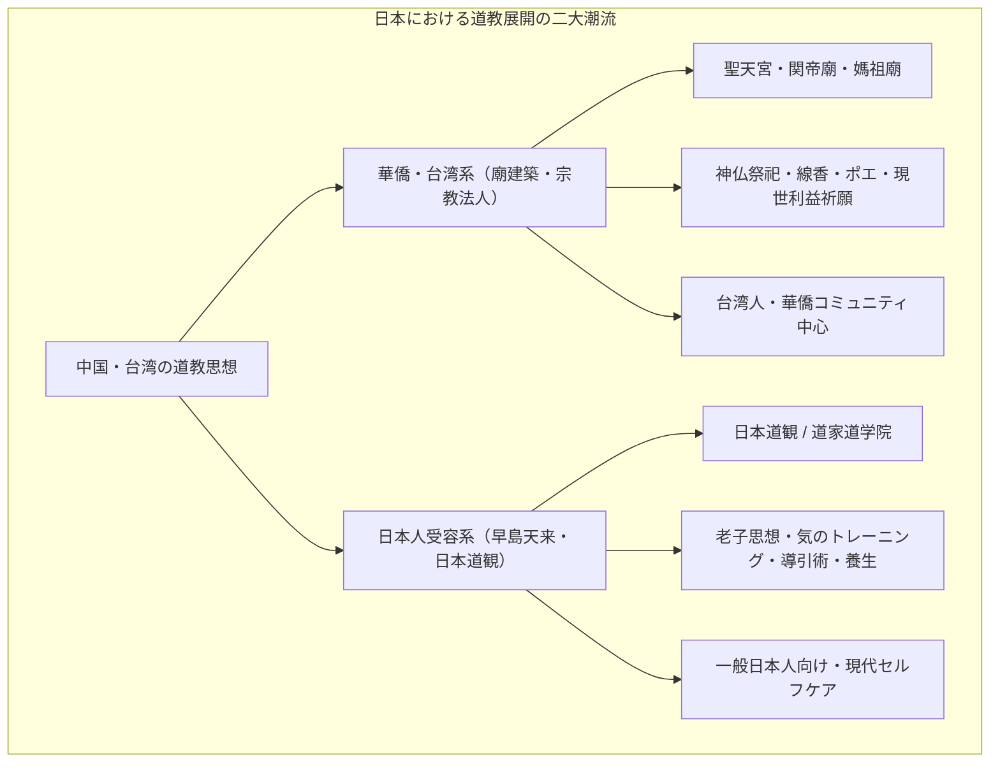

# 日本道観（道家道学院） 専門構造分析ノート

> [!warning] 執筆前の確認事項
> - **日本道観（にほんどうかん）**および**道家道学院（どうかどうがくいん）**は、初代道長・**早島天来（はやしま てんらい / 早島正雄、1928–1999）**が創始した、日本における道教（タオイズム）・導引術の最大組織である。
> - 華僑・台湾人による民族信仰としての道廟とは異なり、**日本人向けに老荘思想・道教の内丹術・気のトレーニング（導引術）を現代的健康法・自己開発プログラムとして体系化**した。
> - 台湾道教総会や中国本土の道教協会（全真派・白雲観等）とも正式な交流を持ち、日本における正統タオイズムの普及団体（一般社団法人日本タオイズム協会）として活動している。

> [!summary] 要旨
> **日本道観・道家道学院**は、古代中国の老子・荘子の思想および道教秘伝の「気の養生法（導引術・動功・洗心術）」を現代社会に甦らせたタオイズム修養組織である。創始者・早島天来が中国・台湾で修行・伝授された道教医学と内丹術をベースに、1969年に日本道観を設立。病気にならない心身（無為自然）の体得を目的とする「気のトレーニング」を全国展開し、出版・通信教育・道場指導を通じて日本社会に「タオイズム（道家思想）」を広く定着させた。

---

## 1. 日本における道教受容の比較対比（華僑系道廟 vs 日本道観）

### 比較考察マトリクス表

| 比較軸 | 華僑・台湾系道廟（[[五千頭の龍が昇る聖天宮\|聖天宮]]、[[横浜関帝廟・横濱媽祖廟\|関帝廟]]等） | 日本道観・道家道学院（早島天来系） |
| :--- | :--- | :--- |
| **中心対象** | **三清道祖、関聖帝君、天上聖母**（神格化された神仏） | **老子、道（TAO）、気（天地のエネルギー）** |
| **実践形態** | 廟前での線香供養、神像礼拝、祭礼パレード、金紙焼納 | **導引術（気の体操）、動功（気功）、洗心術（瞑想法）** |
| **目的・救済** | 家内安全、商売繁盛、海難除け、死後救済 | **無病息災、自然治癒力向上、不老長寿、天地自然との合一** |
| **指導者** | 台湾・華僑の道教法師（道士・壇主） | **早島天来（初代道長） ➔ 早島妙聴（二代道長）** |
| **組織形態** | 宗教法人、一般社団法人（伝統寺院型） | 一般社団法人日本タオイズム協会、学院・道場型 |

---

## 2. 概要と基本情報

| 項目 | 内容 |
| :--- | :--- |
| **組織名称** | 日本道観（総本部） ／ 道家道学院（本校） ／ 一般社団法人 日本タオイズム協会 |
| **創始者** | [[早島天来]]（早島正雄 / 道号：司馬天法、1928–1999） |
| **現代表者** | 早島 妙聴（二代道長・日本タオイズム協会理事長） |
| **創設年** | 1969年（日本道観） ／ 1980年（道家道学院） |
| **総本部所在地** | 福島県いわき市平沼ノ内諏訪原1-1-1（日本道観総本部） |
| **主要拠点** | 東京本校（千代田区三番町）、大阪、名古屋、福岡、札幌、仙台、広島等 |
| **三大プログラム** | **導引術（どういんじゅつ）**、**動功（どうこう）**、**洗心術（せんしんじゅつ）** |
| **公式URL** | `https://www.taoism.or.jp/` ／ `https://www.dokan.co.jp/` |

---

## 3. 創始者・早島天来とタオイズムの体系化

### (1) 早島天来の経歴と道教伝授
早島天来（1928〜1999）は、若年期より東洋医学・武道・易学を修め、戦後台湾に渡って台湾道教界の最高指導者らと親交を結び、道教の正統な法嗣（道士）として認められた。

### (2) 「導引術」の現代的復興とブーム
古代中国の馬王堆漢墓から出土した「導引図」に示されるような、呼吸と身体動作によって体内の気血を巡らせる「導引術」を、現代人が日常生活で実践できる形にリライト。1970〜80年代に多数の著書（ベストセラー『導引術入門』等）を出版し、日本全国に大ブームを巻き起こした。

### (3) 国際タオイズム交流の推進
中国本土の中国道教協会（北京白雲観、武当山、龍虎山等）や台湾道教界と学術・文化交流を行い、2013年には「一般社団法人日本タオイズム協会」を設立して国際シンポジウムを共催するなど、学術・文化レベルでの正統タオイズムの普及に尽力した。

---

## 4. 三大修行・実践体系の深層解剖

### 4-1. 導引術（どういんじゅつ）
- 体内のツボ（経絡）を刺激しながら、呼吸法と独自のポーズを組み合わせることで、滞った「邪気」を体外に排出し、「天地の精気」を体内に取り込む気の健康法。

### 4-2. 動功（どうこう）
- 立ち姿勢で行う気功法。体の中心軸（丹田）を整え、重力と調和しながら無理のない滑らかな動きを行うことで、気の循環を活性化させる。

### 4-3. 洗心術（せんしんじゅつ）
- 老子の「無為自然（あるがまま）」「上善如水（水のように柔軟に生きる）」の思想に基づき、執着やストレスから心を解放し、天地自然と一体になる瞑想・生活哲学。

---

## 5. 食文化・養生思想（タオイズムの食養生）

- **道教食養法（仙食・薬膳）**:
  日本道観では、老子思想に基づく「腹八分」「身土不二」「陰陽調和」の食生活を推奨。過度な肉食や化学調味料を避け、季節の野菜、穀物、薬膳茶を摂取することで内臓（五臓六腑）の気を養う。
- **オリエンタルベジとの接点**:
  道教の不老長寿・気功修行においては、気を濁らせる刺激物（五葷）や重い肉食を避ける「避穀（ひこく）・精進」が伝統的に重視されており、台湾素食文化の哲学的源流となっている。

---

## 6. 関連教団・関連人物・関連概念

- **[[早島天来]]**: 創始者・初代道長
- **老子**: タオイズム（道教）の始祖
- **無為自然**: 宇宙の法則に従う根本理念
- **[[五千頭の龍が昇る聖天宮]]**: 伝統宮殿式道廟（比較対象）
- **[[天道（一貫道）]]**: 三教合一新宗教（比較対象）

---

## 7. 史料・参考文献

- 早島天来『導引術入門』『定本・老子道徳経の読み方』（日本道観出版局）
- 一般社団法人日本タオイズム協会 公式刊行物 (`https://www.taoism.or.jp/`)
- 福井文雅『道教の総合的研究』（国書刊行会）

---

## 8. 関連ノート (Vault内)

- [[五千頭の龍が昇る聖天宮]]
- [[東京媽祖廟]]
- [[横浜関帝廟・横濱媽祖廟]]
- [[神戸関帝廟]]
- [[天道（一貫道）]]
- [[系統別分類カタログ]]

---

## 9. 検証・品質ゲートと留保事項

> [!warning] 留保事項
> - **位置づけ**: 宗教法人ではなく教育・修養・一般社団法人として活動しているが、宗教学・思想史においては「日本における現代タオイズム（道教）の代表的受容・展開組織」として分類される。
> - **evidence_type**: `primary_and_secondary_sources`
> - **confidence**: `5`

---

*※本稿は[[_分派・異端研究ポータル]]の道教・タオイズム修養組織に関する専門構造分析ノートである。*
