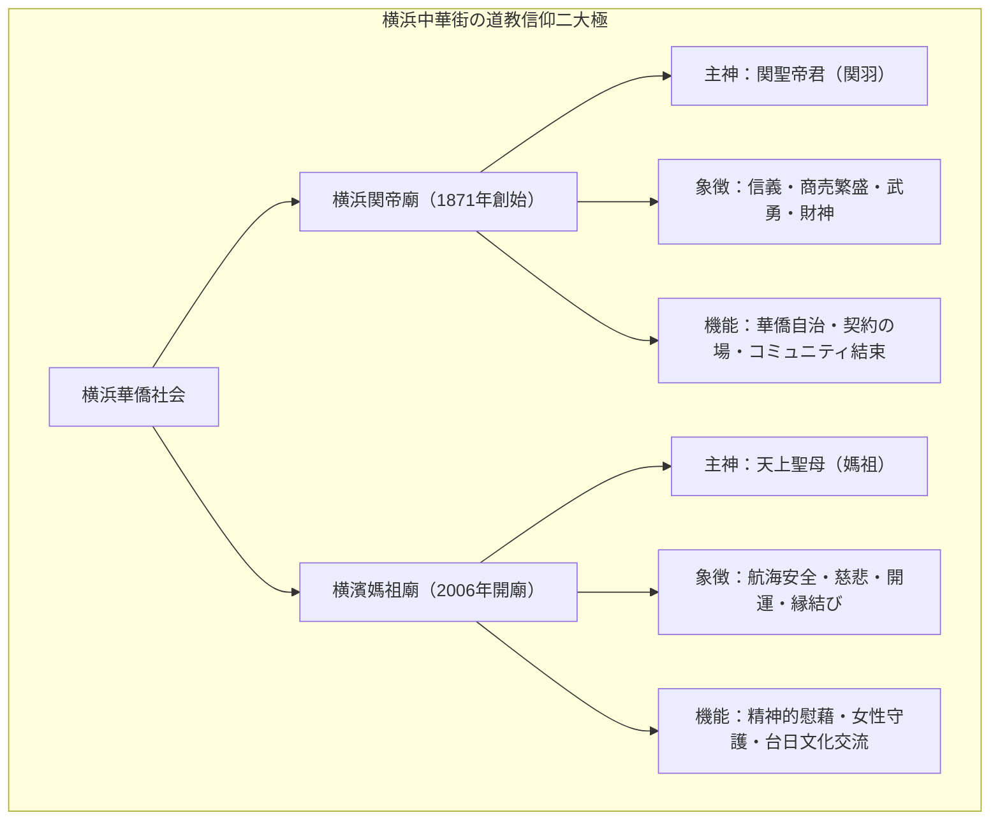

# 横浜関帝廟・横濱媽祖廟 専門構造分析ノート

> [!warning] 執筆前の確認事項
> - **横浜関帝廟（よこはまかんていびょう）**と**横濱媽祖廟（よこはままそびょう）**は、日本最大のチャイナタウンである横浜中華街（神奈川県横浜市中区山下町）に鎮座する二大道教寺院（廟）である。
> - **横浜関帝廟（1871年創始）**は、三国志の英雄・関羽（関聖帝君）を「商売繁盛・信義・武神」の神として祀り、明治初期以来の横浜華僑社会の団結と公共的自治の中心となってきた。
> - **横濱媽祖廟（2006年開廟）**は、航海安全・諸願成就の海の女神・媽祖（天上聖母）を祀り、開港150周年事業の一環として台湾・中国の技術を結集して建立された。
> - 周辺の中華街には、一貫道系の台湾素食店**「[[健福（台湾素食レストラン）\|健福]]」**など、道教・中華信仰と密接に連動した食文化拠点が点在している。

> [!summary] 要旨
> **横浜関帝廟・横濱媽祖廟**は、在日華僑・台湾人コミュニティの精神的支柱であり、日本における道教・中華民間信仰の最高峰の聖域である。関帝廟が「信義と商業の守護神」として中華街の経済秩序を象徴するのに対し、媽祖廟は「慈悲と海難救済の母神」として人々の現世利益・生命守護を司る。本場の宮殿式彫刻・瑠璃瓦・金箔装飾が施された荘厳な建築美を誇り、五本の線香、金紙焼納、擲筊（ポエ占い）などの本格的な道教祭祀が日々執り行われている。

---

## 1. 二大廟の機能・象徴対比

### 比較考察マトリクス表

| 比較軸 | 横浜関帝廟（1871年創始） | 横濱媽祖廟（2006年開廟） |
| :--- | :--- | :--- |
| **主神（祭神）** | **関聖帝君**（三国志武将・関羽雲長） | **天上聖母**（北宋の実在女性・林黙娘 / 媽祖） |
| **神格と利益** | 商業の神（財神）、信義の神、悪霊退散、学問（文衡帝君） | 海上安全、子宝（註生娘娘）、縁結び（月下老人）、学問（文昌帝君） |
| **歴史と設立** | 1871年に小祠建立。関東大震災・空襲・火災を経て2000年第4代本殿再建 | 2006年に横浜開港150周年を記念し、華僑・台湾の支援で新築開廟 |
| **法人形態** | 一般社団法人 横浜関帝廟（華僑総会・コミュニティ運営） | **宗教法人 横濱媽祖廟** |
| **主要祭礼** | **関帝誕（旧暦6月24日）**：獅子舞・龍舞・華僑パレード | **媽祖誕（旧暦3月23日）**：台湾伝統音楽・神輿巡行 |
| **周辺素食環境** | 横浜中華街内の台湾素食専門店（[[健福（台湾素食レストラン）\|健福]]等）と隣接 | 同上 |

---

## 2. 概要と基本情報

| 項目 | 内容 |
| :--- | :--- |
| **施設名称** | 横浜関帝廟（Kanteibyo） ／ 横濱媽祖廟（Masobyo） |
| **所在地** | 関帝廟：神奈川県横浜市中区山下町140 ／ 媽祖廟：山下町136 |
| **主神** | 関聖帝君（関帝廟） ／ 天上聖母・媽祖（媽祖廟） |
| **配祀神** | 関平、周倉、福徳正神、玉皇上帝、月下老人、註生娘娘、臨水夫人、文昌帝君 |
| **開門時間** | 9:00〜19:00（季節・祭礼により変動あり） |
| **参拝作法** | 5本の線香供養（各香炉に1本ずつ）、ポエ占い、金紙焼納 |
| **公式URL** | `http://www.yokohama-kanteibyo.com/` ／ `http://www.yokohama-masobyo.jp/` |

---

## 3. 史的経緯と華僑社会の発展

### (1) 横浜開港と関帝廟の誕生
1859年の横浜開港に伴い、欧米商館の買弁（通訳・仲介人）として多くの中国人（華僑）が横浜に定住。1862年に一人の華僑が関羽の木像を祀る小祠を建て、1871年（明治4年）に華僑有志の寄付により初代関帝廟が落成した。関帝廟は単なる祈りの場にとどまらず、商人同士が契約を交わし、紛争を調停する「信義の法廷」として機能した。

### (2) 幾度の被災と不屈の再建史
関帝廟は、1923年の関東大震災、1945年の横浜大空襲、1986年の不審火による全焼と、3度にわたり焼失。しかしその都度、世界中の華僑・信徒からの巨額の義援金により再建され、現在の壮麗な第4代本殿は2000年に落慶した。

### (3) 横濱媽祖廟の開廟（2006年）
海を渡って異国の地で生き抜いてきた華僑の心の支えとして、台湾・台南の祀典大天后宮や福建省・湄洲媽祖祖廟からの分霊を迎え、2006年3月17日に開廟。八角形の中国伝統楼閣建築は中華街の新たなシンボルとなった。

---

## 4. 信仰儀礼と道教文化の深層解剖

### 4-1. 五本の線香と五大神炉
参拝者は、売店で5本の線香と金紙を購入し、1番から5番までの香炉に順に1本ずつ線香を捧げる。
1. **玉皇上帝炉**: 天の最高神
2. **天上聖母炉（または関聖帝君炉）**: 本廟の主神
3. **註生娘娘炉**: 子宝・安産の女神
4. **文昌帝君炉**: 学問・試験合格の神
5. **月下老人炉**: 縁結びの神

### 4-2. 擲筊（ポエ）による神意確認
悩み事や願い事がある信徒は、三日月型の木片（ポエ）を神前に投げ、表（陽）と裏（陰）の組み合わせ（聖筊）が出るまで対話を行う。

### 4-3. 金紙（冥銭・神への供物）の焼納
金箔が貼られた紙（寿金・太極金）に自らの氏名・生年月日を記入して供え、参拝後に特製の金炉で燃やすことで、祈願が天界へ届くと信じられている。

---

## 5. 関連教団・関連人物・関連概念

- **関聖帝君**: 武神・財神・商業道徳の最高神
- **天上聖母（媽祖）**: 航海安全・諸願成就の海の母神
- **[[五千頭の龍が昇る聖天宮]]**: 埼玉県坂戸市の台湾宮殿式道廟
- **[[東京媽祖廟]]**: 東京都新宿区のビル型媽祖廟
- **[[神戸関帝廟]]**: 兵庫県神戸市の華僑道教廟
- **[[天道（一貫道）]]**: 関帝を白陽期の重要な神仏として崇敬
- **[[健福（台湾素食レストラン）]]**: 横浜中華街のオリエンタルベジ専門店

---

## 6. 史料・参考文献

- 横浜関帝廟 公式編纂『横浜関帝廟史』
- 横濱媽祖廟 公式ガイドブック
- 可児弘明『横浜中華街—被災と復興の華僑史』（中公新書）
- 田中一成『中国の宗族と演劇』（東京大学出版会）

---

## 7. 関連ノート (Vault内)

- [[東京媽祖廟]]
- [[五千頭の龍が昇る聖天宮]]
- [[神戸関帝廟]]
- [[天道（一貫道）]]
- [[道徳会館]]
- [[健福（台湾素食レストラン）]]
- [[一貫道と台湾素食レストラン]]
- [[系統別分類カタログ]]

---

## 8. 検証・品質ゲートと留保事項

> [!warning] 留保事項
> - **法人格の区分**: 横濱媽祖廟は宗教法人、横浜関帝廟は歴史的経緯から一般社団法人として運営されているが、双方ともに実態として道教・中華民間信仰の正統な宗教施設として機能している。
> - **evidence_type**: `primary_source_based`
> - **confidence**: `5`

---

*※本稿は[[_分派・異端研究ポータル]]の道教・華僑宗教施設に関する専門構造分析ノートである。*
