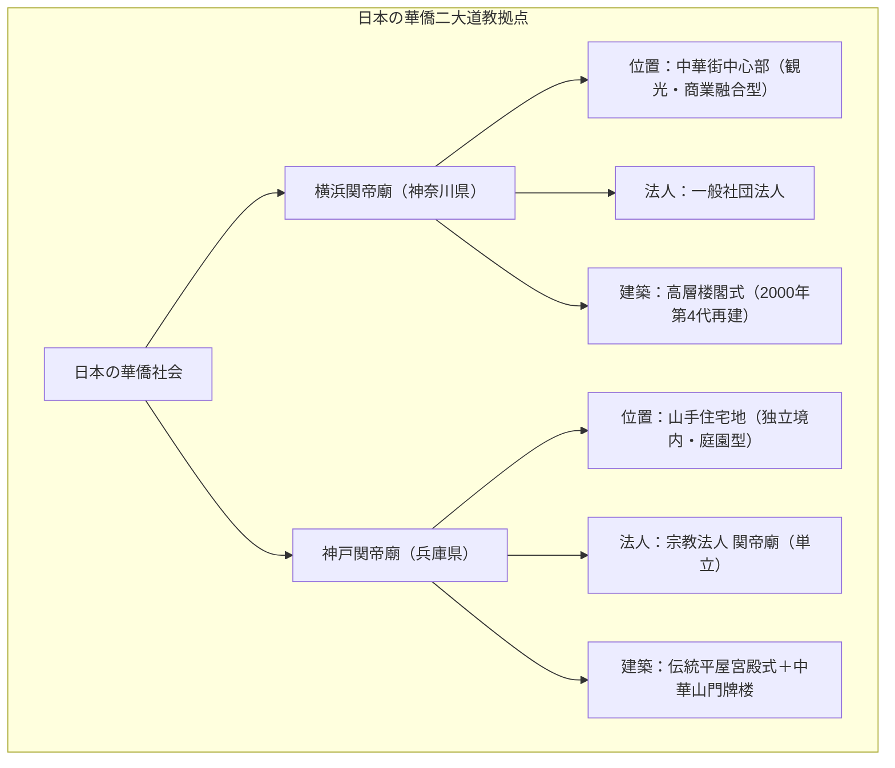

# 神戸関帝廟 専門構造分析ノート

> [!warning] 執筆前の確認事項
> - **神戸関帝廟（こうべかんていびょう / Kobe Kanteibyo）**は、兵庫県神戸市中央区中山手通に所在する、関西華僑社会の歴史的信仰拠点である。
> - 1892年（明治25年）に創始され、第二次世界大戦の神戸大空襲で焼失後、1947年に再建された。
> - 横浜関帝廟が中華街の中心に位置するのに対し、神戸関帝廟は南京町（神戸中華街）から北西に離れた閑静な山手エリアに鎮座し、独立した伝統的中華山門（牌楼）と境内庭園を備えている。
> - 主神の関聖帝君（関羽）とともに、仏教の「観世音菩薩」を合祀し、三教合一の融和的な信仰形態を今に伝えている。

> [!summary] 要旨
> **神戸関帝廟**は、130年以上の歴史を誇る単立宗教法人であり、関西における道教・華僑民間信仰の象徴的聖域である。三国志の義将・関羽（関聖帝君）を商売繁盛・信義・厄除けの守護神として奉斎。毎年旧暦6月24日の「関帝誕」や旧暦7月15日の「中元節（盂蘭盆会・普度）」には、伝統的な施餓鬼供養や獅子舞が盛大に執り行われ、在日華僑社会のアイデンティティと世代間継承を支える重要な文化財的価値を有している。

---

## 1. 東西二大関帝廟の構造対比（横浜 vs 神戸）

### 比較考察マトリクス表

| 比較軸 | 横浜関帝廟（横浜市中区） | 神戸関帝廟（神戸市中央区） |
| :--- | :--- | :--- |
| **創始時期** | 1871年（明治4年） | 1892年（明治25年） |
| **立地環境** | 横浜中華街の目抜き通り中央（過密商業地） | 中山手通の閑静な住宅街（専用境内・中華牌楼） |
| **主祭神** | 関聖帝君、地母娘娘、玉皇上帝 | 関聖帝君、観世音菩薩、福徳正神 |
| **法人格** | 一般社団法人 横浜関帝廟 | **宗教法人 関帝廟** |
| **主要祭事** | 関帝誕（旧暦6月24日パレード） | 関帝誕、**中元節普度（施餓鬼・華僑大供養）** |
| **空間体験** | 圧倒的な極彩色・観光客で賑わう動的空間 | 線香の煙が静かに漂う厳かな祈りと自治の静的空間 |

---

## 2. 概要と基本情報

| 項目 | 内容 |
| :--- | :--- |
| **廟名** | 宗教法人 関帝廟（神戸関帝廟） |
| **所在地** | 兵庫県神戸市中央区中山手通7-3-2 |
| **主神** | **関聖帝君（関羽雲長）** |
| **配祀神** | 関平太子、周倉将軍、観世音菩薩、福徳正神 |
| **開廟年** | 1892年（明治25年） |
| **拝観時間** | 8:30〜17:00（入場無料・年中無休） |
| **公式URL** | `http://www.kanteibyo.jp/` |

---

## 3. 史的経緯と神戸華僑史

### (1) 神戸港開港と華僑の定住
1868年の神戸開港後、大阪・兵庫の貿易に従事する華僑（広東・福建・三江出身者）が急増。南京町を形成しつつ、精神的結束と祖先供養・商売繁盛を祈願するため、1892年（明治25年）に現在の中山手通に土地を購入して関帝廟を建立した。

### (2) 空襲での焼失と戦後復興
1945年6月の神戸大空襲により本殿・牌楼が全焼。終戦後、神戸華僑総会および信徒有志が直ちに復興委員会を組織し、1947年に仮本殿を落慶。1999年には中華人民共和国より瓦や石材を取り寄せて現在の中華門（牌楼）および石塀を再整備した。

### (3) 中元節（普度）の伝統継承
神戸関帝廟の最大の特徴は、毎年旧暦7月中旬に行われる「中元節普度（ふど）」である。阪神・淡路大震災の犠牲者や無縁仏、祖先の霊を慰めるため、巨大な紙製の神像（大士爺）を安置し、大量の精進供物や金紙を捧げる伝統儀礼が厳格に維持されている。

---

## 4. 境内構造と信仰作法

- **中華山門（牌楼）**:
  中山手通に面してそびえる極彩色の門。龍の彫刻と「関帝廟」の扁額が掲げられる。
- **本殿**:
  中央の厨子に関聖帝君像、向かって左に関平（関羽の養子・忠節の象徴）、右に周倉（関羽の部将・青龍偃月刀を持つ武勇の象徴）が祀られる。
- **観音殿・福徳正神**:
  向かって左脇壇に観世音菩薩、右脇壇に福徳正神（土地公）が祀られ、道教・仏教・民間信仰が調和している。
- **参拝作法**:
  中国式の長い線香を香炉に立て、三跪九叩頭（正座して額を地につける礼拝）を行い、ポエ（擲筊）で神意を問う。

---

## 5. 関連教団・関連人物・関連概念

- **関聖帝君**: 商業道徳・義理人情の守護神
- **[[横浜関帝廟・横濱媽祖廟]]**: 東日本の華僑道教二大廟
- **[[東京媽祖廟]]**: 東京都新宿区の都市型廟
- **[[五千頭の龍が昇る聖天宮]]**: 埼玉県坂戸市の台湾道観
- **[[天道（一貫道）]]**: 関帝を重要な神仏として尊崇

---

## 6. 史料・参考文献

- 宗教法人関帝廟 公式編纂『神戸関帝廟百年史』
- 陳来幸『神戸華僑と近代中国』（研文出版）
- 兵庫県総務部学事課『兵庫県宗教法人名簿』

---

## 7. 関連ノート (Vault内)

- [[横浜関帝廟・横濱媽祖廟]]
- [[東京媽祖廟]]
- [[五千頭の龍が昇る聖天宮]]
- [[天道（一貫道）]]
- [[道徳会館]]
- [[系統別分類カタログ]]

---

## 8. 検証・品質ゲートと留保事項

> [!warning] 留保事項
> - **文化財としての性格**: 関西における現存最古級の華僑宗教施設であり、宗教法人として完全に独立した自治運営が行われている。
> - **evidence_type**: `primary_source_based`
> - **confidence**: `5`

---

*※本稿は[[_分派・異端研究ポータル]]の道教・関西華僑宗教施設に関する専門構造分析ノートである。*
