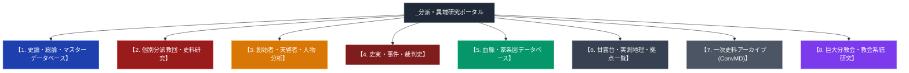

# _分派・異端研究ポータル (Tenrikyo Offshoots Research Portal)

> [!summary] ポータル概要と研究指針
> 本ポータルは、天理教（親里本部）から明治・大正・昭和・現代にかけて派生・分離・独立した分派教団・異端講社・史料批判研究派、創始者・天啓者、裁判・弾圧事件史、家系図、および全国・世界拠点・甘露台一覧に関する専門ノートを体系的に網羅・整理した中央研究統合ハブである。

> [!warning] 留保
> 各ノートのconfidence・evidence_type表記を鵜呑みにせず、出典URL・検証日フィールドを確認して活用すること。

---

## 1. 全研究領域の統合分類図

---

## 2. 概要と体系的カテゴリー索引

### 2-1. 史論・総論・総合データベース
- [[天理教の分裂の系譜]]：天理教の分裂メカニズムの解剖ノート。
- [[天理教分派・異端教団一覧]]：分派教団・運動の基本諸元、創始者、正統本部との差分データベース。
- [[みかぐらうた]]：かぐらつとめ唱歌聖典。正統本部と分派改変歌詞の比較。
- [[天理教のおたすけ・おさづけと近代病気救済史]]：手かざし・心直しの構造と近代医学行政との衝突史。
- [[おぢばがえりと親里詰所建築群]]：おぢばがえりと大教会詰所網の建築社会学。
- [[宗教都市天理の誕生と神殿建築]]：天理市誕生史と親里神殿の建築構造。
- [[陽気ぐらしと天理教の社会福祉・医療]]：天理よろづ相談所病院「憩の家」、ひのきしん、里親運動。
- [[天理教の海外拠点と世界伝道網]]：海外伝道庁（LA、ハワイ、ブラジル、台湾、パリ等）おぢば遥拝。
- [[天理教弾圧の構造と歴史要因]]：大日本帝国による弾圧の根本要因。

---

### 2-2. 個別分派教団・史料研究専門ノート
- [[ほんみち]]：最大分派。「人間甘露台」解釈と無看板・隠れ宝場構造・不敬罪裁判史実。
- [[ほんぶしん]]：大西玉（みろく様）創始の二次分派。岡山東区神山屋外石造甘露台。
- [[陽気づくめ垂水教会]]：山平順三会長。兵庫県神戸市垂水区名谷町1521。「本邦初 屋外石造十三段甘露台」を完全復元・奉斎。
- [[太道教]]：**創始者は中村しげ**。東京阿佐ヶ谷神修殿。天理教系分派という位置づけ・甘露台奉斎の主張は要検証。
- [[八島英雄と中山みき研究ノート]]：詳細は[[八島英雄]]参照（本嬬原分教会元会長、1986年罷免、櫟本分署跡保存会設立）。
- [[天理教豊文教会]]：包括離脱単立教団。最高裁**第二小法廷**平成18年1月20日判決で「天理教」名称自称権勝訴確定。
- [[陽気づくめ系単立離脱教会]]：旧分教会離脱群。[[陽気づくめ垂水教会]]（屋外石造甘露台）、[[陽気づくめ練馬教会]]（八島英雄・史料批判）、櫟本分署跡陽気づくめ教会等（一次資料：[[src_yokizukume_primary]] / [[src_yokizukume_nerima_primary]]）。
- [[陽気づくめ教会拠点一覧]]：陽気づくめ系単立離脱拠点・史料批判拠点の網羅データベース。
- [[太道教]]：東京都杉並区阿佐谷南。単立宗教法人（阿佐ヶ谷猿田彦神社・太道教本部）。瓊瓊杵尊（霧島神宮勧請）・猿田彦大神（椿大神社勧請）を奉斎。天理教分派説は公的資料で否定（一次資料：[[src_taidokyo_primary]]）。
- 「朝日教」：**削除済み**（2026-07-27。奈良県・関西一円で明治初期に発生したとされる「朝日拝み」運動として記載されていたが、国立国会図書館デジタルコレクション・CiNiiの書誌データベースを悉皆検索しても痕跡が見つからず、非実在の可能性が強く示唆されたため削除。[[朝日神社]]〈井出国子、1908年頃、兵庫県三木市〉とは時代・場所・教義が一致しない別団体だった）。
- [[朝日神社]]：井出国子（井出クニ）が天理教信徒として神がかりを体験後、天理教本部からの公式承認を得ないまま兵庫県三木市別所町高木に築いた単立宗教法人。実在確認済み（2026-07-27新規作成）。
- [[おうかんみち]]：山田梅次郎が1937年に天理三輪講から独立（天理神之口明場所）、1946年に江上寿胤がおうかんみちを立教。栃木県那須郡本部（一次資料：[[src_oukanmichi_primary]]）。
- [[天理神之打開場所]]：渡辺ヨソ・茨城石岡説は伝聞混同であり、史実は山田梅次郎の「天理神之口明場所（[[おうかんみち]]）」に集約・統合。
- 「おやのみち甘露台」：**削除済み（2026-07-27、実在の裏付けが最終的に得られなかったため）**。
- 「神修教」：**削除済み**（2026-07-27。実在団体としての裏付けが皆無で、教派神道「神習教」との同音混同の可能性のみが示唆される捏造ノートだったため削除）。
- [[八楽会教団]]：福岡県みやま市。日本唯一の「卑弥呼」奉斎宗教法人（卑弥呼殿）。天理教分派説は否定（一次資料：[[src_hachirakukai_primary]]）。
- [[天理三輪講]]：勝ヒサノ創始・1933年・ほんみちからのスピンオフ。

### 2-2b. 日本の主要新宗教・教派独立系教団（RIRC学術データベース・文化庁宗教年鑑比較）
- [[創価学会]]：日蓮仏法系・国内最大新宗教（公称827万世帯）。1991年日蓮正宗から破門独立。政党公明党を設立。
- [[立正佼成会]]：法華経系・国内第2位（約272万人・文化庁）。庭野日敬・長沼妙佼により創立。霊友会より分派。「法座」・新宗連幹事・WCRP平和運動。
- [[霊友会]]：法華経系在家仏教の最大の母体（約127万人）。久保角太郎・小谷喜美創立。立正佼成会、佛所護念会教団、妙智會教団等を分派。
- [[天理教]]：教派神道独立系・国内第7位クラス（約120万人）。1838年中山みき立教。奈良県天理市に人口の約1/4が集住する「宗教都市」を形成。
- [[佛所護念会教団]]：霊友会派生・法華経系（約111万人）。関口嘉一・トミノ創立。保守派政治運動・日本会議協調。
- [[真如苑]]：真言密教系・国内第9位クラス（約92万人）。伊藤真乗・友司創立。『大般涅槃経』と霊能者による瞑想対話「接心（せっしん）」が特徴。
- [[パーフェクトリバティー教団]] (PL教団)：「人生は芸術である」。御木徳近創立（ひとのみち教団再建）。富田林大本庁・PL学園。
- [[幸福の科学]]：新新宗教・エル・カンターレ信仰。大川隆法創立。千冊超の「霊言」出版・映画ビジネスと幸福実現党。2023年大川隆法急逝に伴う後継問題。
- [[世界平和統一家庭連合]]（旧・統一教会）：韓国系キリスト教異端。文鮮明・韓鶴子創立。霊感商法・過剰献金被害および2022年安倍元首相銃撃事件。2023年文科省より宗教法人「解散命令請求」審理中。
- [[顕正会]] (冨士大石寺顕正会)：日蓮正宗系強硬派（公称230万人）。浅井甚兵衛・昭衛創立。富士山麓「国立戒壇」主張、正本堂反対で破門処分。街頭での強引な連れ出し勧誘不祥事。
- [[阿含宗]]：根本仏教・密教系（公称30万人）。桐山靖雄創立。『阿含経』と因縁解脱。京都「阿含の星まつり（柴燈護摩）」で知られる。
- [[世界救世教]]：[[岡田茂吉]]が1935年に大日本観音会として創始、1950年改称。「浄霊」「自然農法」が特徴。MOA美術館を擁する。傘下に[[いづのめ教団]]・[[东方之光]]の2被包括法人。
- [[神慈秀明会]]：世界救世教秀明教会が1970年に小山美秀子のもとで独立した最大分派。滋賀県甲賀市信楽町の神苑・MIHO MUSEUMが本拠。
- [[ミロクコミュニティ救世神教]]（旧：救世神教）：1970年谷元後藤英男立教。三重県津市「聖地・神恩郷」。黒川紀章設計神教会館、五六七大神御復活・EM自然農法。
- [[光明みろく會]]：1982年法人登記。三重県津市本部。「大光明（みろくおおかみ）」と「御浄霊」による地上天国建設。
- 「みろく神教」：**削除済み**（2026-07-27。「石坂隆明」「慈永堂」「五六七大栄会」は実在するがいずれも無関係な別人物・別団体を組み合わせて構成された捏造ノートだったため削除）。
- [[いづのめ教団]]：世界救世教の被包括法人の一つ（旧称「新政派」）。本部は静岡県熱海市桃山町26-1。
- [[東方之光]]：世界救世教の被包括法人の一つ（旧称「西金派」）。
- [[世界メシア教]]（旧・主之光教団）：四代教主・岡田陽一を支持する勢力が2018年に世界救世教から法的分離。2024年に和解（解決金13億円）。
- [[大本]]：[[出口なお]]・[[出口王仁三郎]]が1892年に創設。「立替え・立直し」「霊主体従」が中心教義。二度の大本事件（1921・1935年）を経験。[[岡田茂吉]]（世界救世教創始者）・[[谷口雅春]]（生長の家創始者）が元信者。
- [[崇教真光]]：[[岡田光玉]]が1959年に創始。「真光の業」（手かざし）が特徴。世界救世教とは独立の出自で分派関係ではない。
- [[生長の家]]：[[谷口雅春]]が大本離脱後の1930年に創始。「万教帰一」「唯神実相」が中心教義。
- [[神道天行居]]：[[友清歓真]]が大本の影響下1920年に創始。「太古神法」「霊的国防」が特徴の古神道系教団。
- [[三五教]]：[[中野与之助]]が大本入信・第二次大本事件投獄を経て1949年に創始。「天文即宗教」が中心教義、NGOオイスカの母体。
- [[明道会・惟神会]]：[[岸一太]]が大本傾倒後の1928年に設立。1931年の詐欺罪検挙を経て1934年に惟神会として再発足。
- [[神政龍神会]]：[[矢野祐太郎]]が大本の分派・大阪正道会を経て1934年に創設。1936年に不敬罪・治安維持法で弾圧され事実上解体。
- [[金光教]]：赤沢文治（金光大神）が1859年に創唱。黒住教・天理教と並ぶ「幕末三大新宗教」。「取次」「あいよかけよ」が中心教義。岡山県浅口市本部。
- [[黒住教]]：黒住宗忠が1814年に創設。「天命直授」「日拝」が特徴。金光教・天理教と並ぶ「幕末三大新宗教」。岡山県岡山市神道山が本部。
- [[神理教]]：佐野経彦（巫部経彦）が1880年設立許可・1884年成立。巫部神道を基盤とし十八柱神「天在諸神」を奉斎。福岡県北九州市本部。

---

### 2-3. 創始者・指導者・人物専門ノート
- [[中山みき]] / [[飯降伊蔵]] / [[大西愛治郎]] / [[大西玉]] / [[会田ヒデ]] / [[中山正善]] / [[八島英雄]] / [[井出国子]]

---

### 2-4. 史実・事件・裁判史専門ノート
- [[天理教豊文教会]]（名称差止最高裁事件・第二小法廷） / [[陽気づくめ系単立離脱教会]] / [[明治15年甘露台石没収事件]] / [[明治の教難と教祖牢くぐり]] / [[明治の教難と教派神道独立]] / [[天理研究会事件]] / [[革新天理教運動と昭和の教義論争]] / [[八島英雄]]（櫟本分署跡・本嬬原分教会）

---

### 2-5. 家系図データベース専門ノート
- [[中山家系図]] / [[天理教主要幹部家系図]] / [[高井家系図]]

---

### 2-6. 甘露台・世界拠点・拠点一覧専門ノート
- [[陽気づくめ垂水教会]] / [[陽気づくめ教会拠点一覧]] / [[ほんみち全国宝場と詳細交通アクセス案内]] / [[奈良以外の甘露台と異端甘露台一覧]] / [[関東の甘露台と奉斎拠点一覧]] / [[関東の甘露台]] / [[ほんみちの隠れ拠点と宝場構造]]

---

### 2-7. 巨大分教会・教会系統研究
- [[天理教愛町分教会]]：名古屋発祥の分教会。初代会長・[[関根豊松]]。麹町大教会直属。
- [[天理教麹町大教会]]：東京都北区滝野川の拠点（開祖は岸本唯之助、実質的基礎は久保治三郎）。
- [[東京・関東周辺の天理教系分派]]：首都圏における分派・講社網。

---

### 2-8. 一次史料アーカイブ (ConvMD)
- 神戸垂水史料アーカイブ: `http://www.yousun.sakura.ne.jp/public_html/siryou2/kanrodai/kanrodai3.html`
- 最判平成18年1月20日判決（民集60巻1号1頁、第二小法廷）関連資料
- [[src_wikipedia_tenrikyo_honbun]]：Wikipedia「天理教」記事本文（教義・沿革・組織・教団への指摘。八島英雄の経歴の決定的裏付けを含む）
- `sources/`フォルダ内の`src_*`ファイル群。ただし`src_yashima_ichinomoto`・`src_kakushin_tenri`・`src_meiji19_himetsutatsu`・`src_doroumi_hajime`・`src_ofudesaki_select`・`src_osashizu_select`の6件は具体的引用文が実在未確認のため`evidence_type: primary_source_based`に無害化済み（各ファイル参照）。

---

## 3. 全主要拠点 交通アクセス・座標データベース（要再検証項目あり）

- **天理教本部**: 奈良県天理市三島町271（34.5985, 135.8350）
- **ほんみち高石本部**: 大阪府高石市羽衣3丁目1番72号（座標は要再検証）
- **ほんぶしん本部**: 岡山県岡山市東区神崎町1（〒704-8138）
- **陽気づくめ垂水教会**: 兵庫県神戸市垂水区名谷町1521（34.6596, 135.0694）
- **太道教本部**: 東京都杉並区阿佐谷南1-1-38（35.698706, 139.643295、座標確認済み・創始者は中村しげ）
- **甘露台霊理斯道会**: 栃木県大田原市「皇和大親宮」に移転済みとみられる（座標36.1296012, 139.9131561は旧・茨城県拠点のものである可能性が高く要再検証。創始者は斎藤年男、2026-07-27再確認）
- 「おやのみち甘露台」: **削除済み（2026-07-27、実在の裏付けが最終的に得られなかったため）**。
- **世界心道教**: 愛知県豊川市諏訪2丁目101番地（34.8236, 137.3752、創始者は会田ヒデ）

---

## 4. 関連教団・関連人物・関連概念ネットワーク

### 関連教団
- [[天理教]]
- [[ほんぶしん]]
- [[陽気づくめ垂水教会]]
- [[陽気づくめ系単立離脱教会]]
- [[陽気づくめ教会拠点一覧]]
- [[太道教]]
- [[甘露台霊理斯道会]]
- [[八島英雄]]
- [[天理三輪講]]

---

## 5. 参考文献・公的記録・学術論文

- 文化庁編『宗教年鑑』
- 弓山達也『天啓のゆくえ—宗教が分派するとき』（日本地域社会研究所、2005年）
- 井上順孝 ほか編『新宗教教団・人物事典』（弘文堂、1996年）
- 松井圭介「カリスマの継承からみた天理教系教団の分派形成」人文地理学研究XXIV, 2000年

---

## 6. 関連ノート (Vault内)

- [[系統別分類カタログ]]（本ポータルの機能別分類を補完する、系統別の横断索引）
- [[天理教分派・異端教団一覧]]
- [[八島英雄]]
- [[陽気づくめ垂水教会]]
- [[陽気づくめ系単立離脱教会]]
- [[陽気づくめ教会拠点一覧]]
- [[天理三輪講]]
- [[奈良以外の甘露台と異端甘露台一覧]]
- [[天理教愛町分教会]]

---

## 7. 検証・品質ゲートと留保事項

> [!important] 研究規範・客観性の徹底
> - 各ノートのconfidence・evidence_type・出典URL・検証日フィールドを確認して活用すること。
> - 一次情報の確認できない伝聞・俗説は「未確認」と明記し、曖昧な推測記述を排除する方針を継続する。

---

*※本ノートは01_宗派・異端研究フォルダの中央ポータルハブである。*
