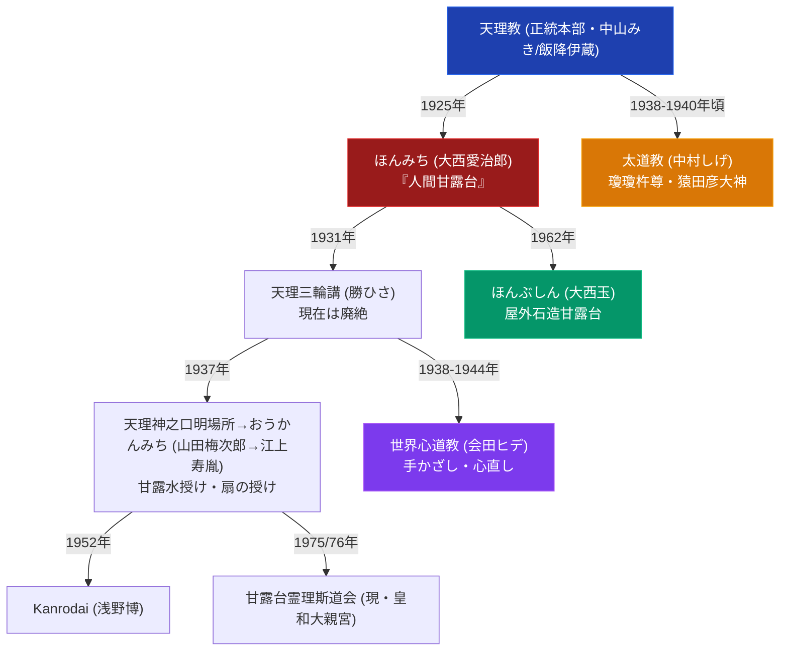

# 天理教系諸派の教義比較マトリクス

> [!summary] 要旨
> 本稿は、天理教（正統本部）と、そこから派生した主要分派・異端教団（ほんみち、ほんぶしん、世界心道教、太道教、おうかんみち、天理三輪講、甘露台霊理斯道会、陽気づくめ垂水教会等）を、「甘露台観」「天啓継承論」「聖典解釈」「救済儀礼」「国家権力との関係」等の教義軸で横断比較する。各教団の詳細な沿革・弾圧史・所在地情報は[[天理教分派・異端教団一覧]]および各個別ノートを参照し、本稿は分類軸に沿った比較整理に特化する。

---

## 1. 分派系統図（簡略版）

> [!warning] 系統図の限界
> 太道教の「天理教から直接分派」はWikipedia本文で確認済みだが、教理面（甘露台継承等）の連続性は未確認。陽気づくめ垂水教会は天理教包括からの離脱経緯の詳細（分派系統上どこに位置するか）が未確認のため図には含めていない。神修教・おやのみち甘露台は共に削除済み（実在未確認のため）。

---

## 2. 教義比較マトリクス（8軸）

| 比較軸 | 天理教（正統本部） | ほんみち | ほんぶしん | 世界心道教 | 太道教 | おうかんみち | 甘露台霊理斯道会 | 陽気づくめ垂水教会 |
| :--- | :--- | :--- | :--- | :--- | :--- | :--- | :--- | :--- |
| **創始者** | 中山みき／飯降伊蔵 | 大西愛治郎 | 大西玉（みろく様） | 会田ヒデ | 中村しげ | 山田梅次郎→江上寿胤 | 未確認 | 山平順三 |
| **成立年** | 1838年 | 1913年天啓／1925年結成 | 1962年 | 1938年天啓／1944年設立 | 1938-1940年頃 | 1937年（前身）／1960年改称 | 1976年 | 昭和後期〜平成期 |
| **甘露台観** | おぢばの物理的木柱（地点固定） | 大西愛治郎自身が「人間甘露台」 | 岡山神山の屋外石造十三段甘露台を実物復元 | 明記なし（水火風の理が中心） | 甘露台継承の裏付けなし（瓊瓊杵尊・猿田彦大神奉斎） | 「甘露水授け」等の秘儀、教主自身への人格的帰属 | 「扇の伺い」「甘露台の霊理」の直解継承を称する | 明治15年没収事件の石造甘露台を屋外に実物大復元 |
| **天啓継承論** | 教祖→本席で完結、1907年以降は真柱統制 | 大西愛治郎が「第三のやしろ」を自称 | 大西玉＝中山みきの再生、武田宗真＝「天啓者・甘露台」 | 会田ヒデが月読之命・国狭土之命の天啓を自覚（3世代天啓チェーンの一例） | 中村しげの「神がかり」（詳細未確認） | 山田梅次郎が中山みきの夫「善兵衛」の生まれ替わりを自覚、江上寿胤が独自の天啓者を宣言 | 未確認 | 未確認（教理継承の詳細不明） |
| **聖典解釈** | 教団公式ドグマ（『天理教教典』等）を通じてのみ解釈 | 『おふでさき』直解、『神誡』『泥海初め』独自文書 | ほんみちの系譜を継ぐが「みろくの理」を独自展開 | 独自祭神「天地月日御親水火風之大神」 | 教理面の独自性は未確認 | 「神人合一」「甘露合世界達設」を標榜 | 中山みきの「教え」の直解を称する | 石造甘露台の物理的復元を教理の中心に据える |
| **救済儀礼** | おさづけ（手振り・ておどり） | 独自の手振り・甘露台人間拝礼 | みろくの理に基づく儀礼（詳細未確認） | 「手かざし（手差し）」「心直し」 | 詳細未確認 | 「甘露水授け」「扇の授け」「息の授け」 | 「扇の伺い」 | 石造甘露台への拝礼が中心と推測（詳細未確認） |
| **国家権力との関係** | 明治期に教派神道として公認・順応 | 二度の弾圧（1928年不敬罪、1938年治安維持法違反）で壊滅的打撃 | 直接の弾圧記録なし | 直接の弾圧記録なし | 直接の弾圧記録なし | 前身の山田梅次郎が治安維持法違反で検挙（1937または1938年） | 記録なし | 記録なし |
| **現況・規模** | 信者数最大規模、全国組織 | 信者数約30万人（推定）、全国宝場網 | 岡山本部＋全国精舎、ハワイにも拠点 | 東海圏中心、詳細な信者数未確認 | 阿佐ヶ谷猿田彦神社境内、規模不明 | 栃木県那須郡に本部、規模不明 | 「皇和大親宮」に改称、規模不明 | 神戸市垂水区、規模不明 |

---

## 3. 分類軸ごとの考察

### 3-1. 甘露台観の3類型
天理教系分派の教義的差異は、多くの場合「甘露台」という中心概念をどう捉えるかに集約される。既存の[[天理教の分裂の系譜]]で提示された「甘露台観の地理的・人間的亀裂」というフレームワークを踏まえ、本稿では確認できた事例から以下の3類型に整理する（この3類型化は本Vaultの分析的整理であり、学術的定説ではない）。

1. **地点固定型**（正統本部）: おぢばの物理的木柱そのものを甘露台とする。
2. **人格化型**（ほんみち、おうかんみち系）: 創始者・教主自身を「人間甘露台」として奉斎する。
3. **物理的復元型**（ほんぶしん、陽気づくめ垂水教会）: 明治15年に警察が没収し未完成に終わった石造十三段甘露台を、独自の聖地に実物大で復元する。

世界心道教・太道教はこの3類型のいずれにも明確に当てはまらず、甘露台よりも独自の祭神（水火風の理、瓊瓊杵尊・猿田彦大神）を中心に据える教義体系を持つ点で異なる系統と言える。

### 3-2. 天啓継承の「連鎖」構造
[[天理教の分裂の系譜]]が指摘する通り、天理教は「教祖（中山みき）」と「本席（飯降伊蔵）」というダブルの天啓構造を持ち、1907年の本席没後に「第三の天啓者」を待望する信仰心理が働いたとされる（弓山達也モデル）。この延長線上に、大西愛治郎（ほんみち）→大西玉（ほんぶしん）、大西愛治郎→天理三輪講→山田梅次郎（おうかんみち前身）→会田ヒデ（世界心道教）という複数世代にわたる天啓継承の連鎖が見られる。ただし各継承段階での天啓の正統性の主張は教団側の自己申告であり、外部の学術的評価とは区別する必要がある。

### 3-3. 弾圧経験の有無による差異
ほんみちおよびその前身に連なる系統（おうかんみちの前身・天理神之口明場所）は、戦前の不敬罪・治安維持法による直接の弾圧を経験している点で、他の分派（ほんぶしん、世界心道教、太道教、甘露台霊理斯道会、陽気づくめ垂水教会）と一線を画す。これらの弾圧経験の有無が、戦後の教団運営における「無看板の宝場制度」（ほんみち）のような組織防衛的特徴の有無にも影響していると考えられる（推測であり断定しない）。

---

## 4. 未解決・要検証の分類問題

> [!warning] 本稿作成にあたり判明した既存ノート間の不一致
> - 太道教は「天理教から直接分派」（Wikipedia本文で確認済み）だが、甘露台継承等の教理的連続性は裏付けがなく、他の分派（ほんみち系）とは性質が異なる可能性がある。
> - 天理三輪講の成立年（1931年か1933年か）、系統（「天理教から独立」か「ほんみちから分派」か、Wikipedia記事内でも節分類と本文記述が矛盾）は未解決のまま。
> - おうかんみちの後継組織（甘露台霊理斯道会・Kanrodai）の設立年に1年の差異（1975年/1976年）が残る。
> - 神修教・おやのみち甘露台は共に削除済み（実在未確認のため）。

---

## 5. 参考文献・関連ノート

- 弓山達也『天啓のゆくえ—宗教が分派するとき』（日本地域社会研究所、2005年）
- 井上順孝ほか編『新宗教教団・人物事典』（弘文堂、1996年）
- 島薗進『新宗教の展開』（岩波書店）
- 各教団の個別ノート（[[ほんみち]]、[[ほんぶしん]]、[[世界心道教]]、[[太道教]]、[[おうかんみち]]、[[天理三輪講]]、[[甘露台霊理斯道会]]、[[陽気づくめ垂水教会]]）

### 関連ノート
- [[天理教分派・異端教団一覧]]
- [[天理教の分裂の系譜]]
- [[天理教]]
- [[_天理教ポータル]]
- [[_分派・異端研究ポータル]]

---

## 6. 検証・品質ゲートと留保事項

> [!warning] 留保事項
> - 本稿は既存Vaultノート（各個別教団ノート・[[天理教分派・異端教団一覧]]・[[天理教の分裂の系譜]]）の記述内容を再整理したものであり、本稿作成にあたって新規のWeb調査は行っていない。個別の事実関係の一次的な裏付けは各参照元ノートの検証日・出典に依拠する。
> - 「甘露台観の3類型」という分類は本Vaultの分析的整理であり、学術的に確立した分類ではない。
> - 太道教・世界心道教等、教理面の詳細が未確認の教団については、比較表内で「未確認」「詳細未確認」と明記し、推測で埋めていない。
> - 本ノートの evidence_type は `"primary_source_based"`、confidence は `4`（引用元の各個別ノートが複数の一次資料で裏付け済みのため中〜高位に設定するが、本稿自体の新規事実確認は行っていないため最高位ではない）。

---

*※本稿は[[_分派・異端研究ポータル]]の比較分析専門ノートである。*
