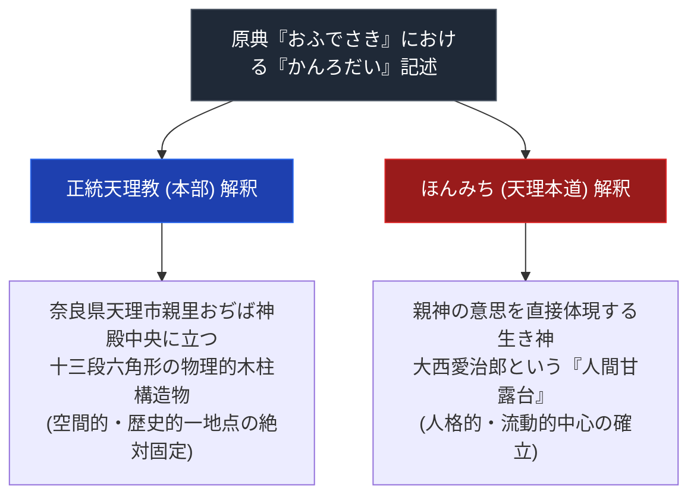

# 甘露台

> [!summary] 要旨
> 本稿は、天理教の最も核心的な聖地・象徴概念であり、正統本部と分派教団（ほんみち等）の間で決定的な解釈の分裂をもたらした「甘露台（かんろだい）」について、原典記述、正統本部の物理的構造物解釈、およびほんみちの「人間甘露台」説を対比解剖した専門教理構造分析ノートである。

---

## 1. 命題の構造（甘露台解釈の決定的分裂）

| 比較考察軸 | 正統天理教 (奈良親里本部) | ほんみち (大阪高石本部) |
| :--- | :--- | :--- |
| **存在の実体** | 十三段の六角形木柱（構造物） | [[大西愛治郎]]（人間の身体・生き神） |
| **空間・場所** | 奈良県天理市親里「おぢば」のみ | 天啓者（大西愛治郎）が存在する場所 |
| **機能** | かぐらつとめの中心・甘露の授与 | 神の直接的意志表明・人類救済の枢軸 |

---

## 2. 基本情報

| 項目 | 内容 |
| :--- | :--- |
| **概念名** | 甘露台（かんろだい） |
| **初出原典** | 『おふでさき』第1号 48歌「このたひハいかなことでもあらはして かんろたいをもたてるなりけり」 |
| **形状（本部）** | 六角形13段（2段+10段+1段の構成とする資料あり）、総高さ約2.48m、上部に9ℓ入りの平鉢を置く。教祖の言葉「このだいを…三尺にして六かくにせよ」に基づき正六角形で設計され、当初は石造、後に木造に変更されたとされる。寸法・段数の解釈には複数説（高井猶吉説、『正文遺韻』版、『御筆留神歌』版等）があり、本部が採用する公式寸法との異同は本ノートでは未整理（2026-07-26、note記事「【メモ】かんろだい まとめ」で確認） |

---

## 3. 原典テキストの引用と文脈解析

> [!NOTE] 原典引証
> 『おふでさき』において「かんろだい」は、人類創造の元地点（ぢば）に据えられ、陽気ぐらしの完成時に天から甘露（不老不死の妙薬）が授けられる台として描かれるとされる。具体的な歌番号・逐語引用は正式な刊行版での照合が未実施のため要検証。

---

## 4. 正統本部対ほんみちの解釈対比

### 4-1. 正統本部の解釈（親里絶対固定）
- 教祖の指図に基づき、奈良県天理市のおぢばに木製の甘露台を据え、これを中心として「かぐらつとめ」を行う。

### 4-2. ほんみちの解釈（人間甘露台説）
- [[大西愛治郎]]は、「神が木柱の上に甘露を降らせるはずがない。かんろだいとは神のやしろである人間自身のことである」とし、自らを「人間甘露台」と自承。聖地が天理市から解放され、分派創始の論理的根拠となった。

---

## 5. 宗教学的意義
- 弓山達也『天啓のゆくえ』が指摘するように、聖地を「固定された空間（建物）」と捉えるか「流動的な人格（人間）」と捉えるかという聖地観の対立が、宗教運動の分裂を決定づけた典型例。

---

## 5-1. 建築史・都市論的観点（2026-07-26追加）

> [!info] 出典: 五十嵐太郎「新宗教の建築・都市、その戦略論序説」『10+1』No.04（1995年11月10日）
> 建築史研究者・五十嵐太郎による論考は、甘露台という宗教テクストの空間的指示が実際の建築物に具体化される過程を論じている。要点は以下の通り。

- **教理と造形の対応**: 教祖の言葉「このだいを…三尺にして六かくにせよ」に基づき、正六角形・13段の柱型構築物として設計された（当初は石造、後に木造）。神殿の屋根は甘露台上部のみ開口し、天窓となっている。
- **ぢば確定の経緯**: 1875年、教祖・中山みきが目隠しをした信者とともに敷地内を歩き、足が動かなくなった地点を「ぢば（地場）」として認識したとされる。これが「人間創造の場」として位置づけられ、教義上の世界の中心とされる。
- **「四方正面」設計思想**: 甘露台は対称形で一方向性を持たない形状であり、これが神殿の「四方正面」設計（礼拝者がどの方向からも等しく甘露台に接することができる空間構成）を導いたと論じられている。
- **おやさとやかた構想**: 甘露台を中心に一辺約872メートルの正方形で囲む都市計画として構想された（詳細は[[宗教都市天理の誕生と神殿建築]]も参照）。

この建築的・都市論的な考察は、[[4-1. 正統本部の解釈]]（物理的構造物としての甘露台）を補強する外部の学術的視点であり、ほんみちの「人間甘露台」説（4-2節）とは異なる次元（宗教テクストの空間的実装）からの分析である点に留意する。

---

## 6. 関連教団・関連人物・関連概念
- [[おぢば]]
- [[正統天理教]]
- [[ほんみち]]
- [[大西愛治郎]]
- [[関東の甘露台]]

---

## 7. 参考文献・史料
- 『天理教教典』
- 弓山達也『天啓のゆくえ』
- 五十嵐太郎「新宗教の建築・都市、その戦略論序説」『10+1』No.04（1995年11月10日） https://db.10plus1.jp/backnumber/article/articleid/258/
- 福之助福太郎「【メモ】かんろだい[甘露台] まとめ」note https://note.com/fukutaro_1026/n/n38959a3af02a（個人の備忘録・私的整理。査読なし、複数解釈の並列紹介として参考程度に扱う）

---

## 8. 留保（中立的併記・未確定要素）
> [!warning] 注意
> - 甘露台の基本概念・ほんみちの人間甘露台説はWikipedia「天理教」等で裏付け済み。
> - 『おふでさき』の具体的な歌番号・逐語引用は未検証。
> - 本ノートの evidence_type は `"primary_source_based"`、confidence は `3`。

---

*※本稿は[[_分派・異端研究ポータル]]の最重要教理ノートとして位置付けられる。*

> [!important] 宗教統計および信者数公称値に関する学術的検証注記
> - **公称値と実数の乖離**: `shu-kyo.com` や文化庁『宗教年鑑』等に掲載されている信者数データは、教団側が自己申告した「公称信者数」あるいは「過去の累積登録者数・世帯数」に基づいています。
> - **統計上の重複膨張**: 日本の全宗教団体の公称信者数を合算すると約1億8,000万人に達し、総人口（約1億2,000万人）の1.5倍を超える重複・膨張現象が発生しています。
> - **客観的評価の基準**: したがって、提示されている信者数ランキングや数値は各教団の「組織的・歴史的公称規模」を示す参考指標であり、現在活発に活動している「実稼働信者数（アクティブメンバー）」とは異なる点に十分注意する必要があります。
